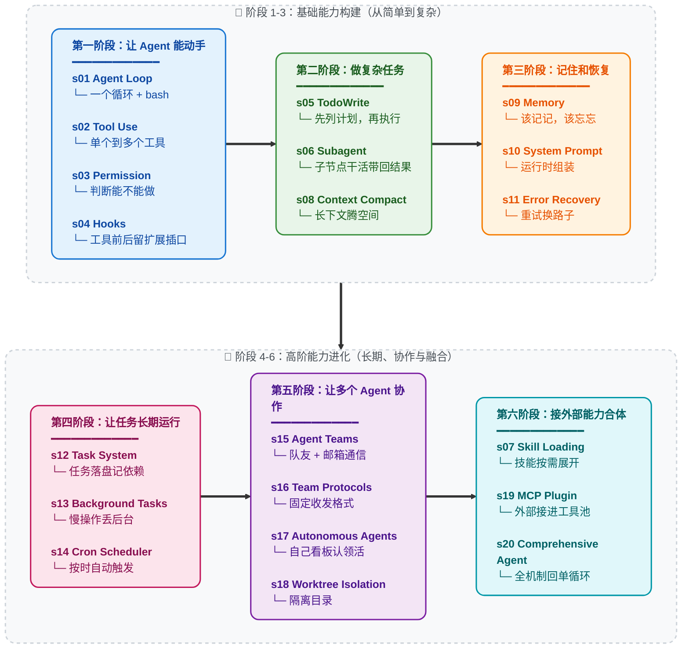

# 导言：真正的 Agent Harness 工程


## Agency 来自模型，Agent 产品 = 模型 + Harness

在讨论代码之前，先把一件事说清楚。

**Agency -- 感知、推理、行动的能力 -- 来自模型训练，不是来自外部代码的编排。** 但一个能干活的 agent 产品，需要模型和 harness 缺一不可。模型是驾驶者，harness 是载具。本仓库教你造载具。

### Agency 从哪来

Agent 的核心是一个神经网络 -- Transformer、RNN、一个被训练出来的函数 -- 经过数十亿次梯度更新，在行动序列数据上学会了感知环境、推理目标、采取行动。Agency 这个东西从来不是外面那层代码赋予的，而是模型在训练中学到的。

人类就是最好的例子。一个由数百万年进化训练出来的生物神经网络，通过感官感知世界，通过大脑推理，通过身体行动。当 DeepMind、OpenAI 或 Anthropic 说 "agent" 时，他们说的核心都是同一件事：**一个通过训练学会了行动的模型，加上让它能在特定环境中工作的基础设施。**

历史已经写好了铁证：

- **2013 -- DeepMind DQN 玩 Atari。** 一个神经网络，只接收原始像素和游戏分数，学会了 7 款 Atari 2600 游戏 -- 超越所有先前算法，在其中 3 款上击败人类专家。到 2015 年，同一架构扩展到 [49 款游戏，达到职业人类测试员水平](https://www.nature.com/articles/nature14236)，论文发表在 *Nature*。没有游戏专属规则。没有决策树。一个模型，从经验中学习。那个模型就是 agent。

- **2019 -- OpenAI Five 征服 Dota 2。** 五个神经网络，在 10 个月内与自己对战了 [45,000 年的 Dota 2](https://openai.com/index/openai-five-defeats-dota-2-world-champions/)，在旧金山直播赛上 2-0 击败了 **OG** -- TI8 世界冠军。随后的公开竞技场中，AI 在 42,729 场比赛中胜率 99.4%。没有脚本化的策略。没有元编程的团队协调逻辑。模型完全通过自我对弈学会了团队协作、战术和实时适应。

- **2019 -- DeepMind AlphaStar 制霸星际争霸 II。** AlphaStar 在闭门赛中 [10-1 击败职业选手](https://deepmind.google/blog/alphastar-mastering-the-real-time-strategy-game-starcraft-ii/)，随后在欧洲服务器上达到[宗师段位](https://www.nature.com/articles/d41586-019-03298-6) -- 90,000 名玩家中的前 0.15%。一个信息不完全、实时决策、组合动作空间远超国际象棋和围棋的游戏。Agent 是什么？是模型。训练出来的。不是编出来的。

- **2019 -- 腾讯绝悟统治王者荣耀。** 腾讯 AI Lab 的 "绝悟" 于 2019 年 8 月 2 日世冠杯半决赛上[以 5v5 击败 KPL 职业选手](https://www.jiemian.com/article/3371171.html)。在 1v1 模式下，职业选手 [15 场只赢 1 场，最多坚持不到 8 分钟](https://developer.aliyun.com/article/851058)。训练强度：一天等于人类 440 年。到 2021 年，绝悟在全英雄池 BO5 上全面超越 KPL 职业选手水准。没有手工编写的英雄克制表。没有脚本化的阵容编排。一个从零开始通过自我对弈学习整个游戏的模型。

- **2024-2025 -- LLM Agent 重塑软件工程。** Claude、GPT、Gemini -- 在人类全部代码和推理上训练的大语言模型 -- 被部署为编程 agent。它们阅读代码库，编写实现，调试故障，团队协作。架构与之前每一个 agent 完全相同：一个训练好的模型，放入一个环境，给予感知和行动的工具。唯一的不同是它们学到的东西的规模和解决任务的通用性。

每一个里程碑都指向同一个事实：**Agency -- 那个感知、推理、行动的能力 -- 是训练出来的，不是编出来的。** 但每一个 agent 同时也需要一个环境才能工作：Atari 模拟器、Dota 2 客户端、星际争霸 II 引擎、IDE 和终端。模型提供智能，环境提供行动空间。两者合在一起才是一个完整的 agent。

### Agent 不是什么

"Agent" 这个词已经被一整个提示词水管工产业劫持了。

拖拽式工作流构建器。无代码 "AI Agent" 平台。提示词链编排库。它们共享同一个幻觉：把 LLM API 调用用 if-else 分支、节点图、硬编码路由逻辑串在一起就算是 "构建 Agent" 了。

不是的。它们做出来的东西是鲁布·戈德堡机械 -- 一个过度工程化的、脆弱的过程式规则流水线，LLM 被楔在里面当一个美化了的文本补全节点。那不是 Agent。那是一个有着宏大妄想的 shell 脚本。

**提示词水管工式 "Agent" 是不做模型的程序员的意淫。** 他们试图通过堆叠过程式逻辑来暴力模拟智能 -- 庞大的规则树、节点图、链式提示词瀑布流 -- 然后祈祷足够多的胶水代码能涌现出自主行为。不会的。你不可能通过工程手段编码出 agency。Agency 是学出来的，不是编出来的。

那些系统从诞生之日起就已经死了：脆弱、不可扩展、根本不具备泛化能力。它们是 GOFAI（Good Old-Fashioned AI，经典符号 AI）的现代还魂 -- 几十年前就被学界抛弃的符号规则系统，现在喷了一层 LLM 的漆又登场了。换了个包装，同一条死路。

### 心智转换：从 "开发 Agent" 到开发 Harness

当一个人说 "我在开发 Agent" 时，他只可能是两个意思之一：

**1. 训练模型。** 通过强化学习、微调、RLHF 或其他基于梯度的方法调整权重。收集任务过程数据 -- 真实领域中感知、推理、行动的实际序列 -- 用它们来塑造模型的行为。这是 DeepMind、OpenAI、腾讯 AI Lab、Anthropic 在做的事。这是最本义的 Agent 开发。

**2. 构建 Harness。** 编写代码，为模型提供一个可操作的环境。这是我们大多数人在做的事，也是本仓库的核心。

Harness 是 agent 在特定领域工作所需要的一切：

```
Harness = Tools + Knowledge + Observation + Action Interfaces + Permissions

    Tools:          文件读写、Shell、网络、数据库、浏览器
    Knowledge:      产品文档、领域资料、API 规范、风格指南
    Observation:    git diff、错误日志、浏览器状态、传感器数据
    Action:         CLI 命令、API 调用、UI 交互
    Permissions:    沙箱隔离、审批流程、信任边界
```

模型做决策。Harness 执行。模型做推理。Harness 提供上下文。模型是驾驶者。Harness 是载具。

**编程 agent 的 harness 是它的 IDE、终端和文件系统。** 农业 agent 的 harness 是传感器阵列、灌溉控制和气象数据。酒店 agent 的 harness 是预订系统、客户沟通渠道和设施管理 API。Agent -- 那个智能、那个决策者 -- 永远是模型。Harness 因领域而变。Agent 跨领域泛化。

这个仓库教你造载具。编程用的载具。但设计模式可以泛化到任何领域：庄园管理、农田运营、酒店运作、工厂制造、物流调度、医疗保健、教育培训、科学研究。只要有一个任务需要被感知、推理和执行 -- agent 就需要一个 harness。

### Harness 工程师到底在做什么

如果你在读这个仓库，你很可能是一名 harness 工程师 -- 这是一个强大的身份。以下是你真正的工作：

- **实现工具。** 给 agent 一双手。文件读写、Shell 执行、API 调用、浏览器控制、数据库查询。每个工具都是 agent 在环境中可以采取的一个行动。设计它们时要原子化、可组合、描述清晰。

- **策划知识。** 给 agent 领域专长。产品文档、架构决策记录、风格指南、合规要求。按需加载（s07），不要前置塞入。Agent 应该知道有什么可用，然后自己拉取所需。

- **管理上下文。** 给 agent 干净的记忆。子 agent 隔离（s06）防止噪声泄露。上下文压缩（s08）防止历史淹没。任务系统（s12）让目标持久化到单次对话之外。

- **控制权限。** 给 agent 边界。沙箱化文件访问。对破坏性操作要求审批。在 agent 和外部系统之间实施信任边界。这是安全工程与 harness 工程的交汇点。

- **收集任务过程数据。** Agent 在你的 harness 中执行的每一条行动序列都是训练信号。真实部署中的感知-推理-行动轨迹是微调下一代 agent 模型的原材料。你的 harness 不仅服务于 agent -- 它还可以帮助进化 agent。

你不是在编写智能。你是在构建智能栖居的世界。这个世界的质量 -- agent 能看得多清楚、行动得多精准、可用知识有多丰富 -- 直接决定了智能能多有效地表达自己。

**造好 Harness。Agent 会完成剩下的。**

### 为什么是 Claude Code -- Harness 工程的大师课

为什么这个仓库专门拆解 Claude Code？

因为 Claude Code 是我们所见过的最优雅、最完整的 agent harness 实现。不是因为某个巧妙的技巧，而是因为它 *没做* 的事：它没有试图成为 agent 本身。它没有强加僵化的工作流。它没有用精心设计的决策树去替模型做判断。它给模型提供了工具、知识、上下文管理和权限边界 -- 然后让开了。

把 Claude Code 剥到本质来看：

```
Claude Code = 一个 agent loop
            + 工具 (bash, read, write, edit, glob, grep, browser...)
            + 按需 skill 加载
            + 上下文压缩
            + 子 agent 派生
            + 带依赖图的任务系统
            + 异步邮箱的团队协调
            + worktree 隔离的并行执行
            + 权限治理
```

就这些。这就是全部架构。每一个组件都是 harness 机制 -- 为 agent 构建的栖居世界的一部分。Agent 本身呢？是 Claude。一个模型。由 Anthropic 在人类推理和代码的全部广度上训练而成。Harness 没有让 Claude 变聪明。Claude 本来就聪明。Harness 给了 Claude 双手、双眼和一个工作空间。

这就是 Claude Code 作为教学标本的意义：**它展示了当你信任模型、把工程精力集中在 harness 上时会发生什么。** 本仓库的课程（s01-s20）逐步拆解并重组 Claude Code 架构中的 harness 机制。学完之后，你理解的不只是 Claude Code 怎么工作，而是适用于任何领域、任何 agent 的 harness 工程通用原则。

启示不是 "复制 Claude Code"。启示是：**最好的 agent 产品，出自那些明白自己的工作是 harness 而非 intelligence 的工程师之手。**

---

## 愿景：用真正的 Agent 铺满宇宙

这不只关乎编程 agent。

每一个人类从事复杂、多步骤、需要判断力的工作的领域，都是 agent 可以运作的领域 -- 只要有对的 harness。本仓库中的模式是通用的：

```
庄园管理 agent  = 模型 + 物业传感器 + 维护工具 + 租户通信
农业 agent      = 模型 + 土壤/气象数据 + 灌溉控制 + 作物知识
酒店运营 agent  = 模型 + 预订系统 + 客户渠道 + 设施 API
医学研究 agent  = 模型 + 文献检索 + 实验仪器 + 协议文档
制造业 agent    = 模型 + 产线传感器 + 质量控制 + 物流系统
教育 agent      = 模型 + 课程知识 + 学生进度 + 评估工具
```

循环永远不变。工具在变。知识在变。权限在变。Agent = 模型(LLM) + 泛化的操作环境(Harness)。

每一个读这个仓库的 harness 工程师都在学习远超软件工程的模式。你在学习为一个智能的、自动化的未来构建基础设施。每一个部署在真实领域的好 harness，都是 agent 能够感知、推理、行动的又一个阵地。

先铺满工作室。然后是农田、医院、工厂。然后是城市。然后是星球。

**Bash is all you need. Real agents are all the universe needs.**

---

```
                    THE AGENT PATTERN
                    =================

    User --> messages[] --> LLM --> response
                                      |
                            stop_reason == "tool_use"?
                           /                          \
                         yes                           no
                          |                             |
                    execute tools                    return text
                    append results
                    loop back -----------------> messages[]


    这是最小循环。每个 AI Agent 都需要这个循环。
    模型决定何时调用工具、何时停止。
    代码只是执行模型的要求。
    本仓库教你构建围绕这个循环的一切 --
    让 agent 在特定领域高效工作的 harness。
```

**20 个递进式课程, 从简单循环到完整 Harness。**
**每个课程添加一个 harness 机制。每个机制有一句格言。**

> **s01** &nbsp; *"One loop & Bash is all you need"* &mdash; 一个工具 + 一个循环 = 一个 Agent
>
> **s02** &nbsp; *"加一个工具, 只加一个 handler"* &mdash; 循环不用动, 新工具注册进 dispatch map 就行
>
> **s03** &nbsp; *"先划边界, 再给自由"* &mdash; 先判断操作能不能做，要不要问用户
>
> **s04** &nbsp; *"挂在循环上, 不写进循环里"* &mdash; 在工具前后留插口，不改主循环也能扩展
>
> **s05** &nbsp; *"没有计划的 agent 走哪算哪"* &mdash; 先列步骤再动手, 完成率翻倍
>
> **s06** &nbsp; *"大任务拆小, 每个小任务干净的上下文"* &mdash; 子 Agent 自己干活，只把结果带回来
>
> **s07** &nbsp; *"用到时再加载, 别全塞 prompt 里"* &mdash; 技能先列目录，用到时再展开
>
> **s08** &nbsp; *"上下文总会满, 要有办法腾地方"* &mdash; 四层压缩策略, 便宜的先跑贵的后跑
>
> **s09** &nbsp; *"记住该记的, 忘掉该忘的"* &mdash; 三个子系统: 筛选、提取、整理
>
> **s10** &nbsp; *"prompt 是组装出来的, 不是写死的"* &mdash; 分段 + 按需拼接
>
> **s11** &nbsp; *"错误不是终点, 是重试的起点"* &mdash; 出错时会重试、腾空间、换路子
>
> **s12** &nbsp; *"大目标拆成小任务, 排好序, 持久化"* &mdash; 文件持久化的任务图, 多 agent 协作的基础
>
> **s13** &nbsp; *"慢操作丢后台, agent 继续思考"* &mdash; 后台线程跑命令, 完成后注入通知
>
> **s14** &nbsp; *"定时触发, 不需要人推"* &mdash; 按时间自动触发任务
>
> **s15** &nbsp; *"一个搞不定, 组队来"* &mdash; 持久化队友 + 异步邮箱
>
> **s16** &nbsp; *"队友之间要有约定"* &mdash; 用固定的请求-回复格式沟通
>
> **s17** &nbsp; *"队友自己看板, 有活就认领"* &mdash; 不需要领导逐个分配, 自组织
>
> **s18** &nbsp; *"各干各的目录, 互不干扰"* &mdash; 任务管目标, worktree 管目录, 按 ID 绑定
>
> **s19** &nbsp; *"能力不够? 插上 MCP"* &mdash; 把外部工具接进同一个工具池
>
> **s20** &nbsp; *"机制很多，循环一个"* &mdash; 前面所有机制回到一个完整 harness

---

## 核心模式

```python
def agent_loop(messages):
    while True:
        response = client.messages.create(
            model=MODEL, system=SYSTEM,
            messages=messages, tools=TOOLS,
        )
        messages.append({"role": "assistant",
                         "content": response.content})

        if response.stop_reason != "tool_use":
            return

        results = []
        for block in response.content:
            if block.type == "tool_use":
                output = TOOL_HANDLERS[block.name](**block.input)
                results.append({
                    "type": "tool_result",
                    "tool_use_id": block.id,
                    "content": output,
                })
        messages.append({"role": "user", "content": results})
```

每个课程在这个循环之上叠加一个 harness 机制 -- 循环本身始终不变。循环属于 agent。机制属于 harness。

## 版本说明

本仓库现在同时保留两条教程线：

- **新版主线：根目录 `s01-s20`**
  根目录下的 `s01_*` 到 `s20_*` 是新的主版本，也是当前推荐阅读路径。每章包含完整叙事 README、英文/日文译本、可运行的 `code.py`，以及必要的图示。
- **旧版过渡：`docs/`、`agents/`、当前 `web/`**
  这些仍保留旧 12 章体系，暂时用于已有读者、旧链接和 Web 平台过渡。

新读者请从根目录 `s01_agent_loop/` 读到 `s20_comprehensive/`。如果你是从旧链接或当前 Web 平台进入，大概率看到的是旧 12 章版本。旧版章节号和新版不完全一致，不要混用章节号。

### 旧版到新版的对应关系

| 旧 12 章版本 | 新 20 章版本 | 主题 |
|---|---|---|
| 旧 s01 | 新 s01 | Agent Loop |
| 旧 s02 | 新 s02 | Tool Use |
| 旧 s03 | 新 s05 | TodoWrite |
| 旧 s04 | 新 s06 | Subagent |
| 旧 s05 | 新 s07 | Skill Loading |
| 旧 s06 | 新 s08 | Context Compact |
| 旧 s07 | 新 s12 | Task System |
| 旧 s08 | 新 s13 | Background Tasks |
| 旧 s09 | 新 s15 | Agent Teams |
| 旧 s10 | 新 s16 | Team Protocols |
| 旧 s11 | 新 s17 | Autonomous Agents |
| 旧 s12 | 新 s18 | Worktree Isolation |
| 新版新增 | s03、s04、s09、s10、s11、s14、s19、s20 | Permission、Hooks、Memory、System Prompt、Error Recovery、Cron、MCP、Comprehensive Agent |

## 范围说明 (重要)

本仓库是一个 0->1 的 harness 工程学习项目 -- 构建围绕 agent 模型的工作环境。
为保证学习路径清晰，仓库有意简化或省略了部分生产机制：

- 完整事件 / Hook 总线 (例如 PreToolUse、SessionStart/End、ConfigChange)。
  s12 仅提供教学用途的最小 append-only 生命周期事件流。
- 基于规则的权限治理与信任流程
- 会话生命周期控制 (resume/fork) 与更完整的 worktree 生命周期控制
- 完整 MCP 运行时细节 (transport/OAuth/资源订阅/轮询)

仓库中的团队 JSONL 邮箱协议是教学实现，不是对任何特定生产内部实现的声明。

## 快速开始

### 新版 20 章主线

```sh
git clone https://github.com/shareAI-lab/learn-claude-code
cd learn-claude-code
pip install -r requirements.txt
cp .env.example .env   # 编辑 .env 填入你的 ANTHROPIC_API_KEY

python s01_agent_loop/code.py        # 起点 — 一个循环 + bash
python s08_context_compact/code.py    # 上下文压缩（复杂章）
python s20_comprehensive/code.py      # 终点章: 全部机制归到一个循环
```

### 旧版 12 章过渡线

```sh
python agents/s01_agent_loop.py
python agents/s12_worktree_task_isolation.py
python agents/s_full.py
```

### Web 平台

当前 Web 平台仍读取 `docs/` 中的旧 12 章内容。新版 20 章请直接阅读根目录 `s01-s20`。

```sh
cd web && npm install && npm run dev   # http://localhost:3000
```

## 学习路径

主线：能动手 → 能做复杂任务 → 能记住和恢复 → 能长期运行 → 能协作 → 能扩展并合体



## 全部章节

| 章节 | 主题 | 关键概念 |
|---|---|---|
| [s01](./s01_agent_loop/) | Agent Loop | `messages` / `while True` / `stop_reason` |
| [s02](./s02_tool_use/) | Tool Use | `TOOL_HANDLERS` / dispatch map / 并发 |
| [s03](./s03_permission/) | Permission | `PermissionRule` / 审批管线 |
| [s04](./s04_hooks/) | Hooks | `PreToolUse` / `PostToolUse` / 扩展点 |
| [s05](./s05_todo_write/) | TodoWrite | `TodoItem` / 先计划后执行 |
| [s06](./s06_subagent/) | Subagent | `fresh messages[]` / 上下文隔离 |
| [s07](./s07_skill_loading/) | Skill Loading | `SkillManifest` / 按需注入 |
| [s08](./s08_context_compact/) | Context Compact | snip / micro / budget / auto 四层压缩 |
| [s09](./s09_memory/) | Memory | selection / extraction / consolidation |
| [s10](./s10_system_prompt/) | System Prompt | 运行时组装 / 分段拼接 |
| [s11](./s11_error_recovery/) | Error Recovery | token 升级 / fallback 模型 / 重试策略 |
| [s12](./s12_task_system/) | Task System | `TaskRecord` / `blockedBy` / 磁盘持久化 |
| [s13](./s13_background_tasks/) | Background Tasks | 线程执行 / 通知队列 |
| [s14](./s14_cron_scheduler/) | Cron Scheduler | 持久化调度 / 会话级触发 |
| [s15](./s15_agent_teams/) | Agent Teams | `MessageBus` / 收件箱 / 权限冒泡 |
| [s16](./s16_team_protocols/) | Team Protocols | 关机握手 / 计划审批 |
| [s17](./s17_autonomous_agents/) | Autonomous Agents | 空闲循环 / 自动认领 |
| [s18](./s18_worktree_isolation/) | Worktree Isolation | `WorktreeRecord` / 任务-目录绑定 |
| [s19](./s19_mcp_plugin/) | MCP Plugin | 多传输 / 通道路由 / 工具池组装 |
| [s20](./s20_comprehensive/) | Comprehensive Agent | 全部机制归到一个循环 |

## 项目结构

```
learn-claude-code/
  s01_agent_loop/          # 每章一个文件夹
    README.md              #   中文源文档（完整叙事）
    README.en.md           #   英文译本
    README.ja.md           #   日文译本
    code.py                #   独立可运行代码
    images/                #   SVG 流程图
  s02_tool_use/
  ...
  s19_mcp_plugin/
  s20_comprehensive/       # 终点章
  agents/                  # 旧 12 章可运行副本 + s_full.py
  skills/                  # s07 使用的 skill 文件
  docs/                    # 旧 12 章文档，过渡期保留
  web/                     # 当前仍基于 docs/ 旧版内容生成
  tests/
```

## 学完之后 -- 从理解到落地

20 个课程走完, 你已经从内到外理解了 harness 工程的运作原理。两种方式把知识变成产品:

### Kode Agent CLI -- 开源 Coding Agent CLI

> `npm i -g @shareai-lab/kode`

支持 Skill & LSP, 适配 Windows, 可接 GLM / MiniMax / DeepSeek 等开放模型。装完即用。

GitHub: **[shareAI-lab/Kode-cli](https://github.com/shareAI-lab/Kode-cli)**

### Kode Agent SDK -- 把 Agent 能力嵌入你的应用

官方 Claude Code Agent SDK 底层与完整 CLI 进程通信 -- 每个并发用户 = 一个终端进程。Kode SDK 是独立库, 无 per-user 进程开销, 可嵌入后端、浏览器插件、嵌入式设备等任意运行时。

GitHub: **[shareAI-lab/Kode-agent-sdk](https://github.com/shareAI-lab/Kode-agent-sdk)**

---

## 姊妹教程: 从*被动临时会话*到*主动常驻助手*

本仓库教的 harness 属于 **用完即走** 型 -- 开终端、给 agent 任务、做完关掉, 下次重开是全新会话。Claude Code 就是这种模式。

但 [OpenClaw](https://github.com/openclaw/openclaw) 证明了另一种可能: 在同样的 agent core 之上, 加两个 harness 机制就能让 agent 从 "踹一下动一下" 变成 "自己隔 30 秒醒一次找活干":

- **心跳 (Heartbeat)** -- 每 30 秒 harness 给 agent 发一条消息, 让它检查有没有事可做。没事就继续睡, 有事立刻行动。
- **定时任务 (Cron)** -- agent 可以给自己安排未来要做的事, 到点自动执行。

再加上 IM 多通道路由 (WhatsApp/Telegram/Slack/Discord 等 13+ 平台)、不清空的上下文记忆、Soul 人格系统, agent 就从一个临时工具变成了始终在线的个人 AI 助手。

**[claw0](https://github.com/shareAI-lab/claw0)** 是我们的姊妹教学仓库, 从零拆解这些 harness 机制:

```
claw agent = agent core + heartbeat + cron + IM chat + memory + soul
```

```
learn-claude-code                   claw0
(agent harness 内核:                 (主动式常驻 harness:
 循环、工具、规划、                    心跳、定时任务、IM 通道、
 团队、worktree 隔离)                  记忆、Soul 人格)
```

## 许可证

MIT

---

**Agency 来自模型。Harness 让 agency 落地。造好 Harness，模型会完成剩下的。**

**Bash is all you need. Real agents are all the universe needs.**


---

# s01: Agent Loop — 一个循环就够了


> *"One loop & Bash is all you need"* — 一个工具 + 一个循环 = 一个 Agent。
>
> **Harness 层**: 循环 — 模型与真实世界的第一道连接。

---

## 问题

你提出了一个问题给大模型：“帮我读取下我的目录下有哪些文件，并且执行XXX.py”。

模型能输出一条 bash 命令，但输出完了就停了，它不会自己跑，也不会看到结果后继续推理。

你可以手动跑一遍，把输出粘贴回对话框，让它接着干。下一个命令出来，你再跑一遍、再贴回去。

每一个来回，你都在做中间层。而把它自动化，就是这一章要做的事。

---

## 解决方案

> 图示：Agent Loop（线上章节包含原始图示：https://learn-claude-code.codex55.lol/s01_agent_loop/）

一个 `while True` 循环，模型调用工具就继续，不调用就停。整个过程只有两个信号：

| 信号 | 含义 | 循环动作 |
|------|------|---------|
| `stop_reason == "tool_use"` | 模型举手说"我要用工具" | 执行 → 结果喂回去 → 继续 |
| `stop_reason != "tool_use"` | 模型说"我做完了" | 退出循环 |

---

## 工作原理

将这个过程翻译成代码。分步来看：

**第 1 步**：把用户的问题作为第一条消息。

```python
messages = [{"role": "user", "content": query}]
```

**第 2 步**：将消息和工具定义一起发给 LLM。

```python
response = client.messages.create(
    model=MODEL, system=SYSTEM, messages=messages,
    tools=TOOLS, max_tokens=8000,
)
```

**第 3 步**：追加模型回答，检查它是否调了工具。没调 → 结束。

```python
messages.append({"role": "assistant", "content": response.content})
if response.stop_reason != "tool_use":
    return
```

**第 4 步**：执行模型要求的工具，收集结果。

```python
results = []
for block in response.content:
    if block.type == "tool_use":
        output = run_bash(block.input["command"])
        results.append({
            "type": "tool_result",
            "tool_use_id": block.id,
            "content": output,
        })
```

**第 5 步**：把工具结果作为新消息追加，回到第 2 步。

```python
messages.append({"role": "user", "content": results})
```

组装为一个完整函数：

```python
def agent_loop(messages):
    while True:
        response = client.messages.create(
            model=MODEL, system=SYSTEM, messages=messages,
            tools=TOOLS, max_tokens=8000,
        )
        messages.append({"role": "assistant", "content": response.content})

        if response.stop_reason != "tool_use":
            return

        results = []
        for block in response.content:
            if block.type == "tool_use":
                output = run_bash(block.input["command"])
                results.append({
                    "type": "tool_result",
                    "tool_use_id": block.id,
                    "content": output,
                })
        messages.append({"role": "user", "content": results})
```

不到 30 行，这就是最小可运行的 agent harness 内核。它不是智能本身，而是让模型能持续行动的最小运行框架，模型负责决策（要不要调工具、调哪个），harness 负责执行（调了就跑、结果喂回去）。后面 18 个章节都在这个循环上叠加机制，循环本身始终不变。

---

## 试一下

> **教学 demo 提示**：代码会执行模型生成的 shell 命令。建议在一个临时测试目录中运行，避免影响你的项目文件。s03 会讲真正的权限系统。

**准备**（首次运行）：

```sh
pip install -r requirements.txt
cp .env.example .env
# 编辑 .env，填入 ANTHROPIC_API_KEY 和 MODEL_ID
```

**运行**：

```sh
python s01_agent_loop/code.py
```

试试这些 prompt：

1. `Create a file called hello.py that prints "Hello, World!"`
2. `List all Python files in this directory`
3. `What is the current git branch?`

观察重点：模型什么时候调用工具（循环继续），什么时候不调用（循环结束）？

---

## 接下来

现在模型手里只有 bash 一个工具，读文件要 `cat`，写文件要 `echo ... >`，找个文件要 `find`，又丑又容易出错。

s02 Tool Use → 给它 5 个真正的工具，会发生什么？模型会不会一次调用多个工具？几个工具同时跑会不会互相踩？

### 深入 CC 源码

> 以下内容基于 CC 源码 `src/query.ts`（1729 行）的核查。核心差异就两个：CC 不看 `stop_reason` 字段而是检查内容里有没有 tool_use 块（因为流式响应中 stop_reason 不可靠）；CC 有更多的退出路径和恢复策略做生产级保护。

**教学版的 30 行 `while True` 就是 CC 1729 行的核心。** 下面每一项都是在这个核心上叠加的保护机制。

### 一、循环结构差异

教学版检查 `response.stop_reason`。CC 不把它作为循环继续的唯一依据——流式响应中 `stop_reason` 可能还没更新但内容里已经有 `tool_use` 块了。CC 用 `needsFollowUp` 标志：接收到流式消息时（`query.ts:830-834`），只要检测到 `tool_use` 块就设为 `true`；`QueryEngine.ts` 会从 `message_delta` 捕获真实 `stop_reason` 用于其他逻辑，但 query loop 本身靠 `needsFollowUp` 决定是否继续。

```typescript
// query.ts:554-558
// stop_reason === 'tool_use' is unreliable.
// Set during streaming whenever a tool_use block arrives.
let needsFollowUp = false
```


### 二、State 对象 10 字段（教学版只用 messages）

| # | 字段 | 用途 | 对应章节 |
|---|------|------|---------|
| 1 | `messages` | 当前迭代的消息数组 | s01 |
| 2 | `toolUseContext` | 工具、信号、权限上下文 | s02 |
| 3 | `autoCompactTracking` | 压缩状态追踪 | s08 |
| 4 | `maxOutputTokensRecoveryCount` | token 恢复尝试次数（上限 3） | s11 |
| 5 | `hasAttemptedReactiveCompact` | 本轮是否已尝试响应式压缩 | s08 |
| 6 | `maxOutputTokensOverride` | 8K→64K 的升级覆盖 | s11 |
| 7 | `pendingToolUseSummary` | 后台 Haiku 生成的 tool use 摘要 | s08 |
| 8 | `stopHookActive` | 停止钩子是否产生阻塞错误 | s04 |
| 9 | `turnCount` | 轮次计数（maxTurns 检查） | s01 |
| 10 | `transition` | 上一次继续原因 | s11 |

> 注：`taskBudgetRemaining`（`query.ts:291`）是 loop-local 局部变量，不在 State 上。源码注释明确写了 "Loop-local (not on State)"。


### 三、多条退出和继续路径

教学版只有 1 条退出路径（模型不调工具就结束）。生产版有多条退出和继续路径，覆盖 blocking limit、prompt too long、model error、abort、hook stop、max turns、token budget continuation、reactive compact retry 等场景。每种场景都有对应的恢复或退出策略。


### 四、流式工具执行和 QueryEngine

CC 的 `StreamingToolExecutor`（`query.ts:561`）让工具在模型还在生成时就开始并行执行（根据工具是否 concurrency-safe 决定并发或独占）。`QueryEngine.ts` 额外加了费用超限、结构化输出验证失败等保护。教学版不实现这些——目标是概念清晰，不是性能极致。


**一句话**：1729 行的 query.ts 核心就是 30 行 `while True`。所有复杂字段和退出路径都是保护机制。先理解核心循环，后面的一切自然展开。


<!-- translation-sync: zh@v1, en@v0, ja@v0 -->


---

# s02: Tool Use — 多加一个工具，只加一行


> *"加一个工具, 只加一个 handler"* — 循环不用动, 新工具注册进 dispatch map 就行。
>
> **Harness 层**: 工具分发 — 扩展模型能触达的边界。

---

## 只有 bash 一个工具

s01 的 Agent 只有一个 bash 工具。读文件要 `cat`，写文件要 `echo "..." > file.py`，改文件要 `sed`。

模型想的是"读这个文件"，却要拼出 `cat path/to/file`。多了一层翻译，浪费 token，还容易拼错。

---

## 全局视角：工具分发

> 图示：Tool Dispatch（线上章节包含原始图示：https://learn-claude-code.codex55.lol/s02_tool_use/）

s01 的循环完全保留（LLM 调用、stop_reason 判断、消息追加）。唯一的变动在工具执行那 1 行：`run_bash()` 替换为 `TOOL_HANDLERS[block.name]()` 查表分发。

给 Agent 加一个工具只需要做两件事：

1. **定义工具**：在 `TOOLS` 数组里加一条描述
2. **注册处理函数**：在 `TOOL_HANDLERS` 字典里加一个映射

---

## 从 1 个工具到 5 个工具

s01 只有一个 bash：

```python
TOOLS = [{"name": "bash", ...}]

def run_bash(command): ...
```

s02 加到 5 个，每个工具都是独立定义：

```python
TOOLS = [
    {"name": "bash",       "description": "Run a shell command.", ...},
    {"name": "read_file",  "description": "Read file contents.",  ...},
    {"name": "write_file", "description": "Write content to file.", ...},
    {"name": "edit_file",  "description": "Replace text in file once.", ...},
    {"name": "glob",       "description": "Find files by pattern.", ...},
]
```

每个工具有自己的实现函数：

```python
def run_read(path, limit=None):
    lines = safe_path(path).read_text().splitlines()
    if limit:
        lines = lines[:limit]
    return "\n".join(lines)

def run_write(path, content):
    safe_path(path).write_text(content)
    return f"Wrote {len(content)} bytes to {path}"

def run_edit(path, old_text, new_text):
    text = safe_path(path).read_text()
    if old_text not in text:
        return "Error: text not found"
    safe_path(path).write_text(text.replace(old_text, new_text, 1))
    return f"Edited {path}"

def run_glob(pattern):
    import glob as g
    return "\n".join(g.glob(pattern, root_dir=WORKDIR))
```

---

## 工具分发

```python
TOOL_HANDLERS = {
    "bash":       run_bash,
    "read_file":  run_read,
    "write_file": run_write,
    "edit_file":  run_edit,
    "glob":       run_glob,
}

# 循环里只改了一行——从硬编码 run_bash 变成查表：
for block in response.content:
    if block.type == "tool_use":
        handler = TOOL_HANDLERS[block.name]    # 查表
        output = handler(**block.input)         # 调用
        results.append(...)
```

加一个工具 = 在 `TOOLS` 数组加一条 + 在 `TOOL_HANDLERS` 字典加一行。循环不变。

---

## 多个工具调用

模型经常一次返回多个 tool_use："读一下 a.py 和 b.py，然后列出所有 .py 文件"。

教学版按 `response.content` 原始顺序逐个执行。CC 的做法更复杂：按原始顺序切成连续 batch，batch 内并发安全的工具并行执行，batch 间严格顺序（见附录）。

---

## 速查

| 概念 | 一句话 |
|------|--------|
| TOOL_HANDLERS | 工具名 → 处理函数的字典。加工具 = 加一行映射 |
| 工具定义 | 告诉模型"我能做什么"的 JSON schema |
| 多工具调用 | 模型可一次返回多个 tool_use，教学版按原始顺序逐个执行 |
| 循环不变 | s01 的 `while True` 循环一行都没改 |

---

## 相对 s01 的变更

| 组件 | 之前 (s01) | 之后 (s02) |
|------|-----------|-----------|
| 工具数量 | 1 (bash) | 5 (+read, write, edit, glob) |
| 工具执行 | 硬编码 `run_bash()` | TOOL_HANDLERS 查表分发 |
| 路径安全 | 无 | safe_path 校验（仅 file tools） |
| 循环 | `while True` + `stop_reason` | 与 s01 完全一致 |

---

## 试一下

```sh
cd learn-claude-code
python s02_tool_use/code.py
```

试试这些 prompt：

1. `Read the file README.md and tell me what this project is about`
2. `Create a file called test.py that prints "hello", then read it back`
3. `Find all Python files in this directory`
4. `Read both README.md and requirements.txt, then create a summary file`

观察重点：模型什么时候只调一个工具，什么时候一次调多个？多个工具调用的顺序和结果是否正确？

---

## 接下来

现在 Agent 有 5 个专用工具。file tools 受 `safe_path` 保护，但 bash 不受限制，`rm -rf /` 还是能跑。

s03 Permission → 在工具执行之前加一道门：这个操作安全吗？需要用户批准吗？

### 深入 CC 源码

> 以下基于 CC 源码 `Tool.ts`、`tools.ts`、`toolOrchestration.ts`、`toolExecution.ts`、`StreamingToolExecutor.ts` 的核查。

### 一、工具定义方式

**教学版**：`TOOLS` 数组 + `TOOL_HANDLERS` 字典。定义和实现分开。
**CC**：每个工具是 `buildTool()` 创建的独立对象，包含 schema、验证、权限、执行。`getAllBaseTools()` 汇总所有工具。

教学版的分离方式对教学更清晰——读者一眼看到"加一个工具 = 两条定义"。

### 二、并发安全判断：isConcurrencySafe()

> 图示：Tool Concurrency（线上章节包含原始图示：https://learn-claude-code.codex55.lol/s02_tool_use/）

教学版按原始顺序逐个执行，不做并发。CC 用 `isConcurrencySafe(input)` 判断能否并发——注意这不是简单的"只读 vs 写"，而是按具体输入判断：

| | isReadOnly | isConcurrencySafe |
|---|---|---|
| FileRead | true | true |
| Glob | true | true |
| Bash `ls` | true | **true** ← 关键差异 |
| Bash `rm` | false | false |
| TaskCreate | false | **true** ← 改状态但可并发（TaskCreate 在 s12 介绍） |

CC 的 Bash tool 的 `isConcurrencySafe` 等于 `isReadOnly`——只读命令可并发，写命令不可。TaskCreate 虽然改了任务文件，但每次都写不同的文件，所以可以并发。

### 三、分区算法

CC 的 `partitionToolCalls()`（`toolOrchestration.ts:91-115`）不是分两组，而是把工具调用**按连续块分批**：

```
[read A, read B, glob *.py, bash "rm x", read C]
  → batch1(并发): [read A, read B, glob *.py]
  → batch2(串行): [bash "rm x"]
  → batch3(并发): [read C]
```

并发安全的连续块编入同一个 batch，batch 内真正并发执行（`toolOrchestration.ts:152-176`，有并发上限）。遇到非并发安全的就开新 batch 串行执行。batch 之间严格顺序。

### 四、验证管线

CC 的每个工具调用经过严格的 5 步验证（`toolExecution.ts`）：

1. **Zod schema 验证**（`614-680`，教学版用 JSON Schema 替代）：参数类型/结构检查
2. **工具级 validateInput()**（`682-733`）：参数值验证（如路径是否在工作区内）
3. **PreToolUse hooks**（`800-862`，s04 详细介绍）：钩子可以返回消息、修改输入、阻止执行
4. **权限检查**（`921-931`，s03 的核心内容）：canUseTool + checkPermissions → allow/deny/ask
5. **执行 tool.call()**（`1207-1222`）

教学版省略了 Zod（用 JSON Schema）、省略了 validateInput（用安全函数）、保留了权限检查和钩子概念。

### 五、流式工具执行

CC 的 `StreamingToolExecutor`（`StreamingToolExecutor.ts`）让工具在模型还在生成时就启动——不等模型说完。`read_file` 可能在模型还在输出"我来分析"的时候就跑完了。教学版不实现这个，目标和 s01 一致——概念清晰，不追求性能极致。

### 六、工具结果持久化

每个工具有一个 `maxResultSizeChars` 字段。结果超过这个值就落盘，模型看到的是预览 + 文件路径。FileRead 特殊——设为 `Infinity`，防止读文件的输出又被当成文件落盘。具体来说，如果 FileRead 的结果超过阈值被落盘，模型下次读那个落盘文件时又会触发落盘 → 无限循环（读文件 → 落盘 → 再读 → 再落盘 → ...）。


<!-- translation-sync: zh@v1, en@v0, ja@v0 -->


---

# s03: Permission — 执行前做权限判断


> *"工具执行前先做权限判断"* — 权限管线决定哪些操作需要审批。
>
> **Harness 层**: 权限 — 在工具执行前加一道门。

---

## 问题

s02 的 Agent 有 5 个工具。file tools 受 `safe_path` 保护，但 bash 不受限制。让它"清理一下项目"，可能执行 `rm -rf /`。

安全不能靠信任模型，要靠代码——在工具执行之前做判断。

---

## 解决方案

> 图示：Permission Overview（线上章节包含原始图示：https://learn-claude-code.codex55.lol/s03_permission/）

s02 的循环完全保留。唯一的变动在工具执行前插入 `check_permission()`——每个工具调用经过三道闸门，顺序固定：硬拒绝优先，软询问次之，都没命中就放行。

三道闸门对应三种决策：

| 闸门 | 作用 | 命中后 |
|------|------|--------|
| 1. 拒绝列表 | 永远禁止的操作（`rm -rf /`、`sudo`） | 直接拒绝，不执行 |
| 2. 规则匹配 | 取决于上下文的操作（写工作区外、`rm` 文件） | 交给闸门 3 |
| 3. 用户审批 | 闸门 2 命中后，暂停等用户确认 | 用户决定允许或拒绝 |

三道都没命中 → 直接执行。大部分日常操作走这条路。

---

## 工作原理

> 图示：Permission Pipeline（线上章节包含原始图示：https://learn-claude-code.codex55.lol/s03_permission/）

**闸门 1**：一张硬拒绝表，先查，命中就返回阻止信息。（教学示意：简单字符串匹配不是可靠安全机制，命令变体和 shell 展开可能绕过。CC 的做法见附录。）

```python
DENY_LIST = [
    "rm -rf /", "sudo", "shutdown", "reboot",
    "mkfs", "dd if=", "> /dev/sda",
]

def check_deny_list(command: str) -> str | None:
    for pattern in DENY_LIST:
        if pattern in command:
            return f"Blocked: '{pattern}' is on the deny list"
    return None
```

**闸门 2**：规则匹配——描述"什么时候需要问用户"。每条规则指定工具和检查条件。

```python
PERMISSION_RULES = [
    {
        "tools": ["write_file", "edit_file"],
        "check": lambda args: not (WORKDIR / args.get("path", "")).resolve().is_relative_to(WORKDIR),
        "message": "Writing outside workspace",
    },
    {
        "tools": ["bash"],
        "check": lambda args: any(kw in args.get("command", "") for kw in ["rm ", "> /etc/", "chmod 777"]),
        "message": "Potentially destructive command",
    },
]

def check_rules(tool_name: str, args: dict) -> str | None:
    for rule in PERMISSION_RULES:
        if tool_name in rule["tools"] and rule["check"](args):
            return rule["message"]
    return None
```

**闸门 3**：规则命中后，暂停等用户输入。

```python
def ask_user(tool_name: str, args: dict, reason: str) -> str:
    print(f"\n⚠  {reason}")
    print(f"   Tool: {tool_name}({args})")
    choice = input("   Allow? [y/N] ").strip().lower()
    return "allow" if choice in ("y", "yes") else "deny"
```

**三道闸门串在一起**，插在工具执行之前：

```python
def check_permission(block) -> bool:
    # 闸门 1: 硬拒绝
    if block.name == "bash":
        reason = check_deny_list(block.input.get("command", ""))
        if reason:
            print(f"\n⛔ {reason}")
            return False

    # 闸门 2 + 3: 规则匹配 → 用户审批
    reason = check_rules(block.name, block.input)
    if reason:
        decision = ask_user(block.name, block.input, reason)
        if decision == "deny":
            return False

    return True

# 在 agent_loop 中——s02 的循环只加了一行：
for block in response.content:
    if block.type == "tool_use":
        if not check_permission(block):           # ← 新增
            results.append({... "content": "Permission denied."})
            continue
        output = TOOL_HANDLERS[block.name](**block.input)  # s02 原有
        results.append(...)
```

---

## 相对 s02 的变更

| 组件 | 之前 (s02) | 之后 (s03) |
|------|-----------|-----------|
| 安全模型 | 无（信任模型） | 三道闸门权限管线 |
| 新函数 | — | check_deny_list, check_rules, ask_user, check_permission |
| 循环 | 直接执行所有工具 | 执行前插入 check_permission() |

---

## 试一下

```sh
cd learn-claude-code
python s03_permission/code.py
```

试试这些 prompt：

1. `Create a file called test.txt in the current directory`（应该直接通过）
2. `Delete all temporary files in /tmp`（bash + rm 会触发闸门 2）
3. `What files are in the current directory?`（只读，全部通过）
4. `Try to write a file to /etc/something`（写工作区外，触发闸门 2）

观察重点：哪些操作直接通过？哪些需要你确认？哪些被直接拒绝？

---

## 接下来

权限检查做了——但每次都在循环里硬编码 `check_permission()`。如果我想在每次工具执行前后加日志？如果想在某些操作后自动触发 git commit？这些扩展逻辑散落在 loop 里，循环很快就会膨胀。

s04 Hooks → 给循环加钩子，扩展逻辑挂在钩子上，循环保持干净。

### 深入 CC 源码

> 以下基于 CC 源码 `types/permissions.ts`、`utils/permissions/permissions.ts`、`toolExecution.ts`、`utils/permissions/yoloClassifier.ts`、`tools/AgentTool/forkSubagent.ts` 的核查。

### 一、PermissionResult：不是 3 种，是 4 种

教学版的三道闸门（deny → ask → allow）和 CC 不完全对应。CC 的 `PermissionResult` 有 4 个 behavior（`types/permissions.ts:241-266`）：

| behavior | 含义 | 教学版对应 |
|----------|------|-----------|
| `allow` | 直接允许 | 闸门 3 通过 |
| `deny` | 直接拒绝 | 闸门 1 命中 |
| `ask` | 弹出对话框问用户 | 闸门 2 命中 |
| `passthrough` | 工具不表态，交给通用管线决定 | 教学版无 |

### 二、生产版的验证阶段

CC 的工具调用不是经过三道闸门，而是经过多个阶段，分布在 `checkPermissionsAndCallTool()`（`toolExecution.ts:599-1745`）、hooks、`hasPermissionsToUseToolInner()`（`utils/permissions/permissions.ts:1158-1310`）和 classifier 逻辑里：

1. **Zod schema 验证**（`toolExecution.ts:614-680`）— 参数类型检查
2. **validateInput()**（`toolExecution.ts:682-733`）— 工具级语义验证
3. **backfillObservableInput()**（`toolExecution.ts:784`）— 补全遗留字段
4. **PreToolUse hooks**（`toolExecution.ts:800-862`）— 钩子可以返回 allow/deny/ask
5. **resolveHookPermissionDecision()**（`toolExecution.ts:921-931`）— 协调钩子+管线决策
6. **hasPermissionsToUseToolInner()**（`permissions.ts:1158-1310`）— 多层规则检查：
   - 整个工具被 deny rule 禁用 → `deny`
   - 整个工具被 ask rule 标记 → `ask`
   - `tool.checkPermissions()` 工具自己的判断
   - 工具自己返回 deny → `deny`
   - `requiresUserInteraction()` → `ask`
   - 内容相关的 ask 规则 → `ask`（不可绕过）
   - 安全检查违规 → `ask`（不可绕过）
   - bypassPermissions 模式 → `allow`
   - 整个工具被 allow rule 放行 → `allow`
   - passthrough → 转为 `ask`

### 三、拒绝列表：不是一个文件，是 8 个来源

CC 没有单一的 deny list。权限规则来自 8 个来源（`types/permissions.ts:54-62`）：

| 来源 | 配置位置 |
|------|---------|
| `userSettings` | `~/.claude/settings.json` |
| `projectSettings` | `.claude/settings.json` |
| `localSettings` | `settings.local.json` |
| `flagSettings` | Feature flags |
| `policySettings` | 企业管理策略 |
| `cliArg` | `--allowedTools` / `--deniedTools` |
| `command` | 内联命令 |
| `session` | 会话内临时授权 |

每条规则格式：`{ toolName: "Bash", ruleBehavior: "deny", ruleContent: "npm publish:*" }`。多个来源的规则合并，高优先级来源覆盖低优先级（从低到高：user < project < local < flag < policy，加上 cliArg、command、session）。

### 四、isDestructive() 是什么

CC 中 `isDestructive`（`Tool.ts:405-406`）**纯粹是 UI 展示用的**——在工具列表里显示 `[destructive]` 标签。它不参与权限决策。默认所有工具都返回 `false`。只有 ExitWorktree（remove 时）和 MCP 工具（依赖 `annotations.destructiveHint`）覆写了它。

### 五、YoloClassifier（自动审批）

CC 的 auto 模式下，不会每次都弹对话框。`classifyYoloAction`（`utils/permissions/yoloClassifier.ts:1012`）把工具调用 + 对话上下文发给一个分类器 LLM 判断是否安全。先尝试 acceptEdits 模式模拟（`permissions.ts:620-656`，如果 acceptEdits 允许 → 直接批准），再查安全工具白名单（`permissions.ts:658-686`），最后才调分类器。分类器连续拒绝太多次 → 回退到人工审批。

### 六、权限冒泡

子 Agent（通过 AgentTool fork 出来的）的 `permissionMode` 设为 `'bubble'`（`forkSubagent.ts:50`）。意思是权限弹窗**冒泡到父 Agent 的终端**，而不是在子 Agent 里静默拒绝。Bash 分类器在这个过程中继续跑——给权限对话框显示的同时在后台判断是否可以自动批准。

### 教学版的简化是刻意的

- 多阶段管线 → 3 道闸门：理解门槛大幅降低
- 8 个规则来源 → 1 个本地 DENY_LIST：概念量可控
- isDestructive → 忽略（教学版没有 UI 层，CC 里它也不参与权限决策）
- YoloClassifier → 省略（依赖于额外的 LLM 调用和遥测系统）
- 权限冒泡 → 省略（s15 才涉及多 Agent）


<!-- translation-sync: zh@v1, en@v1, ja@v1 -->


---

# s04: Hooks — 挂在循环上，不写进循环里


> *"挂在循环上, 不写进循环里"* — hook 在工具执行前后注入扩展逻辑。
>
> **Harness 层**: hook — 扩展点不侵入循环。

---

## 问题

s03 的 Agent 有权限检查了。但每次加一个新检查，比如"记录每次 bash 调用"、"操作后自动 git add"，都要修改 `agent_loop` 函数。

循环很快就变成了这样：

```python
def agent_loop(messages):
    while True:
        # ... LLM call ...
        for block in response.content:
            if block.type != "tool_use":
                continue
            log_to_file(block)          # 加一行
            check_permission(block)     # 加一行
            notify_slack(block)         # 又加一行
            output = execute(block)
            auto_git_add(block)         # 再加一行
            # ... 很快循环就认不出来了
```

你想扩展的是 Agent 的行为，但你改的却是循环本身。循环应该是一个稳定的核心，扩展应该挂在外面。

---

## 解决方案

> 图示：Hooks Overview（线上章节包含原始图示：https://learn-claude-code.codex55.lol/s04_hooks/）

s03 的循环和权限逻辑完全保留。唯一的变动是把 `check_permission()` 从循环体内移到了 hook 上，循环不再直接调用任何检查函数，改为 `trigger_hooks("PreToolUse", block)`，由注册表决定跑什么。

四个事件，覆盖一个完整的 agent cycle：

| 事件 | 触发时机 | 典型用途 |
|------|---------|---------|
| UserPromptSubmit | 用户输入提交后、进入 LLM 前 | 输入验证、注入上下文 |
| PreToolUse | 工具执行前 | 权限检查、日志记录 |
| PostToolUse | 工具执行后 | 副作用（自动 git add 等）、输出检查 |
| Stop | 循环即将退出时 | 收尾清理（CC 还支持强制续跑） |

扩展通过 `register_hook()` 添加，循环只调用 `trigger_hooks()`。

---

## 工作原理

**hook 注册表**：一个字典，事件名映射到回调列表。

```python
HOOKS = {
    "UserPromptSubmit": [],
    "PreToolUse": [],
    "PostToolUse": [],
    "Stop": [],
}

def register_hook(event: str, callback):
    HOOKS[event].append(callback)

def trigger_hooks(event: str, *args):
    for callback in HOOKS[event]:
        result = callback(*args)
        if result is not None:   # 返回值 ≠ None → hook 说"停"
            return result
    return None
```

教学版中，PreToolUse 的非 None 返回值会阻止本次工具执行，Stop 的非 None 返回值会强制续跑。UserPromptSubmit 和 PostToolUse 的返回值未被使用。

**UserPromptSubmit**，用户输入提交后、进入 LLM 前触发。CC 中可以拦截或修改输入，教学版只做日志演示：

```python
def context_inject_hook(query: str) -> str | None:
    """Inject current working directory info into every prompt."""
    print(f"\033[90m[HOOK] UserPromptSubmit: working in {WORKDIR}\033[0m")
    return None   # return None = no modification, let prompt through

register_hook("UserPromptSubmit", context_inject_hook)
```

在主循环中，用户输入后立即触发：

```python
query = input("s04 >> ")
trigger_hooks("UserPromptSubmit", query)   # ← 进入 LLM 之前
history.append({"role": "user", "content": query})
agent_loop(history)
```

**PreToolUse / PostToolUse**，工具执行前后的 hook。s03 的权限检查逻辑现在包装成 PreToolUse hook，再加一个日志 hook 和一个大输出提醒：

```python
# PreToolUse: 权限检查（s03 的逻辑，从循环移到 hook）
def permission_hook(block):
    if block.name == "bash":
        for pattern in DENY_LIST:
            if pattern in block.input.get("command", ""):
                return "Permission denied by deny list"
    if block.name in ("write_file", "edit_file"):
        path = block.input.get("path", "")
        if not (WORKDIR / path).resolve().is_relative_to(WORKDIR):
            choice = input("   Allow? [y/N] ").strip().lower()
            if choice not in ("y", "yes"):
                return "Permission denied by user"
    return None

# PreToolUse: 日志
def log_hook(block):
    print(f"[HOOK] {block.name}(...)")

# PostToolUse: 大文件提醒
def large_output_hook(block, output):
    if len(str(output)) > 100000:
        print(f"[HOOK] ⚠ Large output from {block.name}")

register_hook("PreToolUse", permission_hook)
register_hook("PreToolUse", log_hook)
register_hook("PostToolUse", large_output_hook)
```

**Stop**，循环即将退出时触发（`stop_reason != "tool_use"`）。教学版用于打印收尾统计：

```python
def summary_hook(messages: list) -> str | None:
    """Print a summary when the loop is about to stop."""
    tool_count = sum(1 for m in messages
                     for b in (m.get("content") if isinstance(m.get("content"), list) else [])
                     if isinstance(b, dict) and b.get("type") == "tool_result")
    print(f"\033[90m[HOOK] Stop: session used {tool_count} tool calls\033[0m")
    return None   # return None = allow stop, return string = force continuation

register_hook("Stop", summary_hook)
```

在 agent_loop 中，退出前触发：

```python
if response.stop_reason != "tool_use":
    force = trigger_hooks("Stop", messages)   # ← 退出之前
    if force:
        # hook returned a message → inject it and continue
        messages.append({"role": "user", "content": force})
        continue
    return
```

**循环里只改了一处**：s03 直接调用 `check_permission(block)`，s04 改为 `trigger_hooks("PreToolUse", block)`：

```python
for block in response.content:
    if block.type != "tool_use":
        continue

    # s03: if not check_permission(block): ...
    # s04: hook 替代硬编码
    blocked = trigger_hooks("PreToolUse", block)
    if blocked:
        results.append({"type": "tool_result", "tool_use_id": block.id,
                        "content": str(blocked)})
        continue

    handler = TOOL_HANDLERS.get(block.name)
    output = handler(**block.input) if handler else f"Unknown: {block.name}"

    trigger_hooks("PostToolUse", block, output)

    results.append({"type": "tool_result", "tool_use_id": block.id,
                    "content": output})
```

四个 hook 覆盖了 agent cycle 的关键节点：输入→执行前→执行后→退出。循环只负责调用 trigger_hooks()，具体逻辑全在 hook 回调里。

---

## 相对 s03 的变更

| 组件 | 之前 (s03) | 之后 (s04) |
|------|-----------|-----------|
| 扩展方式 | check_permission() 硬编码在循环里 | HOOKS 注册表 + trigger_hooks() |
| 新函数 | — | register_hook, trigger_hooks |
| hook 回调 | — | context_inject_hook, permission_hook, log_hook, large_output_hook, summary_hook |
| 循环 | 直接调用 check_permission() | 调用 trigger_hooks("PreToolUse", ...) |
| 退出控制 | 无 | trigger_hooks("Stop", ...) 可阻止退出 |
| 输入拦截 | 无 | trigger_hooks("UserPromptSubmit", ...) 可注入上下文 |

---

## 试一下

```sh
cd learn-claude-code
python s04_hooks/code.py
```

试试这些 prompt：

1. `Read the file README.md`（应该直接通过，观察 hook 日志）
2. `Create a file called test.txt`（通过后观察 PostToolUse 是否触发）
3. `Delete all temporary files in /tmp`（bash + rm 触发权限 hook）

观察重点：每次工具执行前，是否出现了 `[HOOK]` 日志？权限被拒时，是 hook 拦截的还是循环里硬编码的？

---

## 接下来

Agent 现在能安全执行操作了。但它有没有停下来想过"我应该先做什么，再做什么"？给它一个复杂任务，它是一上来就动手，还是先列个计划？

s05 TodoWrite → 给 Agent 一个计划工具。先列清单，再做。

### 深入 CC 源码

> 以下基于 CC 源码 `toolHooks.ts`（650 行）、`hooks.ts`、`stopHooks.ts`、`coreTypes.ts` 的完整分析。

### 一、Hook 事件：不止这 4 个，而是 27 个

教学版只讲了 PreToolUse 和 PostToolUse。CC 实际有 27 个 hook 事件（`coreTypes.ts:25-53`）：

| 类别 | 事件 |
|------|------|
| 工具相关 | `PreToolUse`, `PostToolUse`, `PostToolUseFailure` |
| 会话相关 | `SessionStart`, `SessionEnd`, `Stop`, `StopFailure`, `Setup` |
| 用户交互 | `UserPromptSubmit`, `Notification`, `PermissionRequest`, `PermissionDenied` |
| 子 Agent | `SubagentStart`, `SubagentStop` |
| 压缩相关 | `PreCompact`, `PostCompact` |
| 团队相关 | `TeammateIdle`, `TaskCreated`, `TaskCompleted` |
| 其他 | `Elicitation`, `ElicitationResult`, `ConfigChange`, `WorktreeCreate`, `WorktreeRemove`, `InstructionsLoaded`, `CwdChanged`, `FileChanged` |

教学版只讲 4 个核心事件（UserPromptSubmit、PreToolUse、PostToolUse、Stop），因为它们覆盖了一个完整 agent cycle 的关键节点。其他 23 个都是同样的模式。

### 二、HookResult 常用字段摘录

CC 的 `HookResult`（`types/hooks.ts:260-275`）有 14 个字段，以下是常用字段：

| 字段 | 类型 | 用途 |
|------|------|------|
| `message` | Message | 可选 UI 消息 |
| `blockingError` | HookBlockingError | 阻塞错误 → 注入对话让模型自纠 |
| `outcome` | success/blocking/non_blocking_error/cancelled | 执行结果 |
| `preventContinuation` | boolean | 阻止后续执行 |
| `stopReason` | string | 停止原因描述 |
| `permissionBehavior` | allow/deny/ask/passthrough | hook 返回权限决策 |
| `updatedInput` | Record | 修改工具输入 |
| `additionalContext` | string | 附加上下文 |
| `updatedMCPToolOutput` | unknown | MCP 工具输出修改 |

### 三、关键不变式：Hook 'allow' 不能绕过 deny/ask 规则

这是 CC 权限系统最重要的安全设计（`toolHooks.ts:325-331`）：**hook 返回 allow 时，仍然要检查 settings.json 的 deny/ask 规则**。即使用户的 hook 脚本说"允许"，如果在 settings.json 中禁用了这个工具，操作仍然会被阻止。

教学版没有这个层次，只把 PreToolUse 的非 None 返回值解释为阻止本次工具执行。这在教学场景中够了，但在生产环境中会形成安全漏洞。

### 四、stopHookActive 机制

CC 的 Stop hooks 有一个防无限循环机制（`query.ts:212,1300`）：`stopHookActive` 状态字段。当 stop hooks 产生 blockingError 时，循环带 `stopHookActive: true` 重入下一轮。后续迭代中 stop hooks 看到这个标志就不会再次触发。这防止了一个永不停机的 bug：模型自纠后 stop hook 再次报错 → 模型再自纠 → stop hook 再报错...

### 五、hook_stopped_continuation

PostToolUse hooks 返回 `preventContinuation: true` 时，会产生一个 `hook_stopped_continuation` 附件（`toolHooks.ts:117-130`）。query.ts（L1388-1393）检测到后设置 `shouldPreventContinuation = true`，循环退出。这是 "hook 优雅地让 Agent 停机" 的机制，不是崩溃，是完成。

### 教学版的简化是刻意的

- 27 个事件 → 4 个（UserPromptSubmit/PreToolUse/PostToolUse/Stop）：覆盖 agent cycle 关键节点
- 14 个字段 → 简单的返回值（None = 继续，非 None = 阻止/续跑）：心智负担降到最低
- Hook allow vs deny/ask 不变式 → 省略：教学版没有 settings.json 层
- stopHookActive → 省略：教学版 Stop hook 只做简单续跑，不涉及防无限循环机制


<!-- translation-sync: zh@v1, en@v0, ja@v0 -->


---

# s05: TodoWrite — 没有计划的 Agent，做着做着就偏了


> *"没有计划的 agent 走哪算哪"* — 先列步骤再动手，长任务更不容易漏项。
>
> **Harness 层**: 规划 — 让 Agent 在动手之前先想清楚。

---

## 问题

给 Agent 一个复杂任务："把所有 Python 文件改成 snake_case 命名，然后跑测试，修好失败。"

Agent 开始干活，改了 3 个文件，跑了个测试，发现 2 个失败，开始修。修着修着，它忘了最初是"改成 snake_case"，测试失败把注意力全吸走了。

对话越长越严重：工具结果不断填满上下文，系统提示的影响力被稀释。一个 10 步重构，做完 1-3 步就开始即兴发挥，因为 4-10 步已经被挤出注意力了。

---

## 解决方案

> 图示：Todo Overview（线上章节包含原始图示：https://learn-claude-code.codex55.lol/s05_todo_write/）

保留上一章的最小 hook 结构，重点看新增的 `todo_write` 工具和 reminder 机制。`todo_write` 本身不做任何实际工作，不能读文件、不能跑命令，只是让 Agent 在动手之前先理清思路。

dispatch 机制不变，新工具仍然走 `TOOL_HANDLERS[block.name]` 分发。但为了演示 todo reminder，循环里加了一个计数器：连续 3 轮没调 `todo_write` 就注入一条提醒。

---

## 工作原理

**todo_write 工具**，接收一个带状态的列表，保存在当前进程内存中，同时在终端显示进度：

```python
CURRENT_TODOS: list[dict] = []

def run_todo_write(todos: list) -> str:
    global CURRENT_TODOS
    CURRENT_TODOS = todos

    lines = ["\n## Current Tasks"]
    for t in CURRENT_TODOS:
        icon = {"pending": " ", "in_progress": "▸", "completed": "✓"}[t["status"]]
        lines.append(f"  [{icon}] {t['content']}")
    print("\n".join(lines))
    return f"Updated {len(CURRENT_TODOS)} tasks"
```

工具定义和其他 5 个工具一起加入 dispatch map：

```python
TOOLS = [
    {"name": "bash",       ...},
    {"name": "read_file",  ...},
    {"name": "write_file", ...},
    {"name": "edit_file",  ...},
    {"name": "glob",       ...},
    # s05: 新增一条
    {"name": "todo_write", "description": "Create and manage a task list ...",
     "input_schema": {
         "type": "object",
         "properties": {
             "todos": {
                 "type": "array",
                 "items": {
                     "type": "object",
                     "properties": {
                         "content": {"type": "string"},
                         "status": {"type": "string", "enum": ["pending", "in_progress", "completed"]},
                     },
                 },
             },
         },
     },
    },
]

TOOL_HANDLERS["todo_write"] = run_todo_write
```

**Nag reminder**，模型连续 3 轮没调 `todo_write` 时，自动注入一条提醒（教学版机制，CC 源码中没有这个固定轮数逻辑）：

```python
if rounds_since_todo >= 3 and messages:
    messages.append({
        "role": "user",
        "content": "<reminder>Update your todos.</reminder>",
    })
    rounds_since_todo = 0
```

Agent 收到任务后的典型流程：先调 `todo_write` 列出所有步骤（全 `pending`）→ 做一个步骤，改成 `in_progress` → 做完改成 `completed` → 看下一个 `pending` → 继续。连续 3 轮没有调用 `todo_write` 时，循环会在下一次 LLM 调用前追加一条 reminder。

**关键洞察**：todo_write 不给 Agent 增加任何**执行能力**。它增加的是**规划能力**。

---

## 相对 s04 的变更

| 组件 | 之前 (s04) | 之后 (s05) |
|------|-----------|-----------|
| 工具数量 | 5 (bash, read, write, edit, glob) | 6 (+todo_write) |
| 规划能力 | 无 | 带状态的 TODO 列表 + nag reminder |
| SYSTEM 提示 | 通用提示 | 加入 "先计划再执行" 引导 |
| 循环 | 不变 | dispatch 不变，新增 rounds_since_todo 计数器和 reminder 注入 |

---

## 试一下

```sh
cd learn-claude-code
python s05_todo_write/code.py
```

试试这些 prompt：

1. `Refactor s05_todo_write/example/hello.py: add type hints, docstrings, and a main guard`（先列 3 步再执行）
2. `Create a Python package under s05_todo_write/example/demo_pkg with __init__.py, utils.py, and tests/test_utils.py`
3. `Review Python files under s05_todo_write/example and fix any style issues`

观察重点：第一次工具调用是不是 `todo_write`？TODO 列了几步？执行过程中状态有没有从 `pending` 变成 `in_progress` / `completed`？

---

## 接下来

Agent 能计划了。但如果一个任务太大，比如"重构整个认证模块"，光靠 TODO 列表不够。这个任务本身就是几十个小任务的集合，放在同一个对话里会被上下文淹没。

s06 Subagent → 把大任务拆成子任务，每个子任务派一个独立的 Agent。它们有自己的干净上下文，不会互相污染。

### 深入 CC 源码

CC 中有两套任务系统并存（`tasks.ts:133-139`）：

- **TodoWrite（V1）**：一个简单的列表工具，数据在内存 AppState 中维护（`TodoWriteTool.ts:65-103`）。教学版也保存在进程内存里，退出后清空
- **Task System（V2 = s12）**：文件持久化、依赖图、并发锁、ownership

切换由 `isTodoV2Enabled()` 控制。当前源码的实现逻辑：交互式会话中 V2 默认启用，非交互式会话（SDK）中 V1 默认启用；设置 `CLAUDE_CODE_ENABLE_TASKS` 环境变量可强制启用 V2。注意源码注释 "Force-enable tasks in non-interactive mode" 描述的是 env var 路径的用途，和默认分支的返回值语义不同，阅读时需区分。

教学版省略了真实源码中的 `activeForm` 字段（`utils/todo/types.ts:8-15`）。CC 用它给 UI spinner 展示"正在做什么"，教学版只有终端输出，不需要这个字段。

教学版的 nag reminder（3 轮未更新就注入提醒）是教学机制。CC 源码中没有固定的"3 轮"逻辑，更接近的是 `TodoWriteTool.ts:72-107` 中当 3 个以上 todo 全部完成但没有 verification 项时，追加 verification nudge。

Task System 相比 TodoWrite 的核心增量：
- 文件持久化（Claude 配置目录下 `tasks/{taskListId}/{taskId}.json`）而非内存列表
- `blockedBy` 依赖图而非平铺列表
- `proper-lockfile` 并发安全而非无锁
- 四个独立工具（Create/Get/Update/List）而非一个
- TaskCreated / TaskCompleted hooks（`TaskCreateTool.ts:80-129`、`TaskUpdateTool.ts:231-260`）供外部系统集成


<!-- translation-sync: zh@v1, en@v1, ja@v1 -->


---

# s06: Subagent — 大任务拆小，每个拿到的都是干净上下文


> *"大任务拆小, 每个小任务干净的上下文"* — Subagent 用独立 messages[], 不污染主对话。
>
> **Harness 层**: 子 Agent — 上下文隔离, 注意力不漂移。

---

## 问题

Agent 在修一个 bug。它读了 30 个文件来追踪调用链，中间聊了 60 轮。messages 列表涨到 120 条，其中大部分是"追踪调用链"的中间过程，和"修 bug"这个最终目标无关。

这些中间过程占着上下文位置，让 Agent 越来越"健忘"，它记不住最初的问题是什么了。

换个角度：你修 bug 的时候，会"开一个新终端"来追踪调用链。追踪完了，终端关掉，结果写进笔记，回到原来的终端继续修 bug。Agent 也需要这个能力：开一个独立的子进程，给它一个独立的消息列表，让它专心做一件事。

---

## 解决方案

> 图示：Subagent Overview（线上章节包含原始图示：https://learn-claude-code.codex55.lol/s06_subagent/）

保留上一章的最小 hook 结构和 `todo_write` 工具，本章重点转向新增的 `task` 工具。调用它时，spawn 一个子 Agent，拥有全新的 `messages[]`，跑自己的循环，结束后只把摘要文本回传给主 Agent。对话上下文被丢弃，但文件系统的副作用（写文件、改文件、跑命令）保留在工作目录中。

子 Agent 的工具受限：有 bash/read/write/edit/glob，但没有 task，不能递归 spawn 新的子 Agent。子 Agent 的工具调用仍经过权限 hook，安全策略不因上下文隔离而跳过。

---

## 工作原理

**spawn_subagent**，给子 Agent 一个全新的 messages 列表，跑自己的循环，只回传结论：

```python
def spawn_subagent(description: str) -> str:
    # 子 Agent 的工具：基础工具，但没有 task（禁止递归）
    sub_tools = [
        {"name": "bash", ...}, {"name": "read_file", ...},
        {"name": "write_file", ...}, {"name": "edit_file", ...},
        {"name": "glob", ...},
    ]
    messages = [{"role": "user", "content": description}]  # 全新 messages[]

    for _ in range(30):  # safety limit
        response = client.messages.create(
            model=MODEL, system=SUB_SYSTEM,
            messages=messages, tools=sub_tools, max_tokens=8000,
        )
        messages.append({"role": "assistant", "content": response.content})
        if response.stop_reason != "tool_use":
            break
        results = []
        for block in response.content:
            if block.type == "tool_use":
                blocked = trigger_hooks("PreToolUse", block)
                if blocked:
                    results.append({... "content": str(blocked)})
                    continue
                handler = SUB_HANDLERS.get(block.name)
                output = handler(**block.input) if handler else f"Unknown"
                trigger_hooks("PostToolUse", block, output)
                results.append({... "content": output})
        messages.append({"role": "user", "content": results})

    # 只返回最后的文本结论，中间过程全部丢弃
    return extract_text(messages[-1]["content"])
```

主 Agent 调用时，跟调其他工具一样：

```python
TOOLS = [
    {"name": "bash", ...},
    {"name": "read_file", ...},
    {"name": "write_file", ...},
    {"name": "edit_file", ...},
    {"name": "glob", ...},
    {"name": "todo_write", ...},
    # s06: 新增 task 工具
    {"name": "task",
     "description": "Launch a subagent to handle a complex subtask. Returns only the final conclusion.",
     "input_schema": {"type": "object", "properties": {"description": {"type": "string"}}, "required": ["description"]}},
]

TOOL_HANDLERS["task"] = spawn_subagent
```

三个关键设计决策：

| 决策 | 选择 | 原因 |
|------|------|------|
| 上下文隔离 | 全新 `messages[]` | 子 Agent 的中间过程不污染主 Agent 的上下文 |
| 只回传结论 | `extract_text(last_message)` | 不是回传整个 messages 列表 |
| 禁止递归 | 子 Agent 无 task 工具 | 防止子 Agent 再 spawn 新的子 Agent |
| 安全策略不跳过 | 子 Agent 工具调用也走 PreToolUse hook | 上下文隔离不代表权限隔离 |

dispatch 机制不变，task 工具通过 `TOOL_HANDLERS[block.name]` 分发。子 Agent 有独立的 `SUB_SYSTEM` 提示，明确要求"直接完成任务，不要再委派"。

---

## 相对 s05 的变更

| 组件 | 之前 (s05) | 之后 (s06) |
|------|-----------|-----------|
| 工具数量 | 6 (bash, read, write, edit, glob, todo_write) | 7 (+task) |
| 新函数 | — | spawn_subagent（独立 messages[] + 30 轮安全限制） |
| 上下文隔离 | 全部在主对话中 | 子 Agent 用全新的 messages[] |
| 循环 | 不变 | dispatch 不变，子 Agent 有独立 SUB_SYSTEM 和 hook 保护的循环 |

---

## 试一下

```sh
cd learn-claude-code
python s06_subagent/code.py
```

试试这些 prompt：

1. `Use a subtask to find what testing framework this project uses`（子 Agent 去读文件，主 Agent 只收结论）
2. `Delegate: read all .py files in agents/ and summarize what each one does`
3. `Use a task to create s06_subagent/example/string_tools.py with a slugify(text: str) function, then verify it from the parent agent`

观察重点：是否出现 `[Subagent spawned]` / `[Subagent done]`？子 Agent 的工具调用是否以 `[sub] ...` 输出？主 Agent 最后是否只继续处理子 Agent 返回的摘要？

---

## 接下来

Agent 现在能拆任务了。但每个任务需要的知识不一样：改前端组件需要知道 React 规范，写 SQL 需要知道表结构。这些知识全塞进 system prompt，上下文直接爆了。

s07 Skill Loading → 技能按需注入，不在 system prompt 里堆文档。用到的时候才加载，和读文件一样自然。

### 深入 CC 源码

> 以下基于 CC 源码 `AgentTool.tsx`、`runAgent.ts`、`forkSubagent.ts`、`forkedAgent.ts` 的完整分析。

### 一、不是一种模式，是三种

教学版只讲了"全新的 messages[]"。CC 实际有三种执行模式：

| 模式 | 触发条件 | 上下文 |
|------|---------|--------|
| **Normal Subagent** | 指定了 `subagent_type`（normal path） | 全新 messages[]，只有 prompt |
| **Fork Subagent** | 没指定 `subagent_type`，fork gate 开启 | 通过 `buildForkedMessages()` 构造 cache-friendly 前缀，共享 prompt cache |
| **General-Purpose** | 没指定 `subagent_type`，fork gate 关闭 | 同 Normal |

### 二、Fork 模式：为了共享 Prompt Cache

这是教学版没有的核心概念。Fork 模式（`forkSubagent.ts:60-71`）不创建全新上下文，而是通过 `buildForkedMessages()`（`forkSubagent.ts:107-168`）构造 cache-friendly 消息前缀，保留父 assistant message 并生成 placeholder tool results。目的不是隔离，而是让 Anthropic API 的 prompt cache 命中：父子 Agent 的 system prompt、tools、messages 前缀完全一致，API 端不需要重算。

缓存命中的五个关键组件（`forkedAgent.ts:57-68`）：system prompt、tools、model、messages 前缀、thinking config，必须字节级一致。

### 三、Context Isolation 的精确粒度

`createSubagentContext()`（`forkedAgent.ts:345-462`）创建子 Agent 的 `ToolUseContext`：

| 字段 | 行为 |
|------|------|
| `abortController` | 新的 child controller，父 abort 向下传播 |
| `setAppState` | 默认 no-op；但 sync agent 通过 `shareSetAppState` 共享（`runAgent.ts:697-714`） |
| `readFileState` | **从父克隆**（避免重复读相同文件） |
| `queryTracking` | 新 chainId，`depth = parentDepth + 1` |

子 Agent 不是完全隔离的：文件读取状态是共享的。UI 和通知的隔离程度取决于执行路径（sync/async/fork/teammate 各不同）。

### 四、递归 Fork 防护

教学版用"子 Agent 不给 task 工具"表达递归保护。真实实现更精细：`isInForkChild()`（`forkSubagent.ts:78-89`）检查对话历史中是否有 `FORK_BOILERPLATE_TAG`，有就拒绝。但 `constants/tools.ts:36-46` 中 `Agent` 工具默认在所有 agent 的禁用集合里，`USER_TYPE === 'ant'` 时例外；`forkSubagent.ts:73-89` 针对 fork child 有专门的递归保护；`agentToolUtils.ts:100-110` 在 teammate 场景下有特殊放行。不是简单的"禁止新的子 Agent"。

### 五、Permission Bubbling

Fork Agent 的 `permissionMode: 'bubble'`（`forkSubagent.ts:67`）意味着子 Agent 的权限弹窗冒泡到父终端，用户在主终端里审批子 Agent 的操作。

### 六、Async vs Sync

教学版只展示了同步子 Agent（父等着子跑完）。CC 还支持异步路径（`AgentTool.tsx:686-764`）：`run_in_background: true` 时异步启动，返回 `{ status: 'async_launched' }` 立即给父 Agent，子 Agent 完成后通过通知机制告知父 Agent。实际触发条件不止 `run_in_background`，还有 auto-background、assistant force async、coordinator/proactive 等路径。

### 教学版的简化是刻意的

- 三种模式 → 一种（fresh messages）：概念清晰
- Prompt cache 共享 → 省略：教学版不涉及 API 层优化
- 递归 fork 防护 → 简化为"子 Agent 无 task 工具"
- Async → 省略（留给 s13）：s06 先理解同步模型


<!-- translation-sync: zh@v1, en@v0, ja@v0 -->


---

# s07: Skill Loading — 用到的时候才加载


> *"用到时再加载, 别全塞 prompt 里"* — 通过 tool_result 注入, 不塞 system prompt。
>
> **Harness 层**: 知识 — 按需加载, 不堆满上下文。

---

## 问题

你的项目有一套 React 组件规范、一份 SQL 风格指南、一份 API 设计文档。你希望 Agent 自动遵守这些规范。最直接的想法，全塞进 system prompt：

```python
SYSTEM = (
    f"You are a coding agent. "
    + open("docs/react-style.md").read()       # 2000 行
    + open("docs/sql-style.md").read()         # 1500 行
    + open("docs/api-design.md").read()        # 3000 行
)
```

6500 行 system prompt。Agent 每次调用 LLM 都带着这些文档——不管是在改 CSS 颜色还是修 SQL 查询。99% 的内容和当前任务无关，白白消耗 token。

---

## 解决方案

> 图示：Skill Overview（线上章节包含原始图示：https://learn-claude-code.codex55.lol/s07_skill_loading/）

保留上一章的最小 hook 结构、`todo_write` 和子 Agent，本章重点转向新增的 `load_skill` 工具。启动时把技能目录注入 SYSTEM prompt，运行时多注册一个工具加载完整内容，用到才花 token。

两层设计：

| 层 | 位置 | 时机 | 代价 |
|---|------|------|------|
| 1. 目录 | system prompt | 启动时注入（harness 扫描 skills/） | ~100 tokens/skill，每轮都带 |
| 2. 内容 | tool_result | Agent 调用 load_skill 时；SKILL.md 可指引后续的 read_file/bash 调用，用于按需访问额外资源 | ~2000 tokens/skill，按需 |

dispatch 机制不变，load_skill 通过 `TOOL_HANDLERS[block.name]` 分发。

---

## 工作原理

**skills/ 目录**，每个技能一个子目录，包含 `SKILL.md` 文件：

```
skills/
  agent-builder/SKILL.md
  code-review/SKILL.md
  mcp-builder/SKILL.md
  pdf/SKILL.md
```

**第一级：启动时注入目录**：harness 启动时调用 `_scan_skills()` 扫描 skills/ 目录，解析每个 SKILL.md 的 YAML frontmatter（`name`、`description`），存入 `SKILL_REGISTRY` 字典。`list_skills()` 从注册表生成目录，注入 SYSTEM prompt。Agent 每轮都能看到"我有哪些技能可用"，不花额外 API 调用：

```python
SKILL_REGISTRY: dict[str, dict] = {}

def _scan_skills():
    if not SKILLS_DIR.exists():
        return
    for d in sorted(SKILLS_DIR.iterdir()):
        if not d.is_dir():
            continue
        manifest = d / "SKILL.md"
        if manifest.exists():
            raw = manifest.read_text()
            meta, body = _parse_frontmatter(raw)
            name = meta.get("name", d.name)
            desc = meta.get("description", raw.split("\n")[0].lstrip("#").strip())
            SKILL_REGISTRY[name] = {"name": name, "description": desc, "content": raw}

_scan_skills()  # runs once at startup

def list_skills() -> str:
    return "\n".join(f"- **{s['name']}**: {s['description']}" for s in SKILL_REGISTRY.values())

def build_system() -> str:
    catalog = list_skills()
    return (
        f"You are a coding agent at {WORKDIR}. "
        f"Skills available:\n{catalog}\n"
        "Use load_skill to get full details when needed."
    )

SYSTEM = build_system()
```

**第二级：load_skill**：Agent 决定"我需要 SQL 风格指南"，调用 `load_skill("sql-style")`。通过注册表查找，不走文件路径，没有路径遍历风险。SKILL.md 内容通过 `tool_result` 注入，并可通过现有的 file 和 bash 工具进一步访问引用的 `references/`、`scripts/` 或 `assets/`。

```python
def load_skill(name: str) -> str:
    skill = SKILL_REGISTRY.get(name)
    if not skill:
        return f"Skill not found: {name}"
    return skill["content"]
```

关键区别：技能内容不是 system prompt 的一部分，它作为一次工具结果进入当前 messages。后续调用会随历史一起携带，直到上下文压缩、截断或会话结束。这和 s08 的 compact 自然衔接：按需加载解决了"不该提前带的不要带"，compact 解决"该丢的怎么丢"。

---

## 相对 s06 的变更

| 组件 | 之前 (s06) | 之后 (s07) |
|------|-----------|-----------|
| 工具数量 | 7 (bash, read, write, edit, glob, todo_write, task) | 8 (+load_skill) |
| 知识加载 | 无 | 两级：启动时目录注入 SYSTEM + 运行时 load_skill；SKILL.md 可指引后续资源访问 |
| SYSTEM 提示 | 静态字符串 | 启动时扫描 skills/ 注入目录 |
| 技能注册表 | 无 | SKILL_REGISTRY（启动时填充，防路径遍历） |
| 循环 | 不变 | 不变（skill 工具自动分发） |

---

## 试一下

```sh
cd learn-claude-code
python s07_skill_loading/code.py
```

试试这些 prompt：

1. `What skills are available?`
2. `Load the code-review skill and follow its instructions`
3. `I need to do a code review -- load the relevant skill first`

观察重点：Agent 是否直接从 SYSTEM 里的目录知道有哪些技能？需要完整规范时是否出现 `[HOOK] load_skill`？加载后回答是否使用了对应 skill 的说明？

---

## 接下来

按需加载解决了"不该带的不要带"。但另一个问题来了：Agent 连续工作 30 分钟后，messages 列表塞满了中间过程。旧的 tool_result、过时的文件内容，占着上下文但不产生价值。

s08 Context Compact → 四层压缩策略。便宜的先跑，贵的后跑。

### 深入 CC 源码

> 以下基于 CC 源码 `loadSkillsDir.ts`、`SkillTool.ts`、`bundledSkills.ts`、`commands.ts` 的分析。

### 一、技能来源：不是只有一个 skills/ 目录

教学版假设所有技能在 `skills/` 目录下。CC 实际从多个来源加载，分布在多个文件中：`loadSkillsDir.ts` 负责从 user/project/`--add-dir` 目录和 legacy commands（`.claude/commands/`）加载；`bundledSkills.ts` 负责内置技能；`SkillTool.ts` 处理 MCP 远程技能；`commands.ts` 负责命令聚合。类型包括 managed/policy skills、user skills（`~/.claude/skills/`）、project skills（`.claude/skills/`）、`--add-dir` skills、legacy commands、dynamic skills、conditional skills（带 `paths` frontmatter，按文件路径激活）、bundled skills、plugin skills、MCP skills。

### 二、SKILL.md Frontmatter 常见字段

CC 的 SKILL.md YAML frontmatter 由 `parseSkillFrontmatterFields()` 解析（`loadSkillsDir.ts`），常见字段包括：

| 字段 | 用途 |
|------|------|
| `name` / `description` | 显示名称和描述 |
| `when_to_use` | 指导模型何时调用 |
| `allowed-tools` | 技能可用工具的自动允许列表 |
| `context` | `inline`（默认）或 `fork`（作为子 Agent 运行） |
| `model` | 模型覆盖（haiku/sonnet/opus/inherit） |
| `hooks` | 技能级别的 hook 配置 |
| `paths` | 条件激活的 glob 模式 |
| `user-invocable` | 用户可以通过 `/name` 调用 |

完整字段列表随版本迭代会变化，以上仅列出教学版涉及的核心字段。

### 三、两级加载的精确实现

1. **Catalog（启动时）**：`getSkillDirCommands()` 扫描目录 → 注册为 `Command` 对象，只包含元数据。`getSkillListingAttachments()` 把技能列表格式化为附件，预算为上下文窗口的 ~1%（上限 8000 字符）。
2. **Load（调用时）**：模型调 `Skill` 工具（输入字段是 `skill` + 可选 `args`，教学版用 `name`）→ `getPromptForCommand()` 展开完整 SKILL.md 内容 → `SkillTool` 返回的 tool_result 展示文本只是 `"Launching skill: {name}"`，真正的技能内容通过 `newMessages` 注入对话。教学版把两者合并为"通过 tool_result 注入"是一种简化；加载后的 SKILL.md 仍可作为指引，帮助模型后续通过现有 file/bash 工具访问相关资源。

### 教学版的简化是刻意的

- 多文件多来源 → 1 个 `skills/` 目录：足以展示两级加载的核心概念
- 多个 frontmatter 字段 → 只解析 name/description：减少解析复杂度
- forked skills（`context: 'fork'`）→ 省略：教学版只展开 inline 技能加载
- `Skill` 工具输入 `skill`+`args` → 教学版用 `name`：避免参数解析的额外复杂度


<!-- translation-sync: zh@v2, en@v2, ja@v2 -->


---

# s08: Context Compact — 上下文总会满，要有办法腾地方


> *"上下文总会满, 要有办法腾地方"* — 四层压缩策略, 便宜的先跑贵的后跑。
>
> **Harness 层**: 压缩 — 干净的记忆, 无限的会话。

---

## 问题

Agent 跑着跑着，不动了。

手里有 bash、有 read、有 write，能力是够的。但它读了一个 1000 行的文件（~4000 token），又读了 30 个文件，跑了 20 条命令。每条命令的输出、每个文件的内容，全都堆在 `messages` 列表里。

上下文窗口是有限的。满了之后，API 直接拒绝：`prompt_too_long`。

不压缩，Agent 根本没法在大项目里干活。

---

## 解决方案

> 图示：Compact Overview（线上章节包含原始图示：https://learn-claude-code.codex55.lol/s08_context_compact/）

保留 s07 的 hook 结构、技能加载、子 Agent 等骨架，省略部分工具细节以聚焦压缩。核心变动：每轮 LLM 调用前插入三层预处理器（0 API），token 仍超阈值时触发 LLM 摘要（1 API），API 报错时应急裁剪。

核心设计：便宜的先跑，贵的后跑。

---

## 工作原理

> 图示：四层压缩管线（线上章节包含原始图示：https://learn-claude-code.codex55.lol/s08_context_compact/）

### L1: snip_compact — 裁掉无关的旧对话

Agent 跑了 80 轮对话，`messages` 攒了 160 条。最前面的"帮我创建 hello.py"和当前工作几乎无关了，但全占着位置。

消息数超过 50 条 → 保留头部 3 条（初始上下文）和尾部 47 条（当前工作），中间裁掉：

```python
def snip_compact(messages, max_messages=50):
    if len(messages) <= max_messages:
        return messages
    keep_head, keep_tail = 3, max_messages - 3
    snipped = len(messages) - keep_head - keep_tail
    placeholder = {"role": "user",
                   "content": f"[snipped {snipped} messages from conversation middle]"}
    return messages[:keep_head] + [placeholder] + messages[-keep_tail:]
```

裁掉了整条消息，但剩下的消息里 `tool_result` 内容仍在累积——第 34 条消息里可能躺着 30KB 的旧文件内容。→ L2。

### L2: micro_compact — 旧工具结果占位

> 图示：旧结果占位（线上章节包含原始图示：https://learn-claude-code.codex55.lol/s08_context_compact/）

Agent 连续读了 10 个文件。第 1-7 次的完整内容还躺在上下文里，早就不需要了，但占着大量空间。

只保留最近 3 条 `tool_result` 的完整内容，更旧的替换为一行占位符：

```python
KEEP_RECENT_TOOL_RESULTS = 3

def micro_compact(messages):
    tool_results = collect_tool_result_blocks(messages)
    if len(tool_results) <= KEEP_RECENT_TOOL_RESULTS:
        return messages
    for _, _, block in tool_results[:-KEEP_RECENT_TOOL_RESULTS]:
        if len(block.get("content", "")) > 120:
            block["content"] = "[Earlier tool result compacted. Re-run if needed.]"
    return messages
```

旧结果清掉了，但单条新结果可能就有 500KB——一个 `cat` 大文件的输出就能打满上下文。→ L3。

### L3: tool_result_budget — 大结果落盘

> 图示：大结果落盘（线上章节包含原始图示：https://learn-claude-code.codex55.lol/s08_context_compact/）

模型一次读了 5 个大文件，单条 user 消息里所有 `tool_result` 加起来 500KB。

统计最后一条 user 消息里所有 `tool_result` 的总大小。超过 200KB → 按大小排序，从最大的开始落盘到 `.task_outputs/tool-results/`，上下文里只留 `<persisted-output>` 标记 + 前 2000 字符预览。模型看到标记后知道完整内容在磁盘上，需要时可以重新读。

```python
def tool_result_budget(messages, max_bytes=200_000):
    last = messages[-1]
    blocks = [(i, b) for i, b in enumerate(last["content"])
              if b.get("type") == "tool_result"]
    total = sum(len(str(b.get("content", ""))) for _, b in blocks)
    if total <= max_bytes:
        return messages
    ranked = sorted(blocks, key=lambda p: len(str(p[1].get("content", ""))), reverse=True)
    for idx, block in ranked:
        if total <= max_bytes:
            break
        block["content"] = persist_large_output(block["tool_use_id"], str(block["content"]))
        total = recalculate_total(blocks)
    return messages
```

前三层都是纯文本/结构操作，0 API 调用，但也无法"理解"对话内容。上下文可能仍然太大。→ L4。

### L4: compact_history — LLM 全量摘要

> 图示：LLM 全量摘要（线上章节包含原始图示：https://learn-claude-code.codex55.lol/s08_context_compact/）

前三层全跑完了，但在超大项目中连续工作 30 分钟后，token 仍然超过阈值。

三步流程：

1. **保存 transcript**：完整对话写入 `.transcripts/`，JSONL 格式。transcript 保留了可恢复记录，但模型的活跃上下文里只剩摘要。对模型当下推理来说，细节已经不在上下文中了。教学代码没有提供 transcript 检索工具。
2. **LLM 生成摘要**：把对话历史发给 LLM，要求保留当前目标、重要发现、已改文件、剩余工作、用户约束等关键信息。
3. **替换消息列表**：所有旧消息被替换为一条摘要。教学版只保留摘要；真实 Claude Code 会在 compact 后重新附加部分最近文件、计划、agent/skill/tool 等上下文。

```python
def compact_history(messages):
    transcript_path = write_transcript(messages)  # 先保存完整对话
    summary = summarize_history(messages)          # LLM 生成摘要
    return [{"role": "user",
             "content": f"[Compacted]\n\n{summary}"}]
```

**熔断器**：连续失败 3 次后停止重试，防止死循环浪费 API 调用。

### 应急: reactive_compact

有时候 API 还是返回 `prompt_too_long`（413），上下文增长速度快于压缩触发速度时。

这时触发 **reactive_compact**：比 compact_history 更激进，从尾部回退，以字节级精度裁剪到 API 可接受的大小，只保留最后 5 条消息 + 摘要。

```python
def reactive_compact(messages):
    transcript = write_transcript(messages)
    summary = summarize_history(messages)
    tail = messages[-5:]
    return [{"role": "user",
             "content": f"[Reactive compact]\n\n{summary}"}, *tail]
```

reactive compact 有重试上限（默认 1 次）。再失败就抛出异常，不无限循环。完整的错误恢复逻辑留给 s11。

### 合起来跑

```python
def agent_loop(messages):
    reactive_retries = 0
    while True:
        # 三个预处理器（0 API 调用）
        # 顺序：budget 先跑，确保大内容落盘后再做占位和裁剪
        messages[:] = tool_result_budget(messages)    # L3: 大结果落盘
        messages[:] = snip_compact(messages)          # L1: 裁中间
        messages[:] = micro_compact(messages)         # L2: 旧结果占位

        # 还不够？LLM 摘要（1 API 调用）
        if estimate_token_count(messages) > THRESHOLD:
            messages[:] = compact_history(messages)

        try:
            response = client.messages.create(...)
        except PromptTooLongError:
            if reactive_retries < MAX_REACTIVE_RETRIES:
                messages[:] = reactive_compact(messages)  # 应急
                reactive_retries += 1
                continue
            raise  # 超过重试上限，抛出异常
        # ... 工具执行 ...

        # compact 工具：模型主动调用时触发 compact_history
        if block.name == "compact":
            messages[:] = compact_history(messages)
            results.append({..., "content": "[Compacted. History summarized.]"})
            messages.append({"role": "user", "content": results})
            break  # 结束当前 turn，用压缩后的上下文开始新一轮
```

**顺序不能换。** L3（budget）在 L2（micro）前面，因为 micro 会把旧的大 tool_result 替换成一行占位符，budget 必须在那之前把完整内容落盘。这也是为什么 CC 源码把 `applyToolResultBudget` 放在最前面。

---

## 相对 s07 的变更

| 组件 | 之前 (s07) | 之后 (s08) |
|------|-----------|-----------|
| 上下文管理 | 无（上下文无限膨胀） | 四层压缩管线 + 应急 |
| 新函数 | — | snip_compact, micro_compact, tool_result_budget, compact_history, reactive_compact |
| 工具 | bash, read, write, edit, glob, todo_write, task, load_skill (8) | 8 + compact (9) |
| 循环 | LLM 调用 → 工具执行 | 每轮前跑三层预处理器 + 阈值触发 compact_history |
| 设计原则 | — | 便宜的先跑，贵的后跑 |

---

## 试一下

```sh
cd learn-claude-code
python s08_context_compact/code.py
```

试试这些 prompt：

1. `Read the file README.md, then read code.py, then read s01_agent_loop/README.md`（连续读多个文件，观察 L2 压缩旧结果）
2. `Read every file in s08_context_compact/`（一次性读大量内容，观察 L3 落盘）
3. 反复对话 20+ 轮，观察是否出现 `[auto compact]` 或 `[reactive compact]`

观察重点：每次工具执行后，旧 tool_result 是否被压缩？连续对话后 token 超阈值时，是否自动触发了摘要？

---

## 接下来

上下文压缩让 Agent 能跑很久不会崩。但每次压缩后，用户之前告诉它的偏好、约束也跟着丢了。能不能让 Agent 有选择地记住重要的事？

s09 Memory → 三个子系统：选择记什么、提取关键信息、整理巩固。跨压缩、跨会话。

### 深入 CC 源码

> 以下基于 CC 源码 `compact.ts`、`autoCompact.ts`、`microCompact.ts`、`query.ts` 的分析。

### 执行顺序对照

教学版为了讲解方便按 L1/L2/L3/L4 编号，但实际执行顺序和编号不完全对应：

| 维度 | 教学版 | Claude Code |
|------|--------|-------------|
| 执行顺序 | budget → snip → micro → auto | budget → snip → micro → collapse → auto（`query.ts:379-468`） |
| snip_compact | 保留头 3 + 尾 47 | CC 仅主线程启用；实现不在开源仓库中（`HISTORY_SNIP` feature gate），但接口可见：`snipCompactIfNeeded(messages)` → `{ messages, tokensFreed, boundaryMessage? }`，还暴露了 `SnipTool` 工具让模型主动调用。教学版的 3/47 是简化参数 |
| micro_compact | 文本占位符替换 | 两条路径：time-based 直接清内容，cached 走 API `cache_edits`（legacy path 已移除） |
| micro_compact 白名单 | 按位置（最近 3 条） | time-based 按时间阈值触发；cached 按计数触发（`microCompact.ts`） |
| tool_result_budget | 200KB 字符 | 200,000 字符（`toolLimits.ts:49`） |
| compact_history 阈值 | 字符数估算 | 精确 token：`contextWindow - maxOutputTokens - 13_000` |
| 摘要要求 | 5 类信息 | 9 个部分 + `<analysis>`/`<summary>` 双标签 |
| 压缩 prompt | 简单 prompt | 首尾双重防呆禁止调工具 |
| PTL retry | 有（简化） | `truncateHeadForPTLRetry()` 按消息组回退（`compact.ts:243-290`） |
| 后压缩恢复 | 无（教学版只保留摘要） | 自动重新读取最近文件、计划、agent/skill/tool 等 |
| 熔断器 | 3 次 | 3 次（`autoCompact.ts:70`） |
| reactive 重试 | 1 次 | CC 有更精细的分级重试 |

### 执行顺序详解

CC 源码 `query.ts` 中的真实顺序：

1. `applyToolResultBudget`（L379）：先处理大结果，确保完整内容落盘
2. `snipCompact`（L403）：裁中间消息
3. `microcompact`（L414）：旧结果占位
4. `contextCollapse`（L441）：独立的上下文管理系统（教学版无）
5. `autoCompact`（L454）：LLM 全量摘要

教学版的 budget → snip → micro 顺序与此一致。教学版没有 contextCollapse 机制。

### read_file 的取舍

教学版的 `micro_compact` 会把旧 `tool_result` 统一替换成占位符，包括 `read_file`。这通常不影响功能正确性：如果后续还需要文件内容，模型可以重新读一次。代价是可能多一次工具调用，也可能降低 prompt cache 命中率。

Claude Code 没有用教学版这种简单规则解决这个问题。它把 `Read` 也放进可 microcompact 的工具集合，但同时维护 `readFileState`：重复读取未变化文件时返回 `FILE_UNCHANGED_STUB`，compact 后再按预算恢复最近读过的文件内容（例如最多 5 个文件、每个 5K token、总预算 50K token）。这是生产级实现里的缓存和恢复机制，教学版不展开，保留“压缩旧结果，必要时重新读取”的简单 trade-off。

### 完整常量参考

| 常量 | 值 | 源文件 |
|------|-----|--------|
| `AUTOCOMPACT_BUFFER_TOKENS` | 13,000 | `autoCompact.ts:62` |
| `MAX_CONSECUTIVE_AUTOCOMPACT_FAILURES` | 3 | `autoCompact.ts:70` |
| `MAX_OUTPUT_TOKENS_FOR_SUMMARY` | 20,000 | `autoCompact.ts:30` |
| `POST_COMPACT_TOKEN_BUDGET` | 50,000 | `compact.ts:123` |
| `POST_COMPACT_MAX_FILES_TO_RESTORE` | 5 | `compact.ts:122` |
| `POST_COMPACT_MAX_TOKENS_PER_FILE` | 5,000 | `compact.ts:124` |
| 时间 micro_compact 间隔 | 60 分钟 | `timeBasedMCConfig.ts` |
| `MAX_COMPACT_STREAMING_RETRIES` | 2 | `compact.ts:131` |

### contextCollapse 和 sessionMemoryCompact

CC 源码中还有两个机制本教学版没有展开：

- **contextCollapse**：独立的上下文管理系统，启用时抑制 proactive autocompact（`autoCompact.ts:215-222`），由 collapse 的 commit/blocking 流程接管上下文管理。但 manual `/compact` 和 reactive fallback 仍是独立路径，不受 contextCollapse 影响。
- **sessionMemoryCompact**：compact_history 之前，CC 会先尝试用已有的 session memory（s09 会讲到）做轻量摘要，不调 LLM。这个机制等学完 s09 之后回头看会更清楚。

### 压缩 prompt 长什么样？

CC 的压缩 prompt 有两个硬性要求：

1. **绝对禁止调用工具**：开头就是 `CRITICAL: Respond with TEXT ONLY. Do NOT call any tools.`，末尾还会再 REMINDER 一次
2. **先分析再总结**：模型需要先在 `<analysis>` 标签里理清思路，然后在 `<summary>` 标签里输出正式摘要。analysis 在格式化时被剥离

### 教学版的简化是刻意的

- micro_compact 用文本占位 → 我们没有 API 层的 `cache_edits` 权限
- read_file 不特殊处理 → 教学版接受必要时重新读取，避免引入 readFileState 和后压缩恢复机制
- token 用字符数估算 → 精确 tokenizer 不在教学范围内
- 后压缩恢复省略 → 教学版只保留摘要，不自动重新附加文件
- 两个辅助机制不展开 → 属于 10% 的细节

核心设计思想，便宜的先跑贵的后跑，完整保留。


<!-- translation-sync: zh@v2, en@v2, ja@v2 -->


---

# s09: Memory — 压缩会丢细节，要有一层不丢的


> *"压缩会丢细节, 要有一层不丢的"* — 文件仓库 + 索引 + 按需加载，跨压缩、跨会话。
>
> **Harness 层**: 记忆 — 跨压缩、跨会话的知识积累。

---

## 问题

s08 的 autoCompact 会把当前目标、剩余工作、用户约束写进摘要，但细节会丢失："用 tab 缩进不要用空格"可能被简化成"用户有代码风格偏好"。而且新开一个会话，连摘要也没了。

LLM 没有持久状态，所有信息都在上下文窗口里。上下文满了要压缩，压缩就有损。需要一层不参与压缩、跨会话保留的存储。

---

## 解决方案

> 图示：Memory Overview（线上章节包含原始图示：https://learn-claude-code.codex55.lol/s09_memory/）

s08 的压缩管线保留，聚焦记忆。存储选文件系统：`.memory/` 目录下，每个记忆一个 `.md` 文件，带 YAML frontmatter（`name` / `description` / `type`）。文件多了需要索引：`MEMORY.md` 一行一个链接，注入 SYSTEM。

关键设计：索引常驻 SYSTEM prompt（可被 prompt cache 缓存），文件内容按需注入到当前 user turn（按 filename/description 匹配当前对话，不破坏 cache）。写入由每轮结束后的提取器完成：用户显式说"记住"或表达稳定偏好时，提取器会保存为记忆。文件积累多了，定期整理去重。

四类记忆，各有用途：

| 类型 | 回答什么 | 示例 |
|------|---------|------|
| user | 你是谁 | "用 tab 不用空格" |
| feedback | 怎么做事 | "别 mock 数据库" |
| project | 正在发生什么 | "auth 重写是合规驱动" |
| reference | 东西在哪找 | "pipeline bug 在 Linear INGEST" |

---

## 工作原理

> 图示：Memory Subsystems（线上章节包含原始图示：https://learn-claude-code.codex55.lol/s09_memory/）

### 存储：Markdown 文件 + 索引

每个记忆是一个 `.md` 文件，YAML frontmatter 记录元数据：

```markdown
---
name: user-preference-tabs
description: User prefers tabs for indentation
type: user
---

User prefers using tabs, not spaces, for indentation.
**Why:** Consistency with existing codebase conventions.
**How to apply:** Always use tabs when writing or editing files.
```

`MEMORY.md` 是索引，一行一个链接：

```markdown
- [user-preference-tabs](user-preference-tabs.md) — User prefers tabs for indentation
```

写入新记忆时自动重建索引：

```python
def write_memory_file(name, mem_type, description, body):
    slug = name.lower().replace(" ", "-")
    filepath = MEMORY_DIR / f"{slug}.md"
    filepath.write_text(
        f"---\nname: {name}\ndescription: {description}\ntype: {mem_type}\n---\n\n{body}\n"
    )
    _rebuild_index()
```

### 加载：两条路径

**路径一：索引常驻 SYSTEM。** `build_system()` 在每次用户请求开始时读取 `MEMORY.md`，把记忆清单注入。记忆提取和整理只在本轮结束时触发，因此同一轮用户请求中不需要重复重建 SYSTEM。

**路径二：相关记忆按需注入。** 每次用户请求开始时，`load_memories()` 把最近对话和记忆目录（name + description）一起发给 LLM 做一次轻量 side-query，选出相关的文件名，再读文件内容临时注入到当前 user turn。最多 5 条，控制开销。

```python
def select_relevant_memories(messages, max_items=5):
    files = list_memory_files()
    if not files:
        return []

    # Build catalog: "0: user-preference-tabs — User prefers tabs..."
    catalog = "\n".join(f"{i}: {f['name']} — {f['description']}" for i, f in enumerate(files))

    response = client.messages.create(model=MODEL, messages=[{"role": "user",
        "content": f"Select relevant memory indices. Return JSON array.\n\n"
                   f"Recent conversation:\n{recent}\n\nMemory catalog:\n{catalog}"}],
        max_tokens=200)
    text = extract_text(response.content).strip()
    indices = json.loads(re.search(r'\[.*?\]', text).group())
    return [files[i]["filename"] for i in indices if 0 <= i < len(files)]
```

如果 side-query 失败（API 错误、JSON 解析失败），降级到关键词匹配 name + description。

### 写入：每轮结束后提取

用户不会每次都说"记住这个"。偏好通常散落在正常对话中："用 tab 比空格好"、"以后都用单引号"。

`extract_memories()` 在每轮结束时运行，条件是模型停止且没有 tool_use（说明对话告一段落）：

```python
# In agent_loop:
if response.stop_reason != "tool_use":
    extract_memories(pre_compress)   # 从压缩前快照提取新记忆
    consolidate_memories()       # 检查是否需要整理
    return
```

提取前先检查已有记忆，避免重复。提取 prompt 要求 LLM 返回 `{name, type, description, body}` 的 JSON 数组，只有确实有新信息时才写文件。

```python
def extract_memories(messages):
    dialogue = format_recent_messages(messages[-10:])
    existing = "\n".join(f"- {m['name']}: {m['description']}" for m in list_memory_files())

    prompt = (
        "Extract user preferences, constraints, or project facts.\n"
        "Return JSON array: [{name, type, description, body}].\n"
        "If nothing new or already covered, return [].\n\n"
        f"Existing memories:\n{existing}\n\nDialogue:\n{dialogue[:4000]}"
    )
    # ... parse response, write files ...
```

### 整理：低频合并去重

记忆文件会积累。`consolidate_memories()` 在文件数达到阈值（默认 10）时触发，让 LLM 去重、合并矛盾、淘汰过时记忆：

```python
CONSOLIDATE_THRESHOLD = 10

def consolidate_memories():
    files = list_memory_files()
    if len(files) < CONSOLIDATE_THRESHOLD:
        return  # 太少，不值得整理
    # Send all memories to LLM, get back deduplicated list
    # Replace all files with consolidated results
```

CC 把这个过程叫 Dream，实际有四层门控：时间间隔、扫描节流、会话数、文件锁。教学版简化为文件数阈值。

### Memory 适合保存什么

Memory 保存跨会话仍然有用的信息：用户偏好、反复出现的反馈、项目背景、常用入口和排查线索。它关注“以后还会用到什么”，并通过索引 + 按需加载把这些信息带回当前对话。

session memory 关注同一会话内的连续性：compact 之后，当前会话还需要保留哪些上下文。两者配合使用：Memory 管长期知识，session memory 管当前会话的压缩续接。

---

## 相对 s08 的变更

| 组件 | 之前 (s08) | 之后 (s09) |
|------|-----------|-----------|
| 记忆能力 | 无（压缩后偏好随摘要退化） | 存储 + 加载 + 提取 + 整理 |
| 新函数 | — | write_memory_file, select_relevant_memories, load_memories, extract_memories, consolidate_memories |
| 存储 | — | .memory/MEMORY.md 索引 + .memory/*.md 文件 |
| 工具 | bash, read, write, edit, glob, todo_write, task, load_skill, compact (9) | bash, read_file, write_file, edit_file, glob, task (6) |
| 循环 | 每轮只做压缩 | 每轮注入记忆 + 压缩 + 每轮结束后提取 + 定期整理 |

---

## 试一下

```sh
cd learn-claude-code
python s09_memory/code.py
```

试试这些 prompt（分多轮输入，观察记忆的累积和加载）：

1. `I prefer using tabs for indentation, not spaces. Remember that.`
2. `Create a Python file called test.py`（观察 Agent 是否用了 tab）
3. `What did I tell you about my preferences?`（观察 Agent 是否记得）
4. `I also prefer single quotes over double quotes for strings.`

观察重点：每轮结束后是否出现 `[Memory: extracted N new memories]`？`.memory/` 目录下是否生成了 `.md` 文件？`MEMORY.md` 索引是否更新？新一轮对话时 Agent 是否自动加载了之前的记忆？

---

## 接下来

记忆、压缩、工具都已就绪。但 system prompt 还是硬编码的一大段字符串。加了新工具要手动加描述，换了项目要重写整个 prompt。prompt 应该运行时组装。

s10 System Prompt → 分段 + 运行时组装。不同项目、不同工具，拼出不同的 prompt。

### 深入 CC 源码

> 以下基于 CC 源码 `src/` 下 `memdir/`、`services/`、`utils/`、`query/` 的分析，行号已对照核实。

### 源码路径

| 文件 | 行数 | 职责 |
|------|------|------|
| `memdir/memdir.ts` | 507 | 核心：MEMORY.md 定义（`34-38`）、记忆行为指令区分 memory/plan/tasks（`199-266`）、`loadMemoryPrompt()` 三条路径（`419-490`） |
| `memdir/findRelevantMemories.ts` | 141 | Sonnet side-query 选记忆（`18-24` 系统提示、`97-122` 调用逻辑） |
| `memdir/memoryTypes.ts` | 271 | 类型定义，frontmatter 字段 |
| `memdir/memoryScan.ts` | — | 扫描 .md 文件，排除 MEMORY.md，读 frontmatter，最多 200 个，按 mtime 降序（`35-94`） |
| `services/extractMemories/extractMemories.ts` | 615 | forked agent 提取记忆，受限权限，`skipTranscript: true`，`maxTurns: 5`（`371-427`） |
| `services/autoDream/autoDream.ts` | 324 | Dream 整理，四层门控（`63-66` 默认值、`130-190` 门控、`224-233` forked agent） |
| `services/SessionMemory/sessionMemory.ts` | 495 | 会话级记忆管理 |
| `services/compact/sessionMemoryCompact.ts` | — | session memory 轻量摘要，阈值 10K/5/40K（`56-61`） |
| `utils/attachments.ts` | — | 注入预算：200 行 / 4096 字节每文件，60KB 每 session（`269-288`）；按 query 找相关 memory（`2196-2241`） |
| `query.ts` | — | memory prefetch 每轮启动（`301-304`），非阻塞收集（`1592-1614`） |
| `query/stopHooks.ts` | — | stop hook fire-and-forget 触发提取和 Dream（`141-155`） |

### 记忆选择：LLM 选，不是 embedding

CC 用 **Sonnet 本身来选**（`findRelevantMemories.ts`），不是 embedding 向量相似度：

1. `memoryScan.ts` 扫描 `.memory/` 下所有 `.md` 文件（排除 MEMORY.md），最多 200 个，按 mtime 降序
2. 把 `name` + `description` 列成清单
3. 发给 Sonnet side-query："根据名称和描述选出真正有用的记忆（最多 5 个）。不确定就不要选。"
4. Sonnet 返回 `{ selected_memories: ["file1.md", ...] }`
5. 选中文件读取完整内容（每文件 ≤ 200 行 / 4096 字节），注入上下文。单 session 总预算 60KB

每轮用户 turn 开始时，`query.ts:301-304` 启动 memory prefetch（异步）；工具执行后 `1592-1614` 非阻塞收集结果，不卡主流程。

### 提取时机：stop hook，不是 autoCompact 后

触发位置（`stopHooks.ts:141-155`）：在 `handleStopHooks()` 中，fire-and-forget 触发提取和 Dream。教学版把提取放在 `stop_reason != "tool_use"` 分支里，方向一致。

CC 的提取通过 forked agent 执行（`extractMemories.ts:371-427`）：受限权限、`skipTranscript: true`、`maxTurns: 5`。还有重叠保护：如果主 Agent 已经写入了记忆文件，跳过提取。

### 记忆文件格式

CC 用 Markdown + YAML frontmatter，和教学版一致。四种类型：`user`、`feedback`、`project`、`reference`。

`memdir.ts:34-38` 定义索引约束：`MEMORY.md` 最多 200 行 / 25KB。`memdir.ts:199-266` 构建记忆行为指令，明确区分 memory、plan、tasks。存储位置：`~/.claude/projects/<sanitized-git-root>/memory/`。

### Dream：四层门控

不是"空闲时触发"或"数量够了就合并"，而是四层门控（`autoDream.ts`，默认值 `63-66`，门控逻辑 `130-190`）：

1. **时间门控**：距上次合并 ≥ 24 小时
2. **扫描节流**：避免频繁扫描文件系统
3. **会话门控**：自上次合并以来修改了 ≥ 5 个会话 transcript
4. **锁门控**：没有其他进程正在合并（`.consolidate-lock` 文件）

合并本身通过 forked agent 执行（`224-233`）：定位 → 收集近期信号 → 合并写文件 → 剪枝更新索引。锁文件 mtime 就是 lastConsolidatedAt。崩溃恢复：1 小时后锁自动过期。

### User Memory vs Session Memory

| | User Memory | Session Memory |
|---|---|---|
| 持久性 | 跨会话 | 单会话 |
| 存储 | `memory/` 下多个 .md 文件 | `session-memory/<id>/memory.md` |
| 加载到 | system prompt | compact 摘要 |
| 用途 | 跨会话的知识积累 | 跨 compact 的上下文连续性 |

sessionMemoryCompact（s08 中提到的机制）正是使用了 Session Memory：autoCompact 前先读 session memory 文件，如果内容足够（≥ 10K token、≥ 5 条文本消息、≤ 40K token，`sessionMemoryCompact.ts:56-61`），就用它做摘要，不调 LLM。

### 真实实现比教学版复杂的地方

- **Feature flags**：记忆相关功能有多层 feature gate 控制
- **Team memory**：团队共享记忆，`loadMemoryPrompt()` 有专门路径（教学版未涉及）
- **KAIROS**：时机感知的记忆提取策略，`loadMemoryPrompt()` 中 daily-log 模式
- **Prompt cache**：记忆注入需要考虑 prompt cache 的 TTL，避免每次都重写 system prompt 的大段内容
- **文件锁**：多进程并发时的锁机制
- **Memory prefetch**：异步预取，不阻塞主流程

### 教学版的简化是刻意的

- LLM side-query → LLM side-query + 关键词降级：教学版保留了 LLM 选择，加了降级路径
- 记忆 JSON → Markdown + frontmatter：教学版与 CC 一致
- stop hook 触发 → `stop_reason != "tool_use"` 分支：方向一致
- 四层门控 → 文件数阈值：教学版没有 transcript 系统和多会话概念
- forked agent + 受限权限 → 直接调用：教学版没有子进程隔离


<!-- translation-sync: zh@v1, en@v1, ja@v1 -->


---

# s10: System Prompt — 运行时组装，不硬编码


> *"prompt 是组装出来的, 不是写死的"* — 分段 + 按需拼接 + 缓存。
>
> **Harness 层**: 提示 — 运行时组装, 不硬编码。

---

## 问题

从 s01 到 s09，system prompt 都是一行硬编码：

```python
SYSTEM = f"You are a coding agent at {WORKDIR}. Use tools to solve tasks."
```

s01 够用，只有 bash、read、write 三个工具。但到 s09，Agent 已经有记忆、有压缩、有技能加载。prompt 该提的能力越来越多：

```python
SYSTEM = (
    f"You are a coding agent at {WORKDIR}. "
    "Use tools to solve tasks. Act, don't explain. "
    "Before starting any multi-step task, use todo_write. "
    "Skills are available via list_skills and load_skill. "
    "Relevant memories are injected below when available. "
    # ... 加一个能力就多一段
)
```

三个问题：

1. **换项目要重写整个 prompt**，不知道哪些该改、哪些该留
2. **修改一处可能影响全局**，加一段工具描述可能跟前面的指令冲突
3. **每次请求都带全部内容**，即使当前对话用不到某些段落也浪费 token

System prompt 应该是运行时根据当前状态组装的配置：哪些工具启用、哪些上下文可见、哪些记忆相关、哪些内容必须保持稳定以命中 prompt cache。

---

## 解决方案

> 图示：System Prompt Overview（线上章节包含原始图示：https://learn-claude-code.codex55.lol/s10_system_prompt/）

s10 聚焦 prompt 组装机制。以 s08-s09 的能力为背景，但不重复实现压缩和记忆系统。核心变动：把硬编码的 `SYSTEM` 拆成独立段落（section），运行时根据真实状态按需拼接，缓存结果避免重复组装。

四个 section，两种加载策略：

| Section | 加载策略 | 内容 | 判断依据 |
|---------|---------|------|---------|
| identity | 始终 | 你是谁、怎么做事 | 始终存在 |
| tools | 始终 | 可用工具列表 | `enabled_tools` |
| workspace | 始终 | 工作目录 | 始终存在 |
| memory | 按需 | 相关记忆内容 | `.memory/MEMORY.md` 是否存在 |

关键设计：section 是否加载取决于真实状态（工具是否存在、文件是否存在），不是消息里的关键词。

---

## 工作原理

### PROMPT_SECTIONS: 分段定义

把一大段字符串拆成字典，每个 key 是一个主题：

```python
PROMPT_SECTIONS = {
    "identity": "You are a coding agent. Act, don't explain.",
    "tools": "Available tools: bash, read_file, write_file.",
    "workspace": f"Working directory: {WORKDIR}",
    "memory": "Relevant memories are injected below when available.",
}
```

每个 section 独立维护。修改 `tools` 不影响 `identity`，新增 `memory` 不动 `workspace`。

### assemble_system_prompt: 按需拼接

不是所有 section 每次都需要。当前没有记忆文件，加载 memory section 只是浪费 token。根据 context 的真实状态决定加载哪些：

```python
def assemble_system_prompt(context: dict) -> str:
    sections = []

    # 始终加载
    sections.append(PROMPT_SECTIONS["identity"])
    sections.append(PROMPT_SECTIONS["tools"])
    sections.append(PROMPT_SECTIONS["workspace"])

    # 按需加载 — 基于真实状态，不是关键词
    memories = context.get("memories", "")
    if memories:
        sections.append(f"Relevant memories:\n{memories}")

    return "\n\n".join(sections)
```

"始终加载"的是每轮都需要的：身份、工具、工作目录。"按需加载"的只在特定条件下才有用。

为什么不全加载？token 有成本（system prompt 每轮计费），信息越少 LLM 越专注（无关指令是噪音）。

### get_system_prompt: 缓存避免重复拼接

上下文没变时（同一轮对话的多次 LLM 调用，context 相同），重新拼接是浪费。用确定性序列化检测变化，命中缓存直接返回：

```python
def get_system_prompt(context: dict) -> str:
    global _last_context_key, _last_prompt
    key = json.dumps(context, sort_keys=True, ensure_ascii=False, default=str)
    if key == _last_context_key and _last_prompt:
        return _last_prompt
    _last_context_key = key
    _last_prompt = assemble_system_prompt(context)
    return _last_prompt
```

用 `json.dumps` 而不是 `hash()`：Python 内置 `hash()` 有进程随机化，不适合做稳定 cache key，而且遇到 list/dict 会报 `unhashable type`。

注意：这里的缓存只是"避免重复拼接字符串"，和 CC 的 API prompt cache 不是一回事。CC 的 prompt cache 通过 `SYSTEM_PROMPT_DYNAMIC_BOUNDARY` 分隔静态和动态部分，静态部分命中 global cache，不因动态内容变化而失效。

### context: 真实状态，不是关键词猜测

context 反映当前运行态的真实状态：

```python
def update_context(context: dict, messages: list) -> dict:
    memories = ""
    if MEMORY_INDEX.exists():
        content = MEMORY_INDEX.read_text().strip()
        if content:
            memories = content
    return {
        "enabled_tools": list(TOOL_HANDLERS.keys()),
        "workspace": str(WORKDIR),
        "memories": memories,
    }
```

`enabled_tools` 列出实际注册的工具。`memories` 检查 `.memory/MEMORY.md` 是否存在。section 加载基于这些真实状态，不在消息里搜关键词。

### 合起来跑

```python
def agent_loop(messages: list, context: dict):
    system = get_system_prompt(context)
    while True:
        response = client.messages.create(
            model=MODEL, system=system, messages=messages,
            tools=TOOLS, max_tokens=8000)
        # ... 工具执行 ...
        context = update_context(context, messages)
        system = get_system_prompt(context)
```

每轮循环开头拿一次 system prompt。context 变了就重新组装，没变就返回缓存。

---

## 相对 s09 的变更

| 组件 | 之前 (s09) | 之后 (s10) |
|------|-----------|-----------|
| prompt | 硬编码 SYSTEM 字符串 | PROMPT_SECTIONS + assemble_system_prompt |
| 缓存 | 无 | get_system_prompt（json.dumps 检测 + 缓存） |
| 新函数 | — | assemble_system_prompt, get_system_prompt, update_context |
| 工具 | bash, read_file, write_file (3) | bash, read_file, write_file (3) — 不变 |
| 循环 | 用固定 SYSTEM | 用 get_system_prompt(context) |

---

## 试一下

```sh
cd learn-claude-code
python s10_system_prompt/code.py
```

观察重点：

1. 输出中能看到哪些 section 被加载了（`[assembled] sections: ...` 标签）
2. 连续对话时，缓存命中显示 `[cache hit]`
3. 创建 `.memory/MEMORY.md` 文件后，下一轮 memory section 自动加载

试试这些 prompt：

1. `Read the file README.md`（观察始终加载的三个 section）
2. `Create a file called .memory/MEMORY.md with content "- [test](test.md) — test memory"`（写入记忆索引）
3. `Read the file code.py`（观察 memory section 是否出现）

---

## 接下来

System prompt 可以运行时组装了，但 Agent 碰到错误还是会崩。网络抖动、API 限流、输出被截断、上下文超限，这些不是 bug，是常态。

s11 Error Recovery → 四条恢复路径。升级 token、压缩上下文、指数退避、切换模型。

### 深入 CC 源码

> 以下基于 CC 源码 `constants/prompts.ts`（914 行）、`constants/systemPromptSections.ts`（68 行）、`context.ts`（189 行）、`utils/api.ts`（718 行）、`utils/systemPrompt.ts`（123 行）、`bootstrap/state.ts` 的分析。

### CC 的 system prompt 有多少 section？

数量不固定，受 feature flag、output style、KAIROS/Proactive 模式、用户类型、token 预算等影响。大致分两类：

**静态 section**（始终加载）：identity、system、doing_tasks、actions、using_tools、tone_style、output_efficiency 等。

**动态 section**（按状态加载）：session_guidance、memory、ant_model_override、env_info_simple、language、output_style、mcp_instructions、scratchpad、frc、summarize_tool_results、numeric_length_anchors、token_budget、brief 等。

`mcp_instructions` 是唯一的易失性 section（通过 `DANGEROUS_uncachedSystemPromptSection()` 创建），因为 MCP server 可以在轮次间连接和断开。

### 组装函数

```typescript
getSystemPrompt(tools, model, additionalWorkingDirs?, mcpClients?): Promise<string[]>
```

返回 `string[]`（每个元素是一个 section），由 `SYSTEM_PROMPT_DYNAMIC_BOUNDARY` 分隔静态和动态部分。

### cache scope

启用 global cache boundary 时，静态 section 合并成一个 global cache block，动态 section 不使用 global cache（`cacheScope: null`）。没有 boundary 或跳过 global cache 的路径才会走 org scope。

教学版的缓存只避免重复拼接字符串。CC 的三层缓存：

1. **lodash memoize**：`getSystemContext` 和 `getUserContext` 在会话中缓存（`context.ts`）
2. **section 注册缓存**：`STATE.systemPromptSectionCache` 缓存动态 section 结果，`/clear` 或 `/compact` 时清除
3. **API 级缓存**：`splitSysPromptPrefix()`（`api.ts`）把 prompt 按 boundary 分成不同 cache scope 的块

### getUserContext vs getSystemContext

| | getSystemContext | getUserContext |
|---|---|---|
| 内容 | gitStatus、cacheBreaker | CLAUDE.md 内容、currentDate |
| 注入方式 | 追加到 system prompt 数组 | 前置为 `<system-reminder>` 用户消息 |
| 何时跳过 | 自定义 system prompt 时 | 始终运行 |

### 模式如何改变 prompt

- **CLAUDE_CODE_SIMPLE**：整个 prompt 只有 2 行
- **Proactive/KAIROS**：用紧凑版 prompt 替换所有标准 section
- **Coordinator**：用协调器专用 prompt 完全替换
- **Agent 模式**：Agent 定义的 prompt 替换或追加到默认 prompt

### 总大小

标准交互模式下 system prompt 核心约 20-30KB 文本。CLAUDE_CODE_SIMPLE 约 150 字符。用户上下文（CLAUDE.md）和系统上下文（git status）在此基础上累加。


<!-- translation-sync: zh@v1, en@v1, ja@v1 -->


---

# s11: Error Recovery — 错误不是结束，是重试的开始


> *"错误不是终点, 是重试的起点"* — 升级 token、压缩上下文、切换模型。
>
> **Harness 层**: 韧性 — 主循环遇到错误时分类并恢复。

---

## 问题

Agent 跑着跑着报错了：

```
Error: 529 overloaded
```

Agent 崩溃了。它没有重试，没有换模型，没有减少上下文——直接崩溃。

生产环境中 API 错误是常态。三种最常见的故障模式：**输出被截断**（模型话说一半 token 用完了）、**上下文超限**（压缩后还是太长）、**临时故障**（429 限流 / 529 过载）。一个不处理错误的 Agent 就像一个一碰就熄火的车。

---

## 解决方案

> 图示：Error Recovery Overview（线上章节包含原始图示：https://learn-claude-code.codex55.lol/s11_error_recovery/）

s10 的循环、prompt 组装全部保留。唯一的变动：LLM 调用包裹在 try/except 里，根据错误类型走不同的恢复路径。恢复后 `continue` 回到循环开头重新调用 LLM。

三种最常见的恢复模式（教学版只处理 429/529；真实系统还覆盖连接错误、超时、云厂商认证缓存等。CC 实际有 13+ reason code，其余见 Deep dive）：

| 模式 | 触发 | 恢复动作 |
|------|------|---------|
| 输出截断 | `max_tokens` | 升级 8K→64K / 续写提示 |
| 上下文超限 | `prompt_too_long` | reactive compact → 重试 |
| 临时故障 | 429 / 529 | 指数退避 + 抖动，连续 529 可切换备用模型 |

---

## 工作原理

### 路径 1: 输出被截断

模型话说一半，`max_tokens` 用完了。默认 8000 token 不够它输出完整回答。

第一次发生时，直接把 `max_tokens` 从 8K 升级到 64K（8 倍空间），重试同一请求——此时不追加截断输出到 messages，保持原始请求不变。如果 64K 还是不够，才保存截断输出并注入续写提示让模型接着刚才的话继续说，最多 3 次：

```python
if response.stop_reason == "max_tokens":
    # First escalation: don't append truncated output, retry same request
    if not state.has_escalated:
        max_tokens = ESCALATED_MAX_TOKENS
        state.has_escalated = True
        continue  # messages unchanged, same request with more tokens
    # 64K still truncated: save output + continuation prompt
    messages.append({"role": "assistant", "content": response.content})
    if state.recovery_count < MAX_RECOVERY_RETRIES:
        messages.append({"role": "user", "content":
            "Output token limit hit. Resume directly — "
            "no apology, no recap. Pick up mid-thought."})
        state.recovery_count += 1
        continue
    return  # still truncated after 3 continuations
# Normal: append after max_tokens check
messages.append({"role": "assistant", "content": response.content})
```

升级只有一次机会，续写最多 3 次。超过就退出——继续续写也不会有实质产出。

### 路径 2: 上下文超限

LLM 说"你的上下文太长了"（`prompt_too_long`）。s08 的四层压缩全跑过了，还是超。

触发 reactive compact——比 auto compact 更激进。教学版只保留最后 5 条消息模拟压缩效果；真实实现会调用 LLM 生成 compact 摘要再重试。压缩后重试。但如果压缩过一次还是超限，只能退出——再压缩也不会变小：

```python
except PromptTooLongError:
    if not state.has_attempted_reactive_compact:
        messages[:] = reactive_compact(messages)
        state.has_attempted_reactive_compact = True
        continue
    return  # 压缩过了还是超限，只能退出
```

### 路径 3: 临时故障

网络抖动、429 限流、529 过载——这些不是 bug，是分布式系统的常态。

429 和 529 统一走指数退避 + 抖动：第一次等 0.5 秒，第二次等 1 秒，第三次等 2 秒，最多 10 次。加随机抖动让并发请求不在同一时刻重试。连续 3 次 529 过载 → 切换到备用模型（若配置了 `FALLBACK_MODEL_ID` 环境变量）：

```python
def retry_delay(attempt, retry_after=None):
    if retry_after:
        return retry_after
    base = min(500 * (2 ** attempt), 32000) / 1000
    return base + random.uniform(0, base * 0.25)

def with_retry(fn, state, max_retries=10):
    for attempt in range(max_retries):
        try:
            return fn()
        except (RateLimitError, OverloadedError):
            delay = retry_delay(attempt)
            time.sleep(delay)
            if is_overloaded:
                state.consecutive_529 += 1
                if state.consecutive_529 >= 3 and FALLBACK_MODEL:
                    state.current_model = FALLBACK_MODEL
    raise MaxRetriesExceeded()
```

退避公式：`min(500 × 2^attempt, 32000) + random(0~25%)`。如果服务器返回 `Retry-After` header，优先用那个值。

### 合起来跑

```python
def agent_loop(messages, context):
    system = get_system_prompt(context)
    state = RecoveryState()
    max_tokens = 8000

    while True:
        try:
            response = with_retry(
                lambda: client.messages.create(
                    model=state.current_model, system=system,
                    messages=messages, tools=TOOLS,
                    max_tokens=max_tokens),
                state)
        except Exception as e:
            if is_prompt_too_long_error(e):
                if not state.has_attempted_reactive_compact:
                    messages[:] = reactive_compact(messages)
                    state.has_attempted_reactive_compact = True
                    continue
                return
            log_error(e)
            return

        # max_tokens check BEFORE appending to messages
        if response.stop_reason == "max_tokens":
            if not state.has_escalated:
                max_tokens = 64000
                state.has_escalated = True
                continue  # retry same request, messages unchanged
            # save truncated output + continuation prompt
            messages.append({"role": "assistant", "content": response.content})
            messages.append({"role": "user", "content": CONTINUATION_PROMPT})
            continue
        # Normal completion
        messages.append({"role": "assistant", "content": response.content})

        if response.stop_reason != "tool_use":
            return
        # ... tool execution ...
```

外层 try/except 捕获 API 异常（prompt_too_long 等），`with_retry` 处理瞬态错误（429/529），`stop_reason` 检查处理截断。三种恢复机制各管各的错误类型。

---

## 相对 s10 的变更

| 组件 | 之前 (s10) | 之后 (s11) |
|------|-----------|-----------|
| 错误处理 | 无（一碰就崩溃） | 三种恢复模式 + 指数退避 |
| 新常量 | — | ESCALATED_MAX_TOKENS=64000, MAX_RETRIES=10, BASE_DELAY_MS=500, FALLBACK_MODEL |
| 新函数 | — | with_retry, retry_delay, reactive_compact, is_prompt_too_long_error, RecoveryState |
| 工具 | bash, read_file, write_file (3) | bash, read_file, write_file (3) — 不变 |
| 循环 | 裸调用 LLM | try/except 包裹 + continue 重试 |

---

## 试一下

```sh
cd learn-claude-code
python s11_error_recovery/code.py
```

试试这些 prompt：

1. 让 Agent 生成一段很长的代码，观察截断后是否自动续写（看 `[max_tokens] escalating` 日志）
2. 连续读取大量文件撑大上下文，观察 reactive compact
3. 如果遇到 429/529，观察指数退避的日志输出

---

## 接下来

Agent 现在能在错误中自动恢复了。但它处理的任务仍然是"一次性"的——你给它一个任务，它做完，结束。

能不能让 Agent 管理一个**任务列表**——有依赖关系、持久化到磁盘、跨会话能恢复？TODO 列表不是任务系统。

s12 Task System → 任务是有依赖、有状态、持久化的图。这是多 Agent 协作的基础。

### 深入 CC 源码

> 以下基于 CC 源码 `query.ts`（1729 行）、`services/api/withRetry.ts`（822 行）、`query/tokenBudget.ts`（93 行）、`utils/tokenBudget.ts`（73 行）的分析。

### 一、十几种 reason/transition（不只是 3 条）

教学版讲了 3 种最常见的恢复模式。CC 实际有十几种 reason/transition，每轮 LLM 调用后都会判断：

| reason/transition | 教学版对应 | CC 行为 |
|---|---|---|
| `completed` | 正常完成 | 返回结果 |
| `next_turn` | 正常工具调用 | 继续下一轮工具执行 |
| `max_output_tokens_escalate` | 路径 1 | 8K→64K 升级 |
| `max_output_tokens_recovery` | 路径 1 续写 | 续写提示（最多 3 次） |
| `reactive_compact_retry` | 路径 2 | reactive compact → 重试 |
| `prompt_too_long` | 路径 2 | 同上 |
| `collapse_drain_retry` | 未展开 | context collapse 先提交暂存 |
| `model_error` | 未展开 | 重试 |
| `image_error` | 未展开 | `ImageSizeError` / `ImageResizeError` 专门处理 |
| `aborted_streaming` | 未展开 | 流式中止恢复 |
| `aborted_tools` | 未展开 | 工具中止 |
| `stop_hook_blocking` | 未展开 | 注入 blocking error → 模型自纠 |
| `stop_hook_prevented` | 未展开 | hooks 阻止 |
| `hook_stopped` | 未展开 | hook 停止执行 |
| `token_budget_continuation` | 未展开 | token 用量 < 90% 时继续 |
| `blocking_limit` | 未展开 | 阻塞限制 |
| `max_turns` | 未展开 | 达到最大轮次 |

教学版只展开了前 5 种（最常见的），其余各有专门处理逻辑。

### 二、指数退避的精确公式

CC 的退避延迟（`withRetry.ts:530-548`）：

```
delay = min(500 × 2^(attempt-1), 32000) + random(0~25%)
```

| 尝试 | 基础延迟 | + 抖动 |
|------|---------|--------|
| 1 | 500ms | 0-125ms |
| 2 | 1000ms | 0-250ms |
| 4 | 4000ms | 0-1000ms |
| 7+ | 32000ms（上限） | 0-8000ms |

如果服务器返回 `Retry-After` header，优先用那个值。

### 三、CONTINUATION 提示原文

CC 的续写提示（`query.ts:1225-1227`）：

```
Output token limit hit. Resume directly — no apology, no recap of what
you were doing. Pick up mid-thought if that is where the cut happened.
Break remaining work into smaller pieces.
```

Token budget 的 nudge 提示（`tokenBudget.ts:72`）：

```
Stopped at {pct}% of token target. Keep working — do not summarize.
```

### 四、流式错误处理

CC 的流式路径中，可恢复的错误（413、max_tokens、media error）在 streaming 期间**被暂扣不展示**（`query.ts:788-822`）——SDK 消费者看不到，只有恢复逻辑能看到。等 streaming 结束后才判断是否需要恢复。

### 五、529 → Fallback Model 切换

连续 3 次 529 过载错误后（`MAX_529_RETRIES = 3`），CC 自动切换到 fallback model（如 Opus → Sonnet）。切换时清除所有 pending 消息和 tool 结果，给用户展示 "Switched to {model} due to high demand"。

### 六、Diminishing Returns 检测

Token budget 的"继续"不是无限的。当连续 3 次 continuation 且 token 增量 < 500 时，系统判断"继续也没有实质性产出"，停止 continuation（`tokenBudget.ts:60-62`）。


<!-- translation-sync: zh@v1, en@v1, ja@v1 -->


---

# s12: Task System — 目标太大，拆成小任务


> *"大目标拆成小任务, 排好序, 持久化"* — 文件持久化的任务图, 多 agent 协作的基础。
>
> **Harness 层**: 任务 — 持久化的目标, 可恢复的进度。

---

## 问题

Agent 接到一个项目：搭数据库、写 API、加测试。它用 s05 的 TodoWrite 列了一张清单，然后开始写 API，写到一半发现没数据库表，回头补；加测试时发现 API 接口签名又变了...

盖房子不能先盖屋顶再打地基。任务之间有先后。任务依赖应该形成有向无环图（DAG）；教学版只演示 `blockedBy` 检查，没有实现环检测。

s05 的 TodoWrite 是当前任务的执行清单，保存在会话内存中。这里需要的是**任务系统**：每个任务是一个 JSON 文件，任务之间有 `blockedBy` 依赖，跨会话持久化在磁盘上。

---

## 解决方案

> 图示：Task System Overview（线上章节包含原始图示：https://learn-claude-code.codex55.lol/s12_task_system/）

教学代码保留基础 agent loop，为聚焦任务系统省略了 S11 的完整错误恢复（RecoveryState、退避、升级、reactive compact、fallback model）。新增 5 个任务工具 + `.tasks/` 目录持久化 + `blockedBy` 依赖检查。任务系统与错误恢复是独立层：CC 源码中 `utils/tasks.ts` 只管 CRUD，`query.ts` 的 with_retry/RecoveryState 管错误恢复，互不耦合。

TodoWrite vs Task System：

| | TodoWrite (s05) | Task System (s12) |
|---|---|---|
| 定位 | 当前任务的执行清单 | 可恢复的任务系统 |
| 存储 | 进程内 / 会话状态 | `.tasks/{id}.json` |
| 依赖 | 无 | `blockedBy` / `blocks` 依赖图 |
| 生命周期 | 当前会话 / 当前任务 | 跨会话保留 |
| 分工 | 不负责任务认领 | `owner` / claim |
| 状态 | pending / in_progress / completed | pending / in_progress / completed |
| 粒度 | Agent 自己的步骤 | 可被认领、追踪、解锁的任务 |

---

## 工作原理

> 图示：Task DAG（线上章节包含原始图示：https://learn-claude-code.codex55.lol/s12_task_system/）

### Task: 数据结构

每个任务是一个 JSON 文件，存于 `.tasks/` 目录：

```python
@dataclass
class Task:
    id: str
    subject: str
    description: str
    status: str          # pending | in_progress | completed
    owner: str | None    # Agent 名（多 Agent 场景）
    blockedBy: list[str] # 依赖的任务 ID 列表
```

ID 用 `timestamp + random hex` 生成，简单但够用。CC 用顺序 ID + highwatermark 文件防止 ID 重用，是更严谨的设计。

### create_task: 创建任务

```python
def create_task(subject: str, description: str = "",
                blockedBy: list[str] | None = None) -> Task:
    task = Task(
        id=f"task_{int(time.time())}_{random_hex(4)}",
        subject=subject, description=description,
        status="pending", owner=None,
        blockedBy=blockedBy or [],
    )
    save_task(task)
    return task
```

创建时自动 `save_task` 到 `.tasks/{id}.json`。`blockedBy` 声明依赖，比如 "写 API" 的 `blockedBy` 是 `["task_schema"]`。

### can_start: 依赖检查

一个任务只能在它的 `blockedBy` **全部 completed** 之后才能开始：

```python
def can_start(task_id: str) -> bool:
    task = load_task(task_id)
    for dep_id in task.blockedBy:
        if not _task_path(dep_id).exists():
            return False  # missing dependency = blocked
        dep = load_task(dep_id)
        if dep.status != "completed":
            return False
    return True
```

`can_start` 是 `claim_task` 的前置检查：`blockedBy` 里有任何一个不是 completed，就不能认领。不存在的依赖视为 blocked，避免引用错误 ID 时崩溃。

### claim_task: 认领任务

Agent 开始做一个任务时，调用 `claim_task`：设置 `owner`，状态从 `pending` → `in_progress`。`owner` 字段记录谁在做这个任务，多 Agent 场景下防止重复认领：

```python
def claim_task(task_id: str, owner: str = "agent") -> str:
    task = load_task(task_id)
    if task.status != "pending":
        return f"Task {task_id} is {task.status}, cannot claim"
    if not can_start(task_id):
        deps = [d for d in task.blockedBy
                if load_task(d).status != "completed"]
        return f"Blocked by: {deps}"
    task.owner = owner
    task.status = "in_progress"
    save_task(task)
    return f"Claimed {task_id} ({task.subject})"
```

如果任务已被别人认领（`status != "pending"`），或者依赖没完成（`can_start` 返回 False），拒绝认领。

### complete_task: 完成与解锁

任务做完后，设为 `completed`。同时扫描所有其他任务，找出**刚刚被解锁**的下游任务：

```python
def complete_task(task_id: str) -> str:
    task = load_task(task_id)
    task.status = "completed"
    save_task(task)
    # 找出被解锁的下游任务
    unblocked = [t.subject for t in list_tasks()
                 if t.status == "pending" and t.blockedBy
                 and can_start(t.id)]
    msg = f"Completed {task_id} ({task.subject})"
    if unblocked:
        msg += f"\nUnblocked: {', '.join(unblocked)}"
    return msg
```

完成 "schema" 后，"endpoints" 和 "docs" 的 `can_start` 返回 True，它们可以开始。

### get_task: 查看完整细节

`list_tasks` 只显示一行摘要。`get_task` 返回完整的任务 JSON，包括 description 和依赖细节。跨会话恢复时，Agent 需要读取完整描述才能继续工作：

```python
def get_task(task_id: str) -> str:
    task = load_task(task_id)
    return json.dumps(asdict(task), indent=2)
```

### 状态机: 两个动作，三个状态

```
pending ──claim──→ in_progress ──complete──→ completed
```

这里的 `claim` / `complete` 是动作，`pending` / `in_progress` / `completed` 是状态：

- **claim_task**: `pending` → `in_progress`。设置 owner，开始工作。
- **complete_task**: `in_progress` → `completed`。把任务标记为完成，并解锁下游。

CC 没有 `in_progress → pending` 的 release 路径。如果 teammate 终止或 shutdown，CC 会把它未完成的任务 unassign（清除 owner），并将 status 重置为 `pending`，方便其他 agent 重新认领。教学版省略了这一恢复路径。

### 合起来跑

```python
# 创建有依赖的任务
schema = create_task("setup database schema")
endpoints = create_task("create API endpoints", blockedBy=[schema.id])
tests = create_task("write tests", blockedBy=[endpoints.id])
docs = create_task("write docs", blockedBy=[schema.id])

# Agent 认领第一个可做的任务
claim_task(schema.id)       # ✓ Claimed (无依赖)
complete_task(schema.id)    # ✓ Completed → 解锁 endpoints, docs

claim_task(endpoints.id)    # ✓ Claimed (schema 已完成)
complete_task(endpoints.id) # ✓ Completed → 解锁 tests

claim_task(docs.id)         # ✓ Claimed (schema 已完成)
complete_task(docs.id)      # ✓ Completed

claim_task(tests.id)        # ✓ Claimed (endpoints 已完成)
complete_task(tests.id)     # ✓ Completed
```

每个 `create_task` 写一个 JSON 文件，每个 `claim_task` / `complete_task` 更新文件。跨会话时，`.tasks/` 目录还在，Agent 读文件就能恢复进度。

---

## 相对 s11 的变更

| 组件 | 之前 (s11) | 之后 (s12) |
|------|-----------|-----------|
| 任务管理 | 无 | Task dataclass + 5 个工具 |
| 新类型 | — | Task（id, subject, description, status, owner, blockedBy） |
| 存储 | 无持久化 | `.tasks/{id}.json` 跨会话 |
| 依赖 | 无 | `blockedBy` 图 + `can_start` 检查 |
| 工具 | bash, read_file, write_file (3) | + create_task, list_tasks, get_task, claim_task, complete_task (8) |
| 生命周期 | — | pending → in_progress → completed（无 release 回退） |

---

## 试一下

```sh
cd learn-claude-code
python s12_task_system/code.py
```

试试这些 prompt：

1. `Create tasks: setup database schema, create API endpoints (depends on schema), write tests (depends on endpoints), write docs (depends on schema)`
2. `List all tasks and their statuses`
3. `Claim the first unblocked task and complete it`
4. `List tasks again — which ones are now unblocked?`

观察重点：`.tasks/` 目录下是否生成了 JSON 文件？完成任务后，被阻塞的任务是否解锁？

---

## 接下来

任务图有了。但有些任务要跑很久——比如全量测试、部署到服务器。Agent 调 LLM 按量计费，不能干等一个慢操作。

s13 Background Tasks → 慢操作放后台。Agent 继续处理其他任务，后台跑完了通知它。

### 深入 CC 源码

> 以下基于 CC 源码 `utils/tasks.ts`（862 行）、`tools/TaskCreateTool/TaskCreateTool.ts`（138 行）、`tools/TaskUpdateTool/TaskUpdateTool.ts`（406 行）、`tools/TaskGetTool/TaskGetTool.ts`（128 行）、`tools/TaskListTool/TaskListTool.ts`（116 行）、`hooks/useTaskListWatcher.ts`（221 行）的分析。

### 一、TaskRecord 的完整字段

教学版只讲了 id、subject、status、owner、blockedBy。CC 实际有 9 个字段（`utils/tasks.ts:76-89`）：

| 字段 | 类型 | 用途 |
|------|------|------|
| `id` | string | 递增整数 ID |
| `subject` | string | 简短标题 |
| `description` | string | 自由格式描述 |
| `activeForm` | string? | 进行时态，in_progress 时在 spinner 显示 |
| `owner` | string? | 分配的 agent ID |
| `status` | pending/in_progress/completed | 生命周期 |
| `blocks` | string[] | 此任务阻塞的任务 ID（下游） |
| `blockedBy` | string[] | 阻塞此任务的任务 ID（上游） |
| `metadata` | Record? | 任意扩展键值对 |

存储位置：`~/.claude/tasks/{taskListId}/{id}.json`。每个任务一个文件。

### 二、不是 TodoWrite 的升级，是两个独立系统

CC 中 Task System 和 TodoWrite **同时存在**，通过 `isTodoV2Enabled()` 切换（`utils/tasks.ts:133`）——交互式会话默认启用 Task（V2），非交互式/SDK 默认用 TodoWrite。环境变量 `CLAUDE_CODE_ENABLE_TASKS` 可强制启用 Task。Task 有 TodoWrite 没有的：文件锁并发保护、依赖强制执行、ownership、fs.watch 响应式监听、生命周期 hooks。

### 三、并发认领的锁机制

`claimTask()`（`utils/tasks.ts:541-612`）用双重锁防竞争：

**任务文件锁**：`proper-lockfile` 锁住 `{taskId}.json`（最多重试 30 次，指数退避 5-100ms）。锁内：
1. 重新读取任务（防 TOCTOU）
2. 检查已被他人认领 → `already_claimed`
3. 检查已完成 → `already_resolved`
4. 检查上游未完成 → `blocked`
5. 设置 owner

**列表级锁**（agent busy 检查时）：`.lock` 文件，原子性扫描所有任务并检查该 agent 是否已有其他 open task。

注意：教学版把 claim 和开始工作合成一步（claim = set owner + in_progress）；真实 CC 的 `claimTask` 主要解决 owner 竞争，只设 owner 不改 status，状态更新由 `TaskUpdate` 完成。

### 四、高水位标防 ID 重用

`.highwatermark` 文件记录曾分配过的最高任务 ID。即使任务被删除，ID 也不会被重用。

### 五、四个 Task 工具

CC 的任务系统有四个工具（不是教学版的一个通用 Task 工具）：`TaskCreate`、`TaskGet`、`TaskUpdate`、`TaskList`。全部设置 `isConcurrencySafe: true` 和 `shouldDefer: true`（工具 schema 不在初始 prompt 中，需 ToolSearch 后才可见）。

教学版的 `create_task(blockedBy=...)` 在创建时直接声明依赖，是合理简化。真实 CC 的 `TaskCreate` 只接受 subject/description/activeForm/metadata，依赖关系由 `TaskUpdate` 的 `addBlocks/addBlockedBy` 维护。


<!-- translation-sync: zh@v1, en@v1, ja@v1 -->


---

# s13: Background Tasks — 慢操作放后台


> *"慢操作丢后台, agent 继续处理"* — 后台线程跑命令, 完成后注入通知。
>
> **Harness 层**: 后台 — 异步执行, 不阻塞主循环。

---

## 问题

你用过洗衣机吗？把衣服扔进去，按下启动，然后去干别的——做饭、回消息、看论文。30 分钟后洗衣机"滴滴滴"提醒你：好了。你不会站在洗衣机前面干等 30 分钟。

Agent 的 bash 工具也一样。`pip install torch` 要 10 分钟，`npm run build` 要 3 分钟。这些命令一跑，Agent 就在等 bash 工具返回，没法利用这段时间处理别的任务。

读文件是毫秒级，不等。`git status` 一秒内返回，不等。但 `npm install`？分钟级。Agent 等 10 分钟什么都不做，而 LLM 按 token 计费，空转就是浪费。

---

## 解决方案

> 图示：Background Tasks Overview（线上章节包含原始图示：https://learn-claude-code.codex55.lol/s13_background_tasks/）

教学代码沿用 S12 的简化任务系统和 prompt 组装；为了聚焦后台任务，省略完整错误恢复、记忆和技能系统。唯一的变动：慢操作扔到后台线程，Agent 继续跑循环，后台完成后把通知注入到对话里。

同步 vs 后台：

| | 同步 (s12) | 后台 (s13) |
|---|---|---|
| 慢操作 | Agent 干等 | 后台线程执行 |
| Agent 空闲 | 是 | 否，继续处理 |
| 结果 | 立即返回 | 下轮注入通知 |
| 判断标准 | — | `run_in_background` 参数（模型显式请求），启发式兜底 |

---

## 工作原理

### should_run_background: 显式请求优先，启发式兜底

模型通过 bash 工具的 `run_in_background` 参数显式请求后台执行。如果模型没指定，教学版用关键词启发式兜底：

```python
def is_slow_operation(tool_name: str, tool_input: dict) -> bool:
    """Fallback heuristic: commands likely to take > 30s."""
    if tool_name != "bash":
        return False
    cmd = tool_input.get("command", "").lower()
    slow_keywords = ["install", "build", "test", "deploy", "compile",
                     "docker build", "pip install", "npm install",
                     "cargo build", "pytest", "make"]
    return any(kw in cmd for kw in slow_keywords)

def should_run_background(tool_name: str, tool_input: dict) -> bool:
    """Model explicit request takes priority; fallback to heuristic."""
    if tool_input.get("run_in_background"):
        return True
    return is_slow_operation(tool_name, tool_input)
```

CC 的 bash 工具 schema 里有 `run_in_background: boolean` 参数（`BashTool.tsx:241`）。模型自己决定哪些命令丢后台，不靠关键词猜。教学版保留启发式作为兜底，但主路径是模型显式请求。

### start_background_task: 后台执行与生命周期

把工具调用包装成 worker 函数，扔到 daemon 线程里执行。每个后台任务有唯一 ID，状态存在 `background_tasks` 字典里：

```python
_bg_counter = 0
background_tasks: dict[str, dict] = {}   # bg_id → {tool_use_id, command, status}
background_results: dict[str, str] = {}   # bg_id → output
background_lock = threading.Lock()

def start_background_task(block) -> str:
    """Run tool in a daemon thread. Returns background task ID."""
    global _bg_counter
    _bg_counter += 1
    bg_id = f"bg_{_bg_counter:04d}"

    def worker():
        result = execute_tool(block)
        with background_lock:
            background_tasks[bg_id]["status"] = "completed"
            background_results[bg_id] = result

    with background_lock:
        background_tasks[bg_id] = {
            "tool_use_id": block.id,
            "command": block.input.get("command", ""),
            "status": "running",
        }
    thread = threading.Thread(target=worker, daemon=True)
    thread.start()
    return bg_id
```

返回 `bg_id` 而不是只返回 `[Running in background...]`。`daemon=True` 确保 Agent 进程退出时线程跟着退出。教学版用内存字典追踪状态；真实 CC 有 `LocalShellTaskState`，输出重定向到文件，支持停止任务、读取后续输出等完整生命周期。

### collect_background_results: 通知收集

后台任务完成后，收集结果并格式化为 `<task_notification>` 通知：

```python
def collect_background_results() -> list[str]:
    """Collect completed results as task_notification messages."""
    with background_lock:
        ready_ids = [bid for bid, task in background_tasks.items()
                     if task["status"] == "completed"]
    notifications = []
    for bg_id in ready_ids:
        with background_lock:
            task = background_tasks.pop(bg_id)
            output = background_results.pop(bg_id, "")
        notifications.append(
            f"<task_notification>\n"
            f"  <task_id>{bg_id}</task_id>\n"
            f"  <status>completed</status>\n"
            f"  <command>{task['command']}</command>\n"
            f"  <summary>{output[:200]}</summary>\n"
            f"</task_notification>")
    return notifications
```

通知不复用原始 `tool_use_id`。原始 tool call 已经用占位 `tool_result` 回复了，后台完成是独立事件，用 `task_notification` 格式注入。这符合 Messages API 的工具配对语义：一个 `tool_use` 只对应一个 `tool_result`。

### 循环中的集成

agent_loop 里，工具执行分两条路，通知和结果合并为一条 user 消息：

```python
results = []
for block in response.content:
    if block.type != "tool_use":
        continue
    if should_run_background(block.name, block.input):
        bg_id = start_background_task(block)
        results.append({"type": "tool_result",
            "tool_use_id": block.id,
            "content": f"[Background task {bg_id} started] "
                       f"Result will be available when complete."})
    else:
        output = execute_tool(block)
        results.append({"type": "tool_result",
            "tool_use_id": block.id, "content": output})

# 通知和工具结果合入同一条 user 消息
user_content = []
bg_notifications = collect_background_results()
if bg_notifications:
    for notif in bg_notifications:
        user_content.append({"type": "text", "text": notif})
user_content.extend(results)
messages.append({"role": "user", "content": user_content})
```

慢操作先回一个带 `bg_id` 的占位 tool_result，LLM 知道这个命令还在跑，可以先做别的事。后台完成后，通知作为独立 text block 和当前轮的 tool_result 一起组成 user 消息。

教学版在 agent loop 继续运行时轮询后台结果。真实 CC 通过通知队列（`messageQueueManager.ts`）把后台完成事件送入后续 turn，不需要等工具循环。

### 合起来跑

```
Turn 1:
  LLM → bash "npm install" (run_in_background=true)
  → start_background_task → bg_0001
  → tool_result: "[Background task bg_0001 started]..."
  → LLM: "OK, I'll check later. Let me also read the config."

Turn 2:
  LLM → read_file "package.json" (fast, sync)
  → tool_result: file content
  → collect: bg_0001 done! inject <task_notification>
  → LLM sees: config file + install notification in one message
```

Agent 没干等，npm install 跑后台的时候，它去读了配置文件。

---

## 相对 s12 的变更

| 组件 | 之前 (s12) | 之后 (s13) |
|------|-----------|-----------|
| 执行模型 | 全部同步 | 慢操作后台线程 + 通知注入 |
| bash schema | `command` | `command` + `run_in_background` |
| 新函数 | — | `should_run_background`, `is_slow_operation`, `start_background_task`, `collect_background_results` |
| 新类型 | — | `background_tasks: dict`, `background_results: dict`, `background_lock: Lock` |
| 通知格式 | — | `<task_notification>`（不复用 tool_use_id） |
| 循环行为 | 工具串行执行 | 慢操作异步，快操作同步，通知每轮收集 |
| 工具 | 8 (s12) | 8（不变，执行策略变了） |

---

## 试一下

```sh
cd learn-claude-code
python s13_background_tasks/code.py
```

试试这些 prompt：

1. `Run pip list in the background and find all Python files in this directory`
2. `Run npm install (use run_in_background) and while waiting, read package.json`
3. `Create a task to setup the project, then run pip list in the background`

观察重点：慢操作有没有被送到后台？`bg_id` 是否返回？后台通知有没有以 `<task_notification>` 格式注入？

---

## 接下来

后台任务解决了"慢操作不阻塞"。但如果想定时做某件事呢？比如"每天早上 9 点跑测试"、"每 5 分钟检查一次服务器状态"。

s14 Cron Scheduler → 给 Agent 装一个闹钟。

### 深入 CC 源码

> 以下基于 CC 源码 `query.ts`（211, 1054-1060, 1411-1482 行）、`services/toolUseSummary/toolUseSummaryGenerator.ts`（L15 prompt 文本）、`LocalShellTask.tsx`（L24-25 常量, L59-98 看门狗逻辑）、`messageQueueManager.ts`（通知队列）、`utils/task/framework.ts`（L267 `enqueueTaskNotification`）的完整分析。

### 一、pendingToolUseSummary：Haiku 后台生成

CC 在每批工具执行完后，启动一个 Haiku side-query 生成工具使用摘要。发起代码在 `query.ts:1411-1482`，prompt 文本定义在 `services/toolUseSummary/toolUseSummaryGenerator.ts:15`（变量名 `TOOL_USE_SUMMARY_SYSTEM_PROMPT`）。提示是 "Write a short summary label... think git-commit-subject, not sentence"，过去时态，约 30 字符。

Haiku 摘要（~1s）在主模型流式生成（5-30s）期间完成。下一轮开始前，把摘要 yield 出去。SDK 消费这些摘要做移动端进度展示。

### 二、线程模型：没有真正的线程

CC 运行在 Node.js/Bun 单线程事件循环中。"后台"只是 "不 await"。`ShellCommand.background(taskId)` 把 stdout/stderr 重定向到文件，让进程独立运行。

### 三、七种后台任务类型

CC 定义了 7 种后台任务（`Task.ts:7-13`）：`local_bash`、`local_agent`、`remote_agent`、`in_process_teammate`、`local_workflow`、`monitor_mcp`、`dream`。每种有自己的注册、生命周期和通知机制。

### 四、通知注入：命令队列

后台任务完成后通过 `enqueueTaskNotification`（`utils/task/framework.ts:267`）或 `enqueuePendingNotification`（`messageQueueManager.ts`）入队到共享命令队列。通知格式是结构化的 XML：

```xml
<task_notification>
  <status>completed</status>
### Background command "npm test" completed (exit code 0)
</task_notification>
```

优先级分 `next` > `later`（`messageQueueManager.ts`）。后台任务默认 `later`（不阻塞用户输入）。消费点在 `query.ts:1566-1593`。

### 五、停滞看门狗

后台 bash 任务有一个看门狗（`LocalShellTask.tsx` L24-25 常量, L59-98 逻辑），定期检查输出是否停滞，45 秒无增长后检测交互式提示（`(y/n)` 等），防止后台任务卡在无人响应的交互式对话框。

### 六、并发限制

前台工具调用：`CLAUDE_CODE_MAX_TOOL_USE_CONCURRENCY`（默认 10 个并发安全工具）。后台 bash 任务：没有硬性限制，它们是独立的子进程。


<!-- translation-sync: zh@v1, en@v1, ja@v1 -->


---

# s14: Cron Scheduler — 按时间表生产工作


> *"按时间表生产工作, 调度与执行解耦"* — cron 调度, 持久化或会话级。
>
> **Harness 层**: 调度 — 独立线程判断时间, 队列传递触发。

---

## 问题

闹钟不需要你盯着它才会响。你设好 7:00，到点它自己响，你在睡觉、在洗澡、在做饭，它都照响不误。

s13 让 Agent 能后台执行慢操作，但所有操作仍然是你手动触发的。你说一句，Agent 动一下。"每天早上 9 点跑测试"、"每 30 分钟检查 CI 状态"，这些周期性任务不该需要人每次来推。

---

## 解决方案

> 图示：Cron Scheduler Overview（线上章节包含原始图示：https://learn-claude-code.codex55.lol/s14_cron_scheduler/）

教学代码沿用 S13 的简化任务系统、后台执行和 prompt 组装；为了聚焦调度器，省略完整错误恢复、记忆和技能系统。新增：独立的 cron 调度线程，每秒检查一次，时间到了把任务塞进 `cron_queue`；再由 queue processor 在 Agent 空闲时自动交付。

手动 vs 定时：

| | 手动触发 (s13) | 定时触发 (s14) |
|---|---|---|
| 触发者 | 用户输入 | 调度线程 |
| 触发时机 | 随时 | cron 表达式指定 |
| 需要人参与 | 是 | 否（调度器自动入队，空闲时自动交付） |
| 持久性 | — | durable 跨重启 |

---

## 工作原理

### 四层模型

Cron 调度分四层：

1. **Scheduler**：daemon 线程，每秒轮询，判断时间到了没有
2. **Queue**：`cron_queue`，调度线程写入已触发任务
3. **Queue Processor**：发现队列非空且 Agent 空闲，启动一轮 agent_loop
4. **Consumer**：agent_loop 从队列消费，注入到 messages

教学版实现的是最小 queue processor：用 `agent_lock` 判断 Agent 是否空闲，空闲时自动交付定时任务。真实 CC 的 `useQueueProcessor.ts` 还会处理 UI 阻塞、队列优先级和不同消息模式。

### CronJob: 数据结构

每个 cron 任务是一个 `CronJob` 对象：

```python
@dataclass
class CronJob:
    id: str
    cron: str        # "0 9 * * *" (五段式 cron 表达式)
    prompt: str      # 触发时注入给 Agent 的消息
    recurring: bool  # True=周期性，False=一次性
    durable: bool    # True=写磁盘，跨会话保留
```

Cron 表达式，五段式，Unix 用了 50 年：

```
分钟  小时  日  月  星期
  *    *   *   *   *      每分钟
  0    9   *   *   *      每天早上 9:00
 */5    *   *   *   *      每 5 分钟
  0    9   *   *  1-5     工作日早上 9:00
```

支持 `*`、`*/N`、`N`、`N-M`、`N,M,...`。

### cron_matches: 五段式匹配

标准 cron 语义：分钟、小时、月必须全部匹配；日（DOM）和星期（DOW）同时被约束时任一匹配即可（OR）：

```python
def cron_matches(cron_expr: str, dt: datetime) -> bool:
    fields = cron_expr.strip().split()
    if len(fields) != 5:
        return False
    minute, hour, dom, month, dow = fields
    dow_val = (dt.weekday() + 1) % 7  # Python Monday=0 → cron Sunday=0

    m = _cron_field_matches(minute, dt.minute)
    h = _cron_field_matches(hour, dt.hour)
    dom_ok = _cron_field_matches(dom, dt.day)
    month_ok = _cron_field_matches(month, dt.month)
    dow_ok = _cron_field_matches(dow, dow_val)

    if not (m and h and month_ok):
        return False
    # DOM and DOW: both constrained → either matching is enough (OR)
    dom_unconstrained = dom == "*"
    dow_unconstrained = dow == "*"
    if dom_unconstrained and dow_unconstrained:
        return True
    if dom_unconstrained:
        return dow_ok
    if dow_unconstrained:
        return dom_ok
    return dom_ok or dow_ok
```

### 独立调度线程: 每秒轮询

调度器跑在独立的 daemon 线程里，不依赖 agent_loop 是否在执行。单个 job 异常不会杀掉整个线程：

```python
def cron_scheduler_loop():
    while True:
        time.sleep(1)
        now = datetime.now()
        minute_marker = now.strftime("%Y-%m-%d %H:%M")
        with cron_lock:
            for job in list(scheduled_jobs.values()):
                try:
                    if cron_matches(job.cron, now):
                        if _last_fired.get(job.id) != minute_marker:
                            cron_queue.append(job)
                            _last_fired[job.id] = minute_marker
                        if not job.recurring:
                            scheduled_jobs.pop(job.id, None)
                            if job.durable:
                                save_durable_jobs()
                except Exception as e:
                    print(f"[cron error] {job.id}: {e}")
```

关键设计：
- **独立于 agent_loop**：即使 agent_loop 没在跑，调度器也在后台检查时间
- **date-aware minute_marker**：用 `"YYYY-MM-DD HH:MM"` 防止同一分钟重复触发，同时不会在第二天跳过
- **单 job try/except**：一个坏 job 不会拖垮整个调度线程
- **一次性任务**：触发后自动从 scheduled_jobs 里删除

### Queue Processor + agent_loop: 交付端

queue processor 不检查时间，只负责在队列有任务且 Agent 空闲时拉起一轮执行：

```python
def queue_processor_loop():
    while True:
        time.sleep(0.2)
        if not has_cron_queue():
            continue
        if not agent_lock.acquire(blocking=False):
            continue
        try:
            if has_cron_queue():
                run_agent_turn_locked()
        finally:
            agent_lock.release()
```

agent_loop 也不负责检查时间，它只从 `cron_queue` 里拿已触发的任务，注入到 messages 里：

```python
fired = consume_cron_queue()
for job in fired:
    messages.append({"role": "user",
                     "content": f"[Scheduled] {job.prompt}"})
```

生产者（调度线程）、交付者（queue processor）和消费者（agent_loop）通过 `cron_queue`、`cron_lock`、`agent_lock` 解耦。

### 校验：防止坏 cron 杀掉调度器

`schedule_job` 在注册前校验 cron 表达式，非法的直接返回错误：

```python
def schedule_job(cron, prompt, recurring=True, durable=True):
    err = validate_cron(cron)
    if err:
        return err
    # ... register job
```

从磁盘加载 durable job 时也会跳过非法表达式，避免单个坏任务拖垮启动。

### Durable vs Session-only

- **Durable**：任务定义写进 `.scheduled_tasks.json`。Agent 重启后加载文件，恢复任务。
- **Session-only**：只在内存里。Agent 关闭就没了。

> **重要前提**：cron 调度器必须在 Agent 进程内跑。进程关闭，调度也停。Durable 只意味着任务定义跨重启保留，下次 Agent 启动时调度器才会发现"该触发了"并触发。如果需要"即使应用关闭也能定时跑"，请用系统 crontab 或 systemd timer。

### 合起来跑

```
1. 启动时：
   load_durable_jobs() → 从 .scheduled_tasks.json 恢复持久化任务
   Thread(cron_scheduler_loop, daemon=True).start() → 调度线程开始轮询
   Thread(queue_processor_loop, daemon=True).start() → 队列处理器等待交付

2. 注册任务：
   schedule_cron(cron="*/2 * * * *", prompt="run date", durable=True)
   → CronJob 写入 scheduled_jobs + .scheduled_tasks.json

3. 每 2 分钟：
   调度线程检查 → cron_matches 返回 True → cron_queue.append(job)
   → queue processor 发现 Agent 空闲 → agent_loop consume_cron_queue
   → 注入 "[Scheduled] run date"
   → LLM 收到消息，执行 date 命令

4. 关闭进程：
   调度线程跟着停（daemon=True）
   .scheduled_tasks.json 还在磁盘上
   下次启动 → load_durable_jobs → 任务恢复
```

---

## 相对 s13 的变更

| 组件 | 之前 (s13) | 之后 (s14) |
|------|-----------|-----------|
| 触发方式 | 用户手动触发 | 调度线程自动入队 |
| 新类型 | — | CronJob dataclass (id, cron, prompt, recurring, durable) |
| 新函数 | — | cron_matches, validate_cron, schedule_job, cancel_job, cron_scheduler_loop, queue_processor_loop |
| 新存储 | — | .scheduled_tasks.json (durable) + 内存 (session-only) |
| 线程 | 后台执行线程 | + 调度线程 (daemon, 1s 轮询) + queue processor 线程 |
| 队列 | background_results | + cron_queue (调度线程写, queue processor 交付, agent_loop 消费) |
| 工具 | 8 (s12/s13) | + schedule_cron, list_crons, cancel_cron (11) |

---

## 试一下

```sh
cd learn-claude-code
python s14_cron_scheduler/code.py
```

试试这些 prompt：

1. `Schedule a task to print the current date every 2 minutes`
2. `List all cron jobs`
3. `Create a one-shot reminder in 1 minute to check the build status`
4. `Cancel the recurring job and verify with list_crons`

观察重点：调度线程是否在独立运行？cron 任务是否在正确的时间点触发？不输入新 prompt 时，是否也出现 `[queue processor]` 并自动执行？durable job 是否写入了 `.scheduled_tasks.json`？

---

## 接下来

一个 Agent 能做很多事了，能计划、能压缩、能后台、能定时。但有些任务太大了，不是一个 Agent 能搞定的。

"重构整个后端"，把认证模块、数据库层、API 路由、测试全部翻新。一个 Agent 的注意力是有限的，这需要一个团队。

s15 Agent Teams → 一个 Agent 不够，组队吧。持久队友 + 异步收件箱。

### 深入 CC 源码

> 以下基于 CC 源码 `CronCreateTool.ts`、`cronScheduler.ts`、`cron.ts`、`cronTasks.ts`、`cronTasksLock.ts`、`useScheduledTasks.ts`（139 行）的完整分析。

### 一、三个 Cron 工具

CC 暴露了三个 cron 工具给模型：`CronCreate`、`CronDelete`、`CronList`。全部由编译时门控 `feature('AGENT_TRIGGERS')` 和运行时 GrowthBook 标志 `tengu_kairos_cron` 控制。还有一个 `CLAUDE_CODE_DISABLE_CRON` 环境变量做本地覆盖。

### 二、存储：`.claude/scheduled_tasks.json`

```json
{ "tasks": [{ "id": "abc12345", "cron": "0 9 * * *", "prompt": "...", "recurring": true, "durable": true, "createdAt": 1714567890000 }] }
```

Durable 任务写磁盘；session-only 任务存于 `STATE.sessionCronTasks` 内存数组（进程重启丢失）。还有一个 `.scheduled_tasks.lock` 文件防止同项目的多个 session 重复触发。

### 三、调度器：1 秒轮询

`cronScheduler.ts` 每秒检查一次（`CHECK_INTERVAL_MS = 1000`）。谁持有锁谁触发文件任务；所有 session 都触发仅 session 任务。还有一个 `chokidar` 文件观察者监视 `scheduled_tasks.json` 变更。

### 四、Cron 表达式：标准 5 字段

分钟 小时 日 月 星期。支持 `*`、`*/N`、`N`、`N-M`、`N-M/S`、`N,M,...`。不支持 `L`、`W`、`?`。所有时间以本地时区解释。Day-of-month 和 day-of-week 同时约束时用 OR 语义。

### 五、抖动（防惊群效应）

- 重复性任务：触发延迟最多可达期间的 10%（上限 15 分钟），基于任务 ID 的确定性哈希
- 一次性任务：当触发时间落在 `:00` 或 `:30` 时，最多提前 90 秒触发
- 抖动配置可通过 GrowthBook 实时调整，60 秒刷新一次

### 六、自动过期

重复性任务 7 天后自动过期（可配置，上限 30 天）。过期前最后一次触发，触发后自动删除。

### 七、作业数上限

`MAX_JOBS = 50`（`CronCreateTool.ts:25`）。超限时返回错误："Too many scheduled jobs (max 50). Cancel one first."

### 八、触发注入

触发后通过 `enqueuePendingNotification()` 以 `priority: 'later'` 入队命令队列。标记 `workload: WORKLOAD_CRON`，API 在容量紧张时以更低的 QoS 为 cron 发起的请求服务。

### 九、Queue Processor：自动交付

真实 CC 通过 `useQueueProcessor.ts:48-60` 在无 query、无阻塞 UI、队列非空时自动触发处理。`queueProcessor.ts:52-87` 按队列优先级把命令交给 `handlePromptSubmit()`。教学版用 `queue_processor_loop` 保留核心行为：队列有任务且 Agent 空闲时，自动启动一轮 agent_loop。


<!-- translation-sync: zh@v1, en@v1, ja@v1 -->


---

# s15: Agent Teams — 一个搞不定，组队来


> *"一个搞不定, 组队来"* — 文件收件箱 + 队友线程。
>
> **Harness 层**: 团队 — 多 Agent 协作, 消息总线。

---

## 问题

"重构整个后端"涉及认证模块、数据库层、API 路由、测试。一个 Agent 在修 API 路由时，认证模块的细节已经不在上下文里了。上下文窗口就那么大，单个 Agent 的注意力覆盖不了所有模块。

s06 的子 Agent 是临时工，叫来干一件事就走了。但有些任务需要能通信、能协作的队友。

---

## 解决方案

> 图示：Agent Teams Overview（线上章节包含原始图示：https://learn-claude-code.codex55.lol/s15_agent_teams/）

教学代码沿用 S14 的能力（prompt 组装、任务系统、后台执行、cron 调度）。为了聚焦团队机制，省略了完整错误恢复、记忆和技能系统。新增三样：**MessageBus**（文件收件箱）、**spawn_teammate_thread**（启动队友线程）、**inbox 注入**（Lead 接收队友消息并注入 history）。

子 Agent vs 队友：

| | s06 子 Agent | s15 队友 |
|---|---|---|
| 生命周期 | 一次性，用完销毁 | 多轮（教学版限 10 轮，真实 CC 用 idle loop） |
| 通信 | 只回传结论 | 异步收件箱，随时通信 |
| 上下文 | 完全隔离 | 通过消息共享信息 |
| 数量 | 一个主 Agent + 偶尔子 Agent | 一个 Lead + 多个队友 |

---

## 工作原理

> 图示：Team Topology（线上章节包含原始图示：https://learn-claude-code.codex55.lol/s15_agent_teams/）

### MessageBus: 文件收件箱

每个 Agent（包括 Lead 和队友）有一个 `.jsonl` 邮箱。发消息 = 往对方的文件里 append 一行 JSON。读消息 = 读文件 + 删除（消费式）：

```python
class MessageBus:
    def send(self, from_agent: str, to_agent: str,
             content: str, msg_type: str = "message"):
        msg = {"from": from_agent, "to": to_agent,
               "content": content, "type": msg_type,
               "ts": time.time()}
        inbox = MAILBOX_DIR / f"{to_agent}.jsonl"
        with open(inbox, "a") as f:
            f.write(json.dumps(msg) + "\n")

    def read_inbox(self, agent: str) -> list[dict]:
        inbox = MAILBOX_DIR / f"{agent}.jsonl"
        if not inbox.exists():
            return []
        msgs = [json.loads(line) for line in inbox.read_text().splitlines()]
        inbox.unlink()  # 消费式：读完删除
        return msgs
```

为什么用文件而不是内存队列？教学版选文件是因为直观、跨线程可观察。真实 CC 也用文件收件箱（`~/.claude/teams/{team}/inboxes/`），但加了 `proper-lockfile` 防并发写冲突。教学版的 `read_inbox` 有 read + unlink 竞态，多线程同时读可能丢消息，对教学场景可以接受。

### spawn_teammate_thread: 启动队友

Lead 调用 `spawn_teammate` 工具启动一个队友。队友跑在自己的 daemon 线程里，有自己的 system prompt、自己的 messages、自己的简化工具集：

```python
def spawn_teammate_thread(name: str, role: str, prompt: str) -> str:
    system = f"You are '{name}', a {role}. Use tools to complete tasks."

    def run():
        messages = [{"role": "user", "content": prompt}]
        sub_tools = [bash, read_file, write_file, send_message]
        for _ in range(10):           # 最多 10 轮
            inbox = BUS.read_inbox(name)
            if inbox:
                messages.append({"role": "user",
                    "content": f"<inbox>{json.dumps(inbox)}</inbox>"})
            response = client.messages.create(
                model=MODEL, system=system, messages=messages[-20:],
                tools=sub_tools, max_tokens=8000)
            # ... 执行工具、处理结果
        # 完成后发 summary 给 Lead
        BUS.send(name, "lead", summary, "result")

    threading.Thread(target=run, daemon=True).start()
```

关键设计：
- **队友有简化工具集**：bash、read、write、send_message。教学版省略了任务和 cron，聚焦通信机制。真实 CC 的队友也有 TaskCreate、TaskUpdate 等工具，任务系统是团队共享的
- **教学版限 10 轮**：防止队友无限循环。真实 CC 用 idle loop：跑完一轮后发 `idle_notification`，等 inbox 消息，收到后继续，直到 `shutdown_request` 才退出
- **完成后自动汇报**：`BUS.send(name, "lead", summary)` 把最终结果发到 Lead 的收件箱

### Lead 的 inbox 注入

Lead 在每轮主循环结束后检查收件箱。队友发来的消息注入到 history 里，让 LLM 能看到并做出反应：

```python
# 主循环结束后
inbox = BUS.read_inbox("lead")
if inbox:
    inbox_text = "\n".join(
        f"From {m['from']}: {m['content'][:200]}" for m in inbox)
    history.append({"role": "user",
                    "content": f"[Inbox]\n{inbox_text}"})
```

教学版在用户输入循环外注入。CC 更精细，Lead 的 `useInboxPoller` 每 1 秒检查一次，有消息就提交为新的 turn，不需要等用户输入。

### 权限冒泡

教学版省略了权限冒泡。真实 CC 的流程（`permissionSync.ts`、`useSwarmPermissionPoller.ts`）：

1. 队友遇到需要审批的操作 → 发 `permission_request` 到 Lead 收件箱
2. Lead 的 `useInboxPoller` 检测到请求 → 路由到审批队列
3. 用户审批后 → Lead 发 `permission_response` 回队友
4. 队友的 `useSwarmPermissionPoller`（每 500ms 轮询）收到回复 → 继续或拒绝

### 合起来跑

```
1. Lead: "搭建后端：一个人搞不定，组队吧"
2. Lead → spawn_teammate("alice", "backend dev", "创建数据库 schema")
3. Lead → spawn_teammate("bob", "frontend dev", "写 API 客户端")
4. alice 线程启动 → 自己的 LLM 调用 → bash "python manage.py migrate"
5. bob 线程启动 → 自己的 LLM 调用 → write_file("client.ts", ...)
6. alice 完成 → BUS.send("alice", "lead", "Schema done: users, orders tables")
7. bob 完成 → BUS.send("bob", "lead", "Client written with types")
8. Lead 下次循环 → inbox 注入 history → LLM 看到 alice 和 bob 的结果
```

两个队友并行工作。

---

## 相对 s14 的变更

| 组件 | 之前 (s14) | 之后 (s15) |
|------|-----------|-----------|
| Agent 数量 | 1 | 1 Lead + N 队友线程 |
| 通信 | 无 | MessageBus + .mailboxes/*.jsonl |
| 新类 | — | MessageBus, active_teammates dict |
| 新函数 | — | spawn_teammate_thread, run_send_message, run_check_inbox |
| Lead 工具 | 11 (s14) | + spawn_teammate, send_message, check_inbox (14) |
| 队友工具 | — | bash, read_file, write_file, send_message (4) |
| 权限 | 本地决策 | 教学版省略（真实 CC 有冒泡机制） |

---

## 试一下

```sh
cd learn-claude-code
python s15_agent_teams/code.py
```

试试这些 prompt：

1. `Spawn alice as a backend developer. Ask her to create a file called schema.sql with a users table.`
2. `Check your inbox for alice's result.`
3. `Spawn bob as a tester. Ask him to check if schema.sql exists and list its contents.`

观察重点：Lead 如何启动队友？`.mailboxes/` 目录下的 JSONL 文件长什么样？队友完成后 Lead 的 inbox 有没有注入到 history？

---

## 接下来

队友能干活、能通信。但如果 Lead 想让 Alice 关机，直接杀线程会留下写到一半的文件。需要一个体面的关机协议：Lead 发 shutdown_request，队友收尾后退出。

s16 Team Protocols → 关机握手与消息约定。

### 深入 CC 源码

> 以下基于 CC 源码 `spawnMultiAgent.ts`、`useInboxPoller.ts`（969 行）、`useSwarmPermissionPoller.ts`（330 行）、`teammateMailbox.ts`、`teamHelpers.ts` 的完整分析。

### 一、没有中央消息总线，是文件系统

教学版用 `MessageBus` 类收发消息。CC 的做法更直接，每个 Agent 直接写其他 Agent 的收件箱文件。

收件箱路径：`~/.claude/teams/{teamName}/inboxes/{agentName}.json`

写入时用 `proper-lockfile` 文件锁保证并发安全（最多重试 10 次）。每个文件是一个 JSON 数组，append 新消息时读→追加→写回。

### 二、15 种消息类型

CC 的团队通信有 15 种结构化消息（`teammateMailbox.ts`）：

| 类型 | 方向 | 用途 |
|------|------|------|
| `plain text` | 双向 | 普通队友间通信 |
| `idle_notification` | 队友→Lead | 队友完成一轮工作，进入空闲 |
| `permission_request` | 队友→Lead | 队友需要操作审批 |
| `permission_response` | Lead→队友 | Lead 审批结果 |
| `plan_approval_request` | 队友→Lead | 队友提交计划待审 |
| `plan_approval_response` | Lead→队友 | Lead 审批计划 |
| `shutdown_request` | Lead→队友 | 请求体面关机 |
| `shutdown_approved` | 队友→Lead | 确认关机 |
| `shutdown_rejected` | 队友→Lead | 拒绝关机（附原因） |
| `task_assignment` | Lead→队友 | 分配任务 |
| `team_permission_update` | Lead→队友 | 广播权限变更 |
| `mode_set_request` | Lead→队友 | 修改队友的权限模式 |
| `sandbox_permission_*` | 双向 | 网络权限请求/回复 |
| `teammate_terminated` | 系统 | 队友被移除通知 |

文本消息被包装在 `<teammate-message>` XML 标签中交付给模型。

### 三、权限冒泡：双向轮询

教学版省略了权限冒泡。CC 的实际流程（`permissionSync.ts`）：

1. **队友**遇到需要审批的操作 → 发 `permission_request` 到 Lead 的收件箱
2. **Lead** 的 `useInboxPoller`（每 1 秒轮询）检测到请求 → 路由到 `ToolUseConfirmQueue`
3. Lead 的 UI 显示审批对话框，带队友名字和颜色
4. 用户审批后 → Lead 发 `permission_response` 回队友的收件箱
5. **队友**的 `useSwarmPermissionPoller`（每 500ms 轮询）收到回复 → 继续或拒绝执行

### 四、队友生命周期

CC 的队友由 `spawnTeammate()`（`spawnMultiAgent.ts`）创建：

1. **Spawn**：创建 tmux 窗格（或进程内），分配颜色，写入 team config
2. **Work**：`useInboxPoller` 每 1 秒检查收件箱 → 有消息就提交为新的 turn
3. **Idle**：Stop hook 触发 → 发 `idle_notification` 给 Lead
4. **Shutdown**：Lead 发 `shutdown_request` → 队友回复 `shutdown_approved` → Lead 清理

### 五、Team Config

团队注册表在 `~/.claude/teams/{teamName}/config.json`（`teamHelpers.ts`）：

```json
{
  "name": "my-team",
  "leadAgentId": "lead@my-team",
  "members": [{
    "agentId": "researcher@my-team",
    "name": "researcher",
    "agentType": "general-purpose",
    "color": "blue",
    "isActive": true
  }]
}
```

队友之间不能嵌套（`AgentTool.tsx:273` 明确禁止 "teammates spawning other teammates"）。


<!-- translation-sync: zh@v1, en@v1, ja@v1 -->


---

# s16: Team Protocols — 队友之间要有约定


> *"队友之间要有约定"* — request-response 模式驱动协商。
>
> **Harness 层**: 协议 — Agent 之间的结构化握手。

---

## 问题

s15 的队友能干活了，但协调是松散的：Lead 发消息，队友回复，没有结构化的协议。两个场景暴露了问题：

**关机**：Lead 想让 Alice 关机。直接杀线程，Alice 写了一半的文件留在磁盘上。需要握手：Lead 发请求，Alice 确认收尾后关机。

**计划审批**：Bob 想重构认证模块，属于高风险操作。应该先让 Lead 看 Bob 的计划，审批通过后再动手。

这两个场景结构完全一样：一方发请求，另一方给回复，请求和回复通过同一个 ID 关联。有状态机追踪：pending → approved / rejected。

---

## 解决方案

> 图示：Team Protocols Overview（线上章节包含原始图示：https://learn-claude-code.codex55.lol/s16_team_protocols/）

教学代码承接前面章节的 Agent 能力脉络，在 S15 团队通信基础上加入结构化协议。为了聚焦协议机制，省略了完整错误恢复、记忆和技能系统。新增三样：**ProtocolState**（请求状态追踪）、**dispatch_message**（按消息类型路由到处理器）、**match_response**（通过 request_id 关联回复与请求，含类型校验）。

两种协议，一套机制：

| 协议 | 方向 | 用途 |
|------|------|------|
| shutdown_request / response | Lead → 队友 | 体面关机握手 |
| plan_approval_request / response | 队友 → Lead | 计划审批协议示例 |

> 教学版演示了计划审批的请求-响应消息流程，没有实现执行门控（未 approved 时拦截 bash/write_file）。真实 CC 的队友有 permission gating 机制。

---

## 工作原理

### ProtocolState: 请求状态

每个协议请求创建一条状态记录，记录谁发的、发给谁、当前状态、附带内容：

```python
@dataclass
class ProtocolState:
    request_id: str      # 唯一 ID，如 "req_004281"
    type: str            # "shutdown" | "plan_approval"
    sender: str          # 发起方
    target: str          # 接收方
    status: str          # pending | approved | rejected
    payload: str         # 计划文本或关机原因
    created_at: float    # 时间戳

pending_requests: dict[str, ProtocolState] = {}
```

发请求时创建记录，收回复时通过 `request_id` 找到对应记录，更新状态。

### 四步协议流程

以关机为例，完整链路：

```
① Lead 发请求
   req_id = new_request_id()           # "req_004281"
   pending_requests[req_id] = ProtocolState(type="shutdown", status="pending", ...)
   BUS.send("lead", "alice", "shutdown_request", metadata={"request_id": req_id})

② 队友收到 → dispatch
   inbox = BUS.read_inbox("alice")
   msg_type = msg["type"]              # "shutdown_request"
   → 路由到 handle_shutdown_request()

③ 队友回复
   BUS.send("alice", "lead", "shutdown_response",
            metadata={"request_id": req_id, "approve": True})

④ Lead 收响应 → match
   match_response("shutdown_response", req_id, approve=True)
   pending_requests[req_id].status = "approved"
```

`request_id` 是贯穿全链路的关联键，请求带着它出去，回复带着它回来。

> 教学版用 `shutdown_response` 统一命名（approve 字段区分同意/拒绝）。真实源码拆成 `shutdown_approved` 和 `shutdown_rejected` 两种独立消息类型（`teammateMailbox.ts:720-763`）。

### dispatch_message: 按类型路由

队友的 inbox 不只收普通消息，还收协议消息。`handle_inbox_message` 按消息类型分发：

```python
def handle_inbox_message(name, msg, messages):
    msg_type = msg.get("type", "message")
    req_id = msg.get("metadata", {}).get("request_id", "")

    if msg_type == "shutdown_request":
        BUS.send(name, "lead", "Shutting down.", "shutdown_response",
                 {"request_id": req_id, "approve": True})
        return True   # 停止循环

    if msg_type == "plan_approval_response":
        approve = msg["metadata"].get("approve", False)
        messages.append({"role": "user",
            "content": "[Plan approved]" if approve else "[Plan rejected]"})
    return False       # 继续循环
```

新增协议类型只需加新的 `if` 分支。

### match_response: 类型校验

`match_response` 不只按 `request_id` 找状态，还会校验响应类型是否匹配请求类型：

```python
def match_response(response_type, request_id, approve):
    state = pending_requests.get(request_id)
    if not state:
        return
    if state.type == "shutdown" and response_type != "shutdown_response":
        return  # type mismatch, skip
    if state.type == "plan_approval" and response_type != "plan_approval_response":
        return
    if state.status != "pending":
        return  # already resolved, skip duplicate
    state.status = "approved" if approve else "rejected"
```

一个 shutdown_response 不会意外 approve 一个 plan_approval 请求。

### 统一 inbox 消费：consume_lead_inbox

`check_inbox` 工具和主循环末尾都调用同一个 `consume_lead_inbox()` 函数，先路由协议消息再返回剩余内容，避免消息被读走但协议状态没更新：

```python
def consume_lead_inbox(route_protocol=True) -> list[dict]:
    msgs = BUS.read_inbox("lead")
    if route_protocol:
        for msg in msgs:
            meta = msg.get("metadata", {})
            req_id = meta.get("request_id", "")
            msg_type = msg.get("type", "")
            if req_id and msg_type.endswith("_response"):
                match_response(msg_type, req_id, meta.get("approve", False))
    return msgs
```

主循环末尾还会把 inbox 消息注入到 `history`，让 LLM 能看到并做出反应。

### 队友 idle loop：等待而不是退出

s15 的队友跑完 10 轮就退出。s16 的队友在 LLM 返回非 tool_use 后进入 idle 等待：轮询 inbox，收到 shutdown_request 就响应退出，收到新消息就继续工作。

```
LLM 返回非 tool_use
  → idle: 每秒轮询 inbox
  → 收到 shutdown_request → 回复 shutdown_response → 退出
  → 收到新消息 → 注入 messages → 继续 LLM turn
```

教学版省略了 idle_notification 给 Lead 的通知。真实 CC 在 idle 时发 `idle_notification`，Lead 收到后知道队友空闲，可以分配新任务。

### 合起来跑

```
1. Lead: "让 Alice 创建一个文件，然后关机"
2. Lead → spawn_teammate("alice", "backend", "创建 config.py")
3. alice 线程启动 → write_file("config.py", "...") → 完成 → idle
4. Lead → request_shutdown("alice")
   → BUS.send("shutdown_request", {request_id: "req_000142"})
5. alice idle 轮询收到 → handle_shutdown_request
   → BUS.send("shutdown_response", {request_id: "req_000142", approve: True})
6. Lead consume_lead_inbox → match_response("req_000142", approve=True)
   → pending_requests["req_000142"].status = "approved"
   → inbox 消息注入 history，LLM 看到关机结果
```

关机握手完整：请求 → 确认 → 关机。每一步有 `request_id` 追溯。

---

## 相对 s15 的变更

| 组件 | 之前 (s15) | 之后 (s16) |
|------|-----------|-----------|
| 协调方式 | 松散文本消息 | 结构化请求-响应协议 |
| 请求追踪 | 无 | ProtocolState + pending_requests dict |
| 消息路由 | 全部当文本处理 | dispatch_message 按类型分发 |
| 关机 | 自然退出或杀线程 | request_id 握手机制 |
| 计划审批 | 无 | 消息流程示例（未实现执行门控） |
| 新消息类型 | message, result | + shutdown_request/response, plan_approval_request/response |
| 队友生命周期 | 最多 10 轮 | idle loop（等待 inbox 消息） |
| Lead inbox | check_inbox 和主循环分别读 | 统一 consume_lead_inbox |
| Lead 工具 | 14 (s15) | 14（核心工具集加入 request_shutdown, request_plan, review_plan） |
| 队友工具 | 4 (s15) | + submit_plan (5) |

---

## 试一下

```sh
cd learn-claude-code
python s16_team_protocols/code.py
```

试试这些 prompt：

1. `Spawn alice as a backend dev. Ask her to create a file. Then request her shutdown.`
2. `Spawn bob with a refactoring task. Have him submit a plan first. Then review and approve it.`

观察重点：关机握手是否完整（请求 → 确认 → 关机）？`pending_requests` 的状态是否正确转换？`request_id` 是否在请求和响应之间保持一致？队友 idle 后是否能收到 shutdown_request？

---

## 接下来

s15-s16 中，Lead 必须给每个队友分配任务。"Alice 做这个，Bob 做那个"。任务看板上有 10 个未认领的任务，Lead 得手动 assign。

能不能让队友自己看板、自己认领？Lead 只需要创建任务，队友自己发现、自己认领、自己完成。

s17 Autonomous Agents → 队友自组织，不需要领导分配。

### 深入 CC 源码

CC 的团队协议实现（`teammateMailbox.ts`，1184 行）和教学版在核心结构上一致：request_id + approve/reject 的请求-响应模式。差异在于：

**关机协议**：CC 的 shutdown 是三向通信（`teammateMailbox.ts:720-763`、`SendMessageTool.ts:268-430`）。Lead 发 `shutdown_request`，队友回复 `shutdown_approved`（或 `shutdown_rejected` 附原因），系统发送 `teammate_terminated` 通知所有相关方。关机确认后系统自动清理 pane（tmux/iTerm2）、unassign 任务、从 team config 移除成员（`useInboxPoller.ts:677-800`）。教学版用 `shutdown_response` 统一命名，真实源码拆成 approved/rejected 两种独立消息。

**计划审批**：真实源码里 plan approval request 由 `ExitPlanModeV2Tool.ts:263-312` 在 plan-mode-required 队友退出 plan mode 时产生。`useInboxPoller.ts:599-661` 当前会自动回写 approval，并把请求交给 Lead 作为上下文（regular message）。`SendMessageTool.ts:434-518` 仍保留显式 approve/reject response 能力，审批时可同时设置 `permissionMode`（如"批准但以 plan mode 运行"），响应中可包含 `feedback` 字符串供队友修正后重新提交。不是简单的"Lead 手动 review_plan 工具"流程。

**消息格式**：CC 的协议消息是结构化的 JSON（有 Zod schema 验证），教学版用简单的 type + metadata 字典。字段名也不统一：permission 用 `request_id`（`teammateMailbox.ts:453-462`），shutdown 和 plan approval 用 `requestId`（`teammateMailbox.ts:684-763`）。

**执行门控**：CC 的队友有完整的 permission gating。未获批准的高风险操作会被拦截，不是可选的。教学版只演示了消息流程，没有实现执行拦截。

**通用性**：教学版的一个 FSM（pending → approved | rejected）对应两种协议，这个简化完全正确。CC 的所有协议消息共用同一个 request id 关联机制。


<!-- translation-sync: zh@v1, en@v1, ja@v1 -->


---

# s17: Autonomous Agents — 自己看板，自己认领


> *"自己看板，自己认领"* — 空闲时轮询，有活就干。
>
> **Harness 层**: 自治 — 队友自组织，不依赖 Lead 分配。

---

## 问题

s16 的队友能通信、能握手关机。但每个队友等 Lead 分配任务——如果任务看板上有 10 个未认领任务，Lead 得手动 assign 10 次。这不能扩展。队友应该自己看任务看板，发现没人做的任务就认领，做完再找下一个。

---

## 解决方案

> 图示：Autonomous Agents Overview（线上章节包含原始图示：https://learn-claude-code.codex55.lol/s17_autonomous_agents/）

沿用 S16 的教学版 MessageBus 和协议工具。本章新增：**idle_poll**（空闲时每 5 秒轮询一次）、**scan_unclaimed_tasks**（扫描看板上可认领的任务）、**自动认领**（找到任务就 claim，不用 Lead 操心）。

队友生命周期从两阶段变成三阶段：

| 阶段 | 行为 | 退出条件 |
|------|------|---------|
| WORK | inbox → LLM → 工具循环 | `stop_reason != tool_use` |
| IDLE | 每 5s 轮询 inbox + 任务板 | 60s 超时 |
| SHUTDOWN | 发 summary，退出 | — |

---

## 工作原理

### idle_poll: 空闲轮询

队友完成当前任务后不退出，进入 IDLE 阶段——每 5 秒检查一次有没有新工作：

```python
IDLE_POLL_INTERVAL = 5   # seconds
IDLE_TIMEOUT = 60         # seconds

def idle_poll(agent_name, messages, name, role) -> str:
    """Return 'work', 'shutdown', or 'timeout'."""
    for _ in range(IDLE_TIMEOUT // IDLE_POLL_INTERVAL):
        time.sleep(IDLE_POLL_INTERVAL)

        # ① 检查收件箱（优先）
        inbox = BUS.read_inbox(agent_name)
        if inbox:
            # shutdown_request 立即处理
            for msg in inbox:
                if msg.get("type") == "shutdown_request":
                    # ... 回复 shutdown_response
                    return "shutdown"
            # 普通消息注入上下文，回到 WORK
            messages.append(...)
            return "work"

        # ② 扫描任务看板
        unclaimed = scan_unclaimed_tasks()
        if unclaimed:
            task = unclaimed[0]
            result = claim_task(task["id"], agent_name)
            if "Claimed" in result:
                messages.append(...)
                return "work"
    return "timeout"
```

inbox 优先（可能包含 shutdown_request 等协议消息），任务板其次。IDLE 阶段收到 shutdown_request 会直接回复并退出，不等到下一轮 WORK。

### scan_unclaimed_tasks: 扫描任务看板

找 pending 状态、无 owner、所有依赖已完成（`can_start`）的任务：

```python
def scan_unclaimed_tasks() -> list[dict]:
    unclaimed = []
    for f in sorted(TASKS_DIR.glob("task_*.json")):
        task = json.loads(f.read_text())
        if (task.get("status") == "pending"
                and not task.get("owner")
                and can_start(task["id"])):
            unclaimed.append(task)
    return unclaimed
```

三个条件：必须是 pending、没有 owner、所有 blockedBy 依赖已完成。`can_start` 检查依赖任务的状态——有依赖不代表不能做，只有被未完成的任务阻塞才不能做。教学版按文件名排序取第一个；CC 用文件锁防止多个队友同时认领同一个任务。

### claim_task: owner 检查

自动认领时检查 claim 结果，不把失败当成功：

```python
def claim_task(task_id: str, owner: str = "agent") -> str:
    task = load_task(task_id)
    if task.status != "pending":
        return f"Task {task_id} is {task.status}, cannot claim"
    if task.owner:
        return f"Task {task_id} already owned by {task.owner}"
    if not can_start(task_id):
        return f"Blocked by: {deps}"
    task.owner = owner
    task.status = "in_progress"
    save_task(task)
    return f"Claimed {task.id} ({task.subject})"
```

教学版没有文件锁，并发认领可能出现竞争。但至少 `task.owner` 检查避免了最明显的"后写覆盖"问题。CC 用 `proper-lockfile` 保护任务文件，`claimTask` 在文件锁内完成读-改-写（`utils/tasks.ts:541-612`）。

### 队友生命周期: WORK → IDLE → SHUTDOWN

s16 的队友做完任务就退出。s17 加了 IDLE 阶段，队友在外层循环中反复 WORK → IDLE：

```python
# Outer loop: WORK → IDLE cycle
while True:
    # WORK phase: 内层循环（最多 10 轮 LLM 调用）
    for _ in range(10):
        # 检查 inbox、处理协议消息、调 LLM、执行工具
        ...
        if response.stop_reason != "tool_use":
            break  # WORK 阶段结束

    # IDLE phase
    idle_result = idle_poll(name, messages, name, role)
    if idle_result == "shutdown":
        break
    if idle_result == "timeout":
        break  # 60s 超时 → SHUTDOWN

# SHUTDOWN: 发 summary 给 Lead
BUS.send(name, "lead", summary, "result")
```

关键设计：
- **外层 while True**：WORK 和 IDLE 交替进行，直到超时或收到关机请求
- **内层 for 10**：WORK 阶段最多 10 轮 LLM 调用（防止无限循环）
- **IDLE 超时 60 秒**：12 次轮询 × 5 秒 = 60 秒。超时后发送 summary 并退出
- **shutdown_request 两阶段都能响应**：WORK 阶段通过 `handle_inbox_message` 分发；IDLE 阶段 `idle_poll` 直接检查并回复

### 身份重注入

autoCompact（s08）之后，队友的 messages 列表可能被压缩成一段摘要。每次进入新的 WORK 阶段时检查：

```python
if len(messages) <= 3:
    messages.insert(0, {"role": "user",
        "content": f"<identity>You are '{name}', role: {role}. "
                   f"Continue your work.</identity>"})
```

消息过短说明发生了压缩，此时重新注入身份信息。真实 CC 中 context compaction 会保留 system prompt，教学版的简化实现需要手动处理。

### consume_lead_inbox: 统一 inbox 消费

`check_inbox` 工具和主循环末尾都调用同一个 `consume_lead_inbox()` 函数：先路由协议 response 更新状态，再把所有消息注入 Lead 的对话历史。队友发来的 summary/result 不会只打印在终端，Lead 的 LLM 能看到并协调下一步。

### 合起来跑

```
1. Lead: "搭建后端——任务太多，让队友自己认领"
2. Lead → create_task("创建数据库 schema")
3. Lead → create_task("写 API 路由")
4. Lead → create_task("写单元测试")
5. Lead → spawn_teammate("alice", "backend", "你是后端开发者")
6. Lead → spawn_teammate("bob", "backend", "你是后端开发者")

7. alice 线程启动 → WORK: 没有初始 inbox → 空转 → IDLE
8. bob 线程启动 → WORK: 没有初始 inbox → 空转 → IDLE

9. alice IDLE 第 1 次轮询 → scan_unclaimed → 发现"创建数据库 schema"
10. alice → claim_task → "创建数据库 schema" → 回到 WORK
11. bob IDLE 第 1 次轮询 → scan_unclaimed → 发现"写 API 路由"
12. bob → claim_task → "写 API 路由" → 回到 WORK

13. alice WORK: write_file("schema.sql", ...) → complete_task → WORK 结束
14. alice IDLE → scan → "写单元测试" → claim → WORK
15. alice WORK: write_file("test_api.py", ...) → complete_task → WORK 结束
16. alice IDLE → 60s 无新任务 → SHUTDOWN

17. bob 类似流程 → 做完 → SHUTDOWN
18. Lead consume_lead_inbox → 看到 alice 和 bob 的 summary
```

两个队友并行认领、并行工作。Lead 只需要创建任务和启动队友，不需要手动分配。

---

## 相对 s16 的变更

| 组件 | 之前 (s16) | 之后 (s17) |
|------|-----------|-----------|
| 任务分配 | Lead 手动 assign | 队友自动认领（can_start 检查依赖） |
| 队友状态 | WORK 或退出 | WORK → IDLE（轮询 60s） → SHUTDOWN |
| claim_task | 无 owner 检查 | 拒绝已有 owner 的任务 |
| IDLE 阶段关机 | 不处理 shutdown_request | 直接 dispatch shutdown 并退出 |
| Lead inbox | 只打印，不进上下文 | consume_lead_inbox 统一注入 history |
| 新函数 | — | idle_poll, scan_unclaimed_tasks, consume_lead_inbox |
| 身份保持 | 仅 system prompt | 压缩后自动重注入 |
| Lead 工具 | 14 (s16) | 14（不变） |
| 队友工具 | 5 | 8（+ list_tasks, claim_task, complete_task） |
| 队友退出条件 | 完成任务即退出 | 60s 无新任务才退出 |

---

## 试一下

```sh
cd learn-claude-code
python s17_autonomous_agents/code.py
```

试试这个 prompt：

`Create 3 tasks on the board, then spawn alice and bob. Watch them auto-claim and work.`

观察重点：队友是否自动认领了未分配的任务？有 blockedBy 依赖的任务是否在前置完成后被正确认领？空闲超时后是否自动关机？IDLE 阶段收到 shutdown_request 是否立即响应？`.tasks/` 目录下的任务状态如何变化？

---

## 接下来

队友自组织了。但 Alice 和 Bob 都在同一个目录下工作——Alice 改 `config.py`，Bob 也改 `config.py`，互相覆盖。

s18 Worktree Isolation → 每个任务有自己的工作目录，互不干扰。

### 深入 CC 源码

> 教学说明：本章的 idle_poll + auto-claim 机制是教学设计，用统一的轮询函数演示"空闲后找活干"。CC 的实际实现是多个机制的组合，但目标一致——减少 Lead 的手动分配负担。

### 一、CC 的空闲机制：组合路径，不是单一轮询

教学版用一个 `idle_poll()` 统一处理空闲时的 inbox 检查和任务认领。CC 的实际实现是四个机制的组合：

**idle_notification**：队友完成一轮工作后，`sendIdleNotification()`（`inProcessRunner.ts:569-589`）向 Lead 发送空闲通知。Lead 知道队友可用了，可以分配新任务或请求关机。

**mailbox 轮询**：`waitForNextPromptOrShutdown()`（`inProcessRunner.ts:689-868`）是一个 **500ms 轮询循环**，持续检查三类来源：pending user messages、mailbox 文件消息、task list。shutdown_request 被优先处理（`inProcessRunner.ts:768-804`），不会被普通消息饿死。

**task watcher**：`useTaskListWatcher`（`hooks/useTaskListWatcher.ts:34-189`）用 `fs.watch()` 监听 `.claude/tasks/` 目录变化，1 秒 debounce，当新任务创建或依赖解锁时触发检查。依赖判断（`L197-207`）是"blockedBy 中没有未完成的任务"，不是"blockedBy 为空"。

**主动 claim**：轮询循环内部也会调用 `tryClaimNextTask()`（`inProcessRunner.ts:853-860`）——在等待期间主动从 task list 领取任务。所以"队友不主动轮询任务"不准确，CC 同时有被动通知和主动认领。

### 二、任务认领：文件锁 + 原子操作

`claimTask()`（`utils/tasks.ts:541-612`）用 `proper-lockfile` 的任务文件锁，在锁内完成读-检查-改-写。检查项：owner 是否已存在（`L575-576`）、是否已完成（`L580-581`）、blockedBy 中是否有未完成任务（`L585-594`）。`claimTaskWithBusyCheck()`（`utils/tasks.ts:614-692`）用 task-list 级别锁，把 busy check 和 claim 做成原子操作，避免 TOCTOU。

`findAvailableTask()`（`inProcessRunner.ts:595-604`）的依赖判断也是"所有 blockedBy 已完成"，用 `task.blockedBy.every(id => !unresolvedTaskIds.has(id))` 实现。`tryClaimNextTask()`（`inProcessRunner.ts:624-657`）在认领后把状态更新为 `in_progress`，让 UI 立即反映变化。

### 三、教学版 vs CC 对比

| 维度 | 教学版 (s17) | CC |
|------|-------------|-----|
| 空闲机制 | idle_poll 统一轮询（5s） | idle_notification + 500ms mailbox 轮询 + task watcher |
| 任务发现 | scan_unclaimed_tasks（轮询） | useTaskListWatcher（文件监听）+ tryClaimNextTask（主动轮询） |
| 依赖判断 | can_start（所有 blockedBy 已完成） | findAvailableTask（同样语义） |
| 并发安全 | owner 检查（无文件锁） | proper-lockfile 任务锁 + task-list 锁 |
| shutdown 处理 | IDLE 直接分发，WORK 通过 handle_inbox_message | 500ms 轮询中优先处理 shutdown_request |
| 超时退出 | 60s 无新任务 | 无固定超时，Lead 手动 shutdown |
| 身份保持 | messages 长度检测 | context compaction 保留 system prompt |
| claim 失败处理 | 检查返回值，失败不注入 | 文件锁保证原子性 |

教学版的 `idle_poll()` 把 CC 的四个机制合并成一个轮询函数——简化合理，因为核心语义（空闲时找活干、依赖解锁后可认领、shutdown 优先）是一致的。


<!-- translation-sync: zh@v1, en@v1, ja@v1 -->


---

# s18: Worktree Isolation — 各干各的，互不干扰


> *"各干各的目录, 互不干扰"* — 任务管目标, worktree 管目录, 按 ID 绑定。
>
> **Harness 层**: 隔离 — 并行执行的目录隔离。

---

## 问题

s17 中，Alice 和 Bob 都在同一个目录下工作。Alice 的任务是"重构认证模块"，Bob 的任务是"重构 UI 登录页"。

Alice `write_file("config.py", ...)`。Bob 也 `write_file("config.py", ...)`。两个人改同一个文件，互相覆盖。而且无法干净地回滚——分不清哪些改动是谁的。

s15-s17 解决了"谁干什么"（任务系统）和"怎么通信"（消息总线），但没解决"在哪干"。

---

## 解决方案

> 图示：Worktree Overview（线上章节包含原始图示：https://learn-claude-code.codex55.lol/s18_worktree_isolation/）

Git worktree 让你在同一仓库中创建多个独立的工作目录，每个有自己的分支。Alice 在 `.worktrees/auth-refactor/` 下工作，Bob 在 `.worktrees/ui-login/` 下工作——互不干扰。

沿用 S17 的教学版 MessageBus、协议和自治认领机制。本章新增：

| 能力 | 作用 |
|------|------|
| create_worktree | 为任务创建独立目录 + 独立分支 |
| bind_task_to_worktree | 把任务和工作目录绑定（不改状态） |
| remove_worktree / keep_worktree | 完成后清理或保留 |
| validate_worktree_name | 拒绝路径穿越和非法字符 |

---

## 工作原理

### 创建：任务-Worktree 绑定

```python
def create_worktree(name: str, task_id: str = "") -> str:
    validate_worktree_name(name)       # 只允许 [A-Za-z0-9._-]{1,64}
    path = WORKTREES_DIR / name
    ok, result = run_git(["worktree", "add", str(path), "-b", f"wt/{name}", "HEAD"])
    if not ok:
        return f"Git error: {result}"
    if task_id:
        bind_task_to_worktree(task_id, name)
    log_event("create", name, task_id)
    return f"Worktree '{name}' created at {path}"

def bind_task_to_worktree(task_id: str, worktree_name: str):
    task = load_task(task_id)
    task.worktree = worktree_name       # 只写 worktree 字段
    save_task(task)                     # 状态保持 pending，等队友 claim
```

绑定规则：一个任务绑定一个 worktree。绑定不改任务状态——任务仍是 `pending`，队友自动认领时才推进到 `in_progress`。这样 Lead 可以提前创建任务和 worktree，队友 idle 时自然认领带 worktree 的任务。

### 队友工具的 cwd 切换

教学版给每个队友维护一个 `wt_ctx` 字典，记录当前 worktree 路径。队友认领带 worktree 的任务时，`wt_ctx` 自动设置为 worktree 路径；队友的 `bash`、`read_file`、`write_file` 在 worktree 目录下执行：

```python
# 队友线程内部
wt_ctx = {"path": None}

def _run_claim_task(task_id):
    result = claim_task(task_id, owner=name)
    if "Claimed" in result:
        task = load_task(task_id)
        if task.worktree:
            wt_ctx["path"] = str(WORKTREES_DIR / task.worktree)
    return result

def _run_bash(command):
    return run_bash(command, cwd=wt_ctx["path"])  # 在 worktree 下执行
```

这是教学简化。真实 CC 的 EnterWorktree 用 `process.chdir()` 切换整个进程目录，AgentTool isolation 用 `cwdOverride` 包住子 agent 执行。

### 收尾：Keep 还是 Remove

任务完成后，两个选择：

```python
def remove_worktree(name: str, discard_changes: bool = False) -> str:
    # 安全检查：有改动时默认拒绝
    if not discard_changes:
        files, commits = _count_worktree_changes(path)
        if files > 0 or commits > 0:
            return "有未提交改动，使用 discard_changes=true 强制删除，或 keep_worktree 保留"
    ok, _ = run_git(["worktree", "remove", str(path), "--force"])
    if not ok:
        return "删除失败"
    run_git(["branch", "-D", f"wt/{name}"])
    log_event("remove", name)

def keep_worktree(name: str) -> str:
    log_event("keep", name)
    return f"Worktree '{name}' kept for review (branch: wt/{name})"
```

Keep = 留着分支，等人工 review 后合并到主分支。Remove = 有改动时默认拒绝，需要 `discard_changes=true` 确认。不自动 complete task——任务完成由队友的 `complete_task` 显式触发。

### 事件流：可审计

每次生命周期操作写入日志，方便排查：

```python
def log_event(event_type: str, worktree_name: str, task_id: str = ""):
    event = {"type": event_type, "worktree": worktree_name,
             "task_id": task_id, "ts": time.time()}
    # append to .worktrees/events.jsonl
```

事件类型：`create`（创建）、`remove`（删除）、`keep`（保留）。教学版只记录事件用于人工排查；完整恢复还需要 index 或 `git worktree list` 扫描。

### run_git：返回成功/失败

```python
def run_git(args: list[str]) -> tuple[bool, str]:
    r = subprocess.run(["git"] + args, cwd=WORKDIR, ...)
    return r.returncode == 0, output
```

`create_worktree` 和 `remove_worktree` 只在 git 命令成功后才写事件日志，保证日志反映真实状态。

---

## 相对 s17 的变更

| 组件 | 之前 (s17) | 之后 (s18) |
|------|-----------|-----------|
| 工作目录 | 所有 Agent 共享 WORKDIR | 每个任务可绑定独立 git worktree |
| Task 数据 | id/subject/status/owner/blockedBy | + worktree 字段 |
| 队友工具 cwd | 始终 WORKDIR | 认领带 worktree 的任务时自动切换 |
| 新函数 | — | create_worktree, bind_task_to_worktree, remove_worktree, keep_worktree, validate_worktree_name |
| worktree 安全 | 无 | name 校验 + 有改动时拒绝删除 |
| 事件日志 | 无 | events.jsonl 生命周期审计 |
| Lead 工具 | 14 (s17) | + create_worktree, remove_worktree, keep_worktree (17) |
| 队友工具 | 8 (s17) | 8（bash/read/write 在 worktree cwd 执行） |

---

## 试一下

```sh
cd learn-claude-code
python s18_worktree_isolation/code.py
```

试试这个 prompt：

`Create two tasks, then create worktrees for each (bind with task_id). Spawn alice and bob. Watch them auto-claim and work in isolated directories.`

观察重点：两个 worktree 的 `git status` 输出是否显示不同的分支？队友认领带 worktree 的任务后，bash 命令是否在 worktree 目录下执行？`remove_worktree` 对有改动的 worktree 是否拒绝？`.tasks/` 中的任务在绑定后状态是否仍为 `pending`？

---

## 接下来

Agent 团队能在隔离的工作空间中自组织了。但 Agent 的能力受限于我们给它写的工具——bash、read、write、task...

如果用户已经有了自己的工具怎么办？比如一个公司内部的 Jira API、一个自建的部署系统？

s19 MCP Plugin → 给 Agent 装一个插件系统。外部工具通过标准协议接入，Agent 不需要知道它们是谁写的。

### 深入 CC 源码

CC 的 worktree 系统有两条路径：**EnterWorktree**（当前会话切入）和 **AgentTool isolation**（子 agent 隔离）。

### EnterWorktree：当前会话切换

`EnterWorktreeTool.ts:92-97` 创建 worktree 后立即 `process.chdir(worktreePath)`、`setCwd()`、`setOriginalCwd()`、`saveWorktreeState()`。当前会话的工作目录直接切换到 worktree——不是 prompt 提醒，而是进程级目录变更。

`ExitWorktreeTool.ts:261-320` 的 keep/remove 都会 `restoreSessionToOriginalCwd()` 恢复原目录。Remove 时检查未提交改动（`ExitWorktreeTool.ts:190-220`），没有 `discard_changes: true` 就拒绝删除。

### AgentTool isolation：子 agent 隔离

`AgentTool.tsx:590-641` 在 `isolation: "worktree"` 时调用 `createAgentWorktree()` 创建 worktree，用 `cwdOverridePath` 包住子 agent 执行。子 agent 的所有操作自动在 worktree 目录下进行。`AgentTool/prompt.ts:272` 告诉模型：这是临时 worktree，无改动自动清理，有改动返回路径和分支。

`worktree.ts:902-951` 的 `createAgentWorktree()` 不修改全局 session cwd，只给子 agent 用。`worktree.ts:961-1020` 的 `removeAgentWorktree()` 从主 repo root 删除。

### name 校验

`worktree.ts:76-84` 校验 slug：拒绝 `.`/`..`，允许 `[a-zA-Z0-9._-]`。`worktree.ts:48` 定义 `VALID_WORKTREE_SLUG_SEGMENT`。教学版的 `validate_worktree_name` 用同样的规则。

### 路径和分支命名

真实路径是 `.claude/worktrees/`，分支名 `worktree-{slug}`（`worktree.ts:204-227`，斜杠用 `+` 替代）。教学版用 `.worktrees/` 和 `wt/{name}` 简化。

创建时用 `git worktree add -B`（`worktree.ts:326-328`），优先基于 `origin/<defaultBranch>` 而非当前 HEAD。

### 状态管理

CC 没有 task-worktree 绑定。Worktree 状态通过 `PersistedWorktreeSession`（`worktree.ts:756-768`）管理，字段包括 `originalCwd`、`worktreePath`、`worktreeName`、`worktreeBranch`、`originalBranch`、`originalHeadCommit`、`sessionId` 等——没有 taskId。`saveWorktreeState()`（`sessionStorage.ts:2883-2920`）以 `type: 'worktree-state'` 写入 session transcript。

教学版用 task 的 `worktree` 字段做绑定，是教学简化。CC 把 worktree 和 task 作为两个独立系统，通过 Agent 理解上下文来关联。


<!-- translation-sync: zh@v1, en@v0, ja@v0 -->


---

# s19: MCP Tools — 外接工具，标准协议


> *"外接工具, 标准协议"* — 发现、组装、调用，Agent 不需要知道工具是谁写的。
>
> **Harness 层**: 插件 — 外部能力通过标准协议接入。

---

## 问题

s01 到 s18，Agent 的所有工具都是手写的——bash、read、write、task、worktree。每个工具的输入验证、执行逻辑、错误处理，都是你一行行写的。

现在你有 3 个外部服务想接入：公司的 Jira API（查 issue、建 ticket）、自建的部署系统（触发 deploy、看日志）、团队的 Notion 知识库（搜文档、建页面）。你不想为每个服务重写一套工具代码。

你需要一个标准协议——外部服务只要实现它，Agent 就能直接调用，不管服务用什么语言写的。

---

## 解决方案

> 图示：MCP Architecture（线上章节包含原始图示：https://learn-claude-code.codex55.lol/s19_mcp_plugin/）

MCP（Model Context Protocol）定义了 Agent 如何发现和调用外部工具。核心概念：

| 概念 | 作用 |
|------|------|
| MCPClient | Agent 端的客户端，连接 server、发现工具、调用工具 |
| MCP Server | 外部服务，实现 `tools/list` + `tools/call` |
| assemble_tool_pool | 把内置工具和 MCP 工具组装成一个工具池 |
| mcp\_\_server\_\_tool 命名 | 避免不同 server 的工具名冲突 |

沿用 s18 的教学版 worktree 隔离、自主认领、空闲轮询、协议系统。本章新增：`connect_mcp` 工具——连接外部服务，发现工具，加入工具池。

教学版用 mock handler 模拟外部 server。真实版会启动子进程，通过 stdin/stdout 发送 JSON-RPC 请求。mock 的好处是不依赖外部服务就能跑完整流程；代价是你看不到真正的网络通信和进程管理。

---

## 工作原理

### MCPClient：发现 + 调用

```python
class MCPClient:
    def __init__(self, name: str):
        self.name = name
        self.tools: list[dict] = []
        self._handlers: dict[str, callable] = {}

    def register(self, tool_defs, handlers):
        """Simulates tools/list discovery."""
        self.tools = tool_defs
        self._handlers = handlers

    def call_tool(self, tool_name: str, args: dict) -> str:
        """Simulates tools/call."""
        handler = self._handlers.get(tool_name)
        if not handler:
            return f"MCP error: unknown tool '{tool_name}'"
        return handler(**args)
```

教学版用 Python 函数模拟 server 的工具实现。真实版通过 stdio JSON-RPC 与子进程通信。

### connect_mcp：连接 + 发现

```python
def connect_mcp(name: str) -> str:
    if name in mcp_clients:
        return f"MCP server '{name}' already connected"
    factory = MOCK_SERVERS.get(name)
    if not factory:
        return f"Unknown server '{name}'. Available: ..."
    mcp_client = factory()
    mcp_clients[name] = mcp_client
    return f"Connected to '{name}'. Discovered: ..."
```

连接后，server 提供的工具立即可用。

### normalize_mcp_name：名称规范化

```python
_DISALLOWED_CHARS = re.compile(r'[^a-zA-Z0-9_-]')

def normalize_mcp_name(name: str) -> str:
    return _DISALLOWED_CHARS.sub('_', name)
```

所有非 `[a-zA-Z0-9_-]` 的字符替换为 `_`。防止 server 名或工具名中包含特殊字符导致命名冲突或注入问题。

### assemble_tool_pool：组装工具池

```python
def assemble_tool_pool() -> tuple[list[dict], dict]:
    tools = list(BUILTIN_TOOLS)
    handlers = dict(BUILTIN_HANDLERS)
    for server_name, mcp_client in mcp_clients.items():
        safe_server = normalize_mcp_name(server_name)
        for tool_def in mcp_client.tools:
            safe_tool = normalize_mcp_name(tool_def["name"])
            prefixed = f"mcp__{safe_server}__{safe_tool}"
            tools.append(...)
            handlers[prefixed] = (
                lambda *, c=mcp_client, t=tool_def["name"], **kw:
                    c.call_tool(t, kw))
    return tools, handlers
```

前缀 `mcp__{server}__{tool}` 避免不同 server 的工具名冲突。名称经过 `normalize_mcp_name` 规范化。

MCP 工具的 description 带 `(readOnly)` 或 `(destructive)` 标注——教学版用文本标注，真实 CC 用 tool annotations 结构体让权限系统判断。

### 无缓存：工具池变了，prompt 也变

s10-s18 的 agent_loop 用 prompt cache 避免重复序列化。s19 去掉了缓存：

```python
def agent_loop(messages, context):
    tools, handlers = assemble_tool_pool()     # 每次重新构建
    system = assemble_system_prompt(context)    # 每次重新生成
    ...
    if any(b.name == "connect_mcp" ...):
        tools, handlers = assemble_tool_pool()  # 连接后重建
        system = assemble_system_prompt(context)
```

原因：`connect_mcp` 之后工具池变化了——新增了 `mcp__docs__search` 等工具。缓存中的工具列表是旧的，继续用会导致模型调用不到新工具。教学版直接去掉缓存，代价是多花一点序列化时间。

### MCP 工具只有 Lead 可用

教学版中，`connect_mcp` 是 Lead 工具，`assemble_tool_pool` 也只服务于 Lead 的 agent_loop。Teammate 仍使用固定的 8 个子集工具（bash、read_file、write_file、send_message、submit_plan、list_tasks、claim_task、complete_task）。

这是教学简化。真实 CC 中，MCP 工具对主 agent 和子 agent 都可用——子 agent 继承父级的 MCP 配置。

---

## 相对 s18 的变更

| 组件 | 之前 (s18) | 之后 (s19) |
|------|-----------|-----------|
| 工具来源 | 全部手写 builtin | 手写 + MCP 外部工具动态发现 |
| 工具池 | 固定 BUILTIN_TOOLS | assemble_tool_pool 动态组装 mcp\_\_ 前缀工具 |
| 名称安全 | 无 | normalize_mcp_name 规范化 |
| 新类型 | — | MCPClient 类（模拟 tools/list + tools/call） |
| 命名空间 | — | mcp\_\_server\_\_tool 避免冲突 |
| 工具描述 | 无标注 | (readOnly)/(destructive) 标注 |
| prompt 缓存 | 有（s10 起） | 去掉——工具池动态变化后缓存失效 |
| Lead 工具 | 17 (s18) | 18 (+connect_mcp) |
| Teammate 工具 | 8 (s18) | 8（不变，MCP 工具仅 Lead 可用） |
| 扩展方式 | 写代码加工具 | 标准协议，任意语言实现 server |

---

## 试一下

```sh
cd learn-claude-code
python s19_mcp_plugin/code.py
```

试试这些 prompt：

1. `Connect to the docs MCP server and search for something`
2. `Connect to the deploy server and trigger a deployment`
3. `Connect both servers — what tools are now available?`

观察重点：连接 MCP server 后，工具名是否带 `mcp__docs__` 或 `mcp__deploy__` 前缀？两个 server 的工具是否同时可用？MCP 工具的 description 是否带 (readOnly)/(destructive) 标注？

---

## 接下来

现在 Agent 可以通过标准协议接入外部工具了。但前面 19 章每章都只加一个机制，真实 Agent 不会这样拆开运行。

工具、权限、hooks、todo、任务图、记忆、压缩、后台、cron、团队、worktree、MCP 这些机制应该挂在同一个循环上，而不是散在 19 个 demo 里。

s20 Comprehensive Agent → 把前 19 章的机制合回一个完整 harness。机制很多，循环一个。

### 深入 CC 源码

> 以下基于 CC 源码 `services/mcp/client.ts`、`auth.ts`、`config.ts`、`channelNotification.ts` 的分析。

### 一、6 种 Transport 类型

教学版只展示了 stdio mock。CC 支持 6 种传输（`types.ts:23-25`）：

| Transport | 通信方式 |
|-----------|---------|
| `stdio` | 子进程 stdin/stdout（跨平台默认） |
| `sse` | HTTP Server-Sent Events |
| `http` | Streamable HTTP（POST/SSE 双向） |
| `ws` | WebSocket |
| `sse-ide` | IDE 内嵌 SSE 传输 |
| `sdk` | 进程内 SDK 传输 |

连接时本地（stdio）和远程（http/sse/ws）服务器分批并发：本地批量 3 个，远程批量 20 个。

### 二、工具池组装算法

`assembleToolPool()`（`tools.ts:345-364`）：

```typescript
// 去重时优先保留内置工具（name 相同时内置在前）
return uniqBy(
  [...builtInTools.sort(byName), ...filteredMcpTools.sort(byName)],
  'name',
)
```

内置工具和 MCP 工具分开排序，不是合起来排。原因是 CC 的 `claude_code_system_cache_policy` 在最后一个内置工具之后的某个位置放全局缓存断点——混排会破坏这个设计。

### 三、命名规则：`mcp__server__tool`

`buildMcpToolName()`（`mcpStringUtils.ts:50-52`）：

```
mcp__<normalizedServerName>__<normalizedToolName>
```

所有非 `[a-zA-Z0-9_-]` 字符替换为 `_`（`normalization.ts:17-23`）。教学版的 `normalize_mcp_name` 用同样的规则。

### 四、权限检查

CC 对 MCP 工具有独立的权限系统。`checkPermissions()` 对 MCP 工具的检查逻辑不同于内置工具——MCP 工具可以声明自己的权限需求（readOnly、destructive 等），CC 根据声明决定是否需要用户确认。教学版只在 description 中用文本标注 `(readOnly)` / `(destructive)`，不做权限拦截。

### 五、配置来源与优先级

MCP 服务器配置来自多个来源。CC 的配置优先级从低到高：

```
claude.ai 连接器 < plugin < user settings.json < approved project .mcp.json < local settings.local.json
```

`claude.ai` 连接器单独拉取、按内容签名去重，以最低优先级合并（`config.ts:1267-1289`）。企业 `managed-mcp.json` 存在时完全排除其他配置。

教学版直接传 server name 给 `MOCK_SERVERS` 字典，不做配置合并。

### 六、Channel 通知：服务器反向推消息

教学版只讲了 Agent → MCP Server 的单向调用。CC 还支持反向通知（`channelNotification.ts`）：

1. Server 声明 `capabilities.experimental['claude/channel']`
2. Server 通过 MCP 通知 `notifications/claude/channel` 给 Agent 发消息
3. 消息包装在 `<channel source="serverName">...</channel>` XML 标签中
4. Agent 被 SleepTool 唤醒（1 秒内）

Server 还可以请求权限：`notifications/claude/channel/permission_request` → Agent 回复 `notifications/claude/channel/permission`。用户通过 5 字母短 ID 确认/拒绝。

### 七、OAuth 认证流程

CC 的 MCP 认证（`auth.ts`）支持完整的 OAuth 2.0 + PKCE 流程：
- 通过公钥客户端 + PKCE 发现 OAuth 元数据（RFC 8414 / RFC 9728）
- 本地回调服务器接收授权码
- 令牌通过 `getSecureStorage()` 持久化（macOS Keychain / Linux 加密文件 / Windows 凭据管理器）
- 过期前 5 分钟自动刷新
- 支持跨应用访问（XAA）：浏览器获取 id_token → RFC 8693 + RFC 7523 交换 → 无需反复弹浏览器

### 八、连接生命周期的错误处理

CC 对 MCP 连接有精细的错误分类和重试（`client.ts:1266-1402`）：
- 终局性错误（ECONNRESET、ETIMEDOUT、EPIPE 等）：连续 3 次 → 关闭 + 重连
- 工具调用 401：令牌过期 → 抛出 `McpAuthError` → 触发重认证
- 工具调用超时：`Promise.race` 超时（可配置，默认约 28 小时）
- Stdio 断连：按 SIGINT → SIGTERM → SIGKILL 顺序杀进程

### 教学版的简化

- 6 种 transport → 1 种（mock stdio）：概念量可控
- Channel 反向通知 → 省略：教学版 Agent 是主动方
- OAuth 流程 → 省略：教学版假设 server 不需要认证
- 多层配置优先级 → 省略：教学版直接传 server name
- 复杂的错误分类 → 省略：教学版用 try/except 兜底
- MCP 工具只给 Lead → 省略子 agent 继承：简化代码结构


<!-- translation-sync: zh@v2, en@v0, ja@v0 -->


---

# s20: Comprehensive Agent — 全部机制，归到一个循环


> *"机制很多，循环一个"* — 工具、权限、记忆、任务、团队、插件都挂在同一个 while True 上。
>
> **Harness 层**: 综合 — 把前 19 章的机制放回同一个可运行系统。

---

## 问题

前 19 章每章只加一个机制。这样适合学习，但真实 Agent 不会只带一个机制运行。

一个能长期工作的 coding agent 需要同时拥有：

- 工具分发和权限边界
- hooks 扩展点
- todo 计划和任务图
- 技能、记忆、系统 prompt 组装
- 压缩和错误恢复
- 后台任务和 cron 调度
- 团队、协议、自治认领
- worktree 隔离
- MCP 外部工具接入

难点不是把功能堆起来，而是看清楚它们都挂在循环的哪个位置。S20 就是终点章：把所有组件归位。

---

## 解决方案

> 图示：System Architecture（线上章节包含原始图示：https://learn-claude-code.codex55.lol/s20_comprehensive/）

S20 不是再发明一个新机制，而是把前面的教学组件合成一个完整 harness：

```text
用户输入
  → UserPromptSubmit hooks
  → cron/background 通知注入
  → context compact
  → memory + skills + MCP 状态组装 system prompt
  → LLM
  → has tool_use block?
      否 → Stop hooks → 返回
      是 → PreToolUse hooks + permission
          → TOOL_HANDLERS / MCP handlers / background dispatch
          → PostToolUse hooks
          → tool_result / task_notification 回 messages
          → 下一轮
```

循环本身仍然是同一个结构：调用模型，检查响应里是否出现 `tool_use` block，执行工具，把结果追加回 `messages`。CC 源码里也不直接信任 `stop_reason == "tool_use"`，而是以实际出现的 tool_use block 作为是否继续工具轮的信号。变化的是循环周围的 harness 变完整了。

---

## 组件在循环中的位置

| 位置 | 组件 | 作用 |
|------|------|------|
| 用户输入前后 | `UserPromptSubmit` hooks | 记录、注入、审计用户输入 |
| LLM 前 | cron queue | 把定时触发的 prompt 注入 `messages` |
| LLM 前 | background notifications | 后台任务完成后以 `<task_notification>` 注入 |
| LLM 前 | compaction pipeline | 先压大输出，再裁历史，再压旧 tool_result，必要时摘要 |
| LLM 前 | memory / skills / MCP state | 组装 system prompt，让模型看到当前能力和长期上下文 |
| LLM 调用 | error recovery | 429/529 重试，`max_tokens` 升级，prompt too long 触发 reactive compact |
| 工具执行前 | `PreToolUse` hooks + permission | 拦截危险命令、写越界、破坏性 MCP 工具 |
| 工具分发 | `assemble_tool_pool` | 组装内置工具和 MCP 动态工具 |
| 工具执行时 | background dispatch | 慢 bash 操作放 daemon thread，主循环先返回占位结果 |
| 工具执行后 | `PostToolUse` hooks | 大输出告警、日志等后处理 |
| 返回循环 | tool_result | 每个 `tool_use` 对应一个 `tool_result`，再回到下一轮 |
| 本轮没有 tool_use / 停止时 | `Stop` hooks | 统计、清理、审计 |

---

## code.py 包含什么

### 工具与分发

内置工具池包含 27 个工具：

```text
bash, read_file, write_file, edit_file, glob
todo_write, task, load_skill, compact
create_task, list_tasks, get_task, claim_task, complete_task
schedule_cron, list_crons, cancel_cron
spawn_teammate, send_message, check_inbox
request_shutdown, request_plan, review_plan
create_worktree, remove_worktree, keep_worktree
connect_mcp
```

`assemble_tool_pool()` 每轮组装：

```text
BUILTIN_TOOLS + connected MCP tools
BUILTIN_HANDLERS + mcp__server__tool handlers
```

所以 `connect_mcp("docs")` 后，下一轮工具池里会出现 `mcp__docs__search`。

### 权限和 hooks

权限不写死在工具执行行里，而是作为 `PreToolUse` hook：

```python
blocked = trigger_hooks("PreToolUse", block)
if blocked:
    results.append(tool_result(block.id, blocked))
    continue
```

这样 permission、log、审计都可以挂在同一个 hook 点上。执行后再触发 `PostToolUse`。

### 计划与任务

S20 同时保留两层计划：

- `todo_write`：当前会话内的轻量计划，保存在内存中
- task graph：跨会话、可依赖、可认领的任务文件，写入 `.tasks/task_*.json`

前者帮助单个 Agent 不漂移；后者支撑团队协作。

### 子 agent 与团队

S20 有两种 delegation：

- `task`：一次性 subagent。独立 `messages[]`，中间过程丢弃，只返回最终摘要。
- `spawn_teammate`：持久队友线程。通过 MessageBus 收发消息，能 idle 轮询任务板并自动认领。

一次性 subagent 解决“上下文隔离”；持久队友解决“长期并行协作”。

### 记忆、技能和 prompt

`assemble_system_prompt(context)` 每轮组装：

- 身份和工具说明
- workspace
- skills catalog
- `.memory/MEMORY.md`
- 已连接 MCP server

技能只在 system prompt 里放目录。完整内容通过 `load_skill(name)` 按需加载。

### 压缩和恢复

LLM 前先跑压缩管线：

```text
tool_result_budget → snip_compact → micro_compact → compact_history
```

调用模型时再包一层恢复：

- 429：指数退避重试
- 529：指数退避，连续失败可切 fallback model
- `max_tokens`：先提高 max_tokens，再要求 continuation
- prompt too long：reactive compact 后重试

### 后台和 cron

慢 bash 操作不会阻塞主循环：

```text
should_run_background → start_background_task → placeholder tool_result
后台完成 → task_notification → 下一轮注入 messages
```

cron 调度器独立 daemon thread 每秒检查一次。CLI 会监听 `cron_queue`，命中后主动把 `[Scheduled] ...` 注入并运行一轮 Agent。

### worktree 与 MCP

worktree 负责隔离目录：

- `create_worktree(name, task_id)` 创建独立分支和目录
- task 的 `worktree` 字段绑定目录
- 队友 claim 到带 worktree 的 task 后，bash/read/write 自动在对应目录下执行

MCP 负责外部能力：

- `connect_mcp(name)` 连接 mock server
- `assemble_tool_pool()` 把 MCP 工具组装进工具池
- 工具名统一为 `mcp__server__tool`

---

## 相对 s19 的变化

| 组件 | s19 | s20 |
|------|-----|-----|
| 工具池 | 内置 + MCP | 内置 + MCP，补齐 s01-s18 的工具 |
| 权限 | 教学主体省略 | `PreToolUse` hook 中执行 |
| hooks | 省略 | UserPromptSubmit / PreToolUse / PostToolUse / Stop |
| todo | 省略 | `todo_write` + reminder |
| skill | 省略 | catalog in system prompt + `load_skill` |
| compact | 省略 | LLM 前压缩 + `compact` 工具 + reactive compact |
| error recovery | 简化 try/except | retry / max_tokens / prompt too long |
| background | 省略 | 慢操作后台线程 + task notification |
| cron | 省略 | daemon scheduler + durable jobs |
| multi-agent | 保留 | 保留；队友使用隔离目录下的基础工具 |
| worktree | 保留 | 保留 |
| MCP | 新增 | 保留，作为最终工具池的一部分 |

---

## 试一下

```sh
cd learn-claude-code
python s20_comprehensive/code.py
```

可以试：

1. `Create a todo list for inspecting this repo, then list Python files`
2. `Connect to the docs MCP server and search for agent loop`
3. `Create two tasks, create worktrees for them, then spawn alice and bob. Ask them to submit plans before claiming tasks.`
4. `remind me of the meeting in 3 minutes.`
5. `Run npm install in the background and continue reading README.md`

观察重点：

- 工具调用前是否经过 hooks/permission
- `connect_mcp` 后下一轮是否出现 MCP 工具
- 慢操作是否返回 background placeholder
- 到点是不是自动提醒开会
- 队友是否提交 plan，并在 approval 前暂停
- plan 批准后，队友是否能认领任务
- worktree 绑定后，队友是否切到对应目录

---

## 结束亦是开始

从 s01 到 s20，代码表面越来越复杂，但核心始终没变：

```python
while True:
    response = LLM(messages, tools)
    if not has_tool_use(response.content):
        return
    results = execute_tools(response.content)
    messages.append(tool_results)
```

Claude Code 的复杂性不是“另一个 agent 大脑”，而是一个成熟 harness 的复杂性。模型负责判断和行动选择；harness 负责把环境、工具、权限、记忆、团队和外部能力组织好。

这就是全书的终点：机制很多，循环一个。
